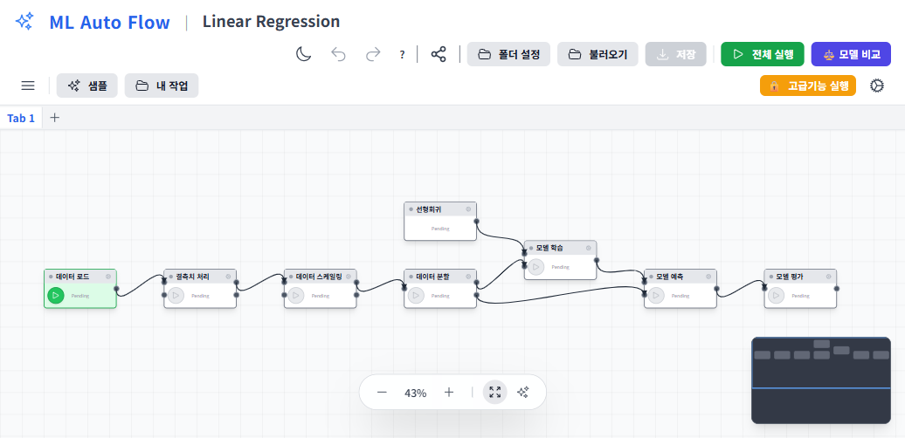
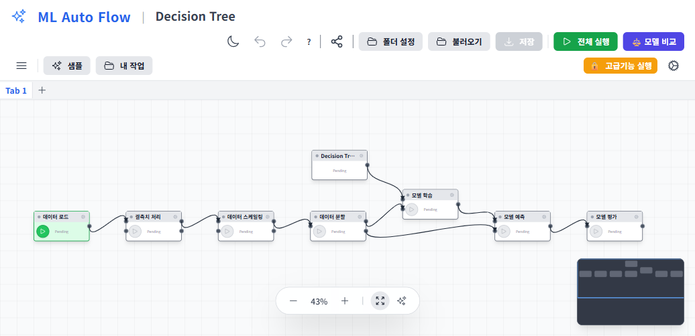
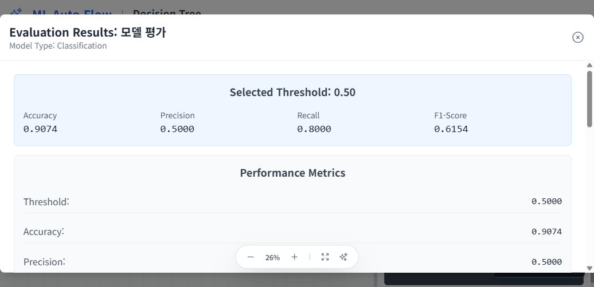
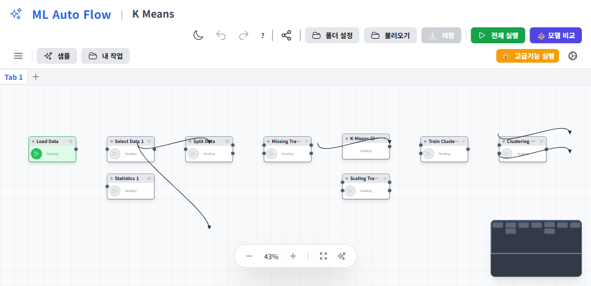
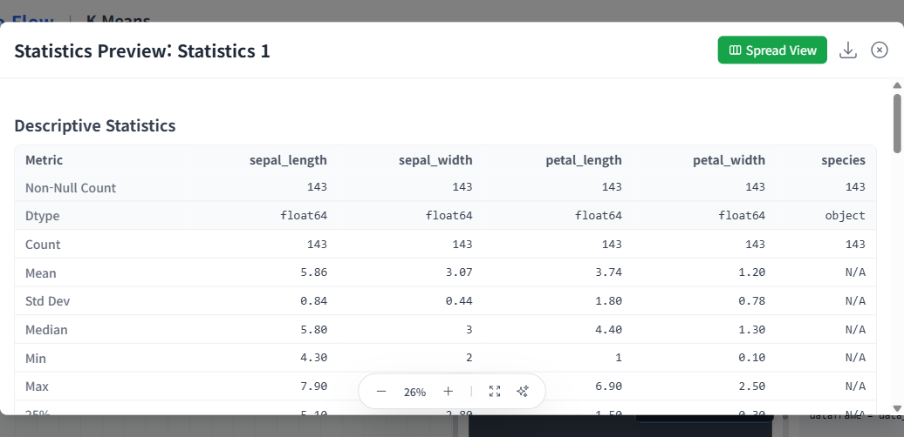
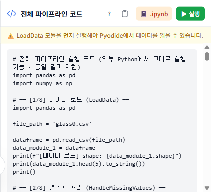
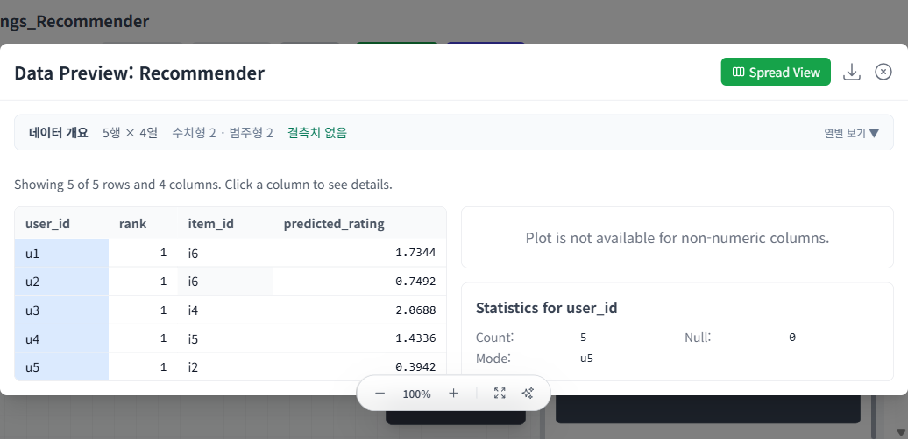

# ML Auto Flow
## 브라우저에서 즉시 실행되는 시각적 머신러닝 파이프라인

*— 클라우드 가입도, 설치도, 과금도 없는 예측 분석 입문 —*

---

> **이 책에 대하여**
>
> 이 책자는 Jeff Barnes의 *Microsoft Azure Essentials: Azure Machine Learning*(Microsoft Press, 2015)이
> 제시한 **학습 흐름**(데이터 → 시각화 → 분할 → 학습 → 채점 → 평가 → 배포 → 재학습)을 길잡이 삼아,
> 같은 여정을 **ML Auto Flow** 앱으로 처음부터 끝까지 걸어 보는 실습 안내서다.
>
> 마지막 **제8부(20~27장)** 는 한 걸음 더 나아가, Christoph Körner & Kaijisse Waaijer의
> *Mastering Azure Machine Learning*(Packt, 2020)이 다루는 **대규모·엔드투엔드 머신러닝**
> (특징공학·NLP·앙상블·딥러닝·AutoML·분산학습·추천·배포·MLOps)을 같은 무대 위로 끌어올린다.
> 그리고 **제9부(28장)** 는 Stephen F. Elston의 *Data Science in the Cloud with Microsoft Azure ML and Python*
> (O'Reilly, 2016)이 보여 준 **수요예측 회귀 종합 사례**(특징공학 → Decision Forest → 잔차진단 → 교차검증)를
> 하나의 실습으로 꿰고, 그 뼈대를 보험·헬스케어로 이전한다.
> 세 책 모두 **개념·구조만 길잡이로 삼고 본문·도식은 새로 서술·작도**했다(원문 무복제).
>
> Azure ML Studio가 *클라우드 위의 드래그-앤-드롭 캔버스*라면, ML Auto Flow는
> **여러분의 브라우저 안에서 도는 캔버스 + 브라우저 내 Python(Pyodide)**이다.
> 가입·결제·서버 프로비저닝 없이, 웹페이지 하나만 열면 같은 개념을 곧바로 손에 익힐 수 있다.
>
> 본문의 모든 **수치·코드·결과**는 앱이 실제로 내보내는 Python을 외부에서 2회 실행해
> **바이트 단위로 동일(byte-identical)**한지 자동 검증한(`npm run verify:pipelines`, **19/19 PASS**)
> 것만 실었다. "책에 적힌 대로 실행하면 같은 결과"가 이 책의 약속이다.

---

# 차례

**머리말 — 데이터 과학의 민주화, 그리고 클라우드 없는 길**

**제1부 · 데이터 과학의 기초**
- 1장 데이터의 과학 — 머신러닝이란 무엇인가
- 2장 머신러닝은 어떻게 작동하는가 — 워크플로와 두 갈래 학습

**제2부 · ML Auto Flow 시작하기**
- 3장 캔버스 둘러보기 — 모듈·포트·실행·미리보기
- 4장 데이터 들여오기와 탐색 — LoadData와 데이터 개요

**제3부 · 지도학습: 예측 모델 만들기**
- 5장 분류 — 성인 소득(>50K) 예측 (end-to-end)
- 6장 회귀 — 자동차 가격 예측 (end-to-end)

**제4부 · 비지도학습**
- 7장 군집 — 도매고객 세분화

**제5부 · 책 너머로: 통계와 진단**
- 8장 통계 분석과 가설검정

**제6부 · ML Auto Flow의 차별화된 강점**
- 9장 Python 코드 내보내기와 재현성 ★
- 10장 AI 보조 기능 — 코드·결과·오류를 한국어로 ★
- 11장 모델을 서비스로 — 스코어링 코드 내보내기
- 12장 추천 시스템 — 협업 필터링과 행렬분해
- 13장 모델 재학습과 지속학습

**제7부 · 보험 계리 응용 — 희소 데이터의 머신러닝 모수추정(MLAPE)**
- 14장 세분화의 줄타기와 희소성 — 왜 MLAPE인가
- 15장 MLAPE의 골격 — 문제를 둘로 쪼개고 4단계로 돌리기
- 16장 거리와 이웃 — KNN과 K-평균
- 17장 커널과 RVM — 차원을 바꾸고, 소수만 남기기
- 18장 일반화 — 훈련·검증·시험과 파라미터 스윕
- 19장 실증과 국내 적용, 그리고 거버넌스

**제8부 · 대규모·고급 머신러닝 — *Mastering Azure ML*이 여는 다음 단계**
- 20장 엔드투엔드 ML 파이프라인의 해부학과 ML 서비스 선택
- 21장 특징 공학 심화와 텍스트(NLP) 특징추출
- 22장 전통 ML의 정점 — 앙상블·부스팅·스태킹
- 23장 딥러닝 — 신경망·CNN·전이학습
- 24장 하이퍼파라미터 최적화와 AutoML
- 25장 대규모 분산 학습
- 26장 추천 엔진 심화 — 암묵 피드백·랭킹·딥러닝 추천
- 27장 모델 배포·운영과 MLOps ★

**제9부 · 종합 사례 연구 — 수요예측 회귀 (Elston)**
- 28장 종합 사례: 자전거 대여 수요예측 — 특징공학·Decision Forest·잔차진단·교차검증 ★

**부록**
- 부록 A 모듈 레퍼런스
- 부록 B 예제 데이터셋과 검증 픽스처
- 부록 C Azure ML Studio ↔ ML Auto Flow 용어 대조표
- 부록 D 변경 이력

---

# 머리말 — 데이터 과학의 민주화, 그리고 클라우드 없는 길

10여 년 전만 해도 예측 모델 하나를 만들어 운영에 올리는 일은 전담 데이터 과학자 팀, 전용 인프라,
그리고 수 주에서 수 개월의 시간을 요구했다. *Azure Machine Learning*이 그 풍경을 바꾼 핵심은
**데이터 과학의 민주화**였다. 누구나 브라우저에서 모듈을 끌어다 놓고 선으로 잇기만 하면
정교한 예측 분석 실험을 구성하고, 클릭 몇 번으로 웹 서비스로 내보낼 수 있게 한 것이다.

ML Auto Flow는 그 정신을 한 걸음 더 끌고 간다. **클라우드 계정도, 신용카드도, 서버도 필요 없다.**
모든 계산은 여러분의 브라우저 안에서 도는 Python(Pyodide·WebAssembly)으로 수행되고,
데이터는 여러분의 기기를 떠나지 않는다. 학습용 노트북 한 대, 혹은 사내 망 안에서도
"데이터를 올리고 → 모델을 만들고 → 평가하고 → 코드로 내보내는" 전 과정을 그대로 체험할 수 있다.

> **이 책이 책과 다른 네 가지**
>
> 1. **클라우드·과금 불필요** — 가입·결제·프로비저닝 절차가 통째로 "브라우저 열기" 한 줄로 대체된다.
> 2. **브라우저 내 Python 실행(Pyodide)** — `numpy`·`pandas`·`scikit-learn`·`statsmodels`가 설치 없이 동작한다.
> 3. **재현성 보증** — "전체 코드 보기"로 내보낸 Python이 외부에서 **동일 결과**를 내며, 자동 회귀 검증으로 늘 지켜진다.
> 4. **AI 한국어 해설** — 코드·결과·오류를 그 자리에서 설명한다(사용자별 로컬 키로 동작, 고급기능 게이트로 보호).

이 책은 무거운 수식 증명에 매달리지 않는다. 대신 **개념의 직관과 그 근거**, 그리고 **손으로 익히는 실습**을
함께 담는다. 각 장은 *왜 그렇게 동작하는가*(이론) → 앱에서의 실습 → 내보낸 코드 → 결과 해석의
네 박자로 진행되며, 곳곳의 사이드바(`>` 박스)에 한 걸음 더 들어간 이론을 따로 묶었다.
앞 장을 건너뛰어도 특정 장만 따로 읽을 수 있도록 구성했다.

마지막 **제7부(14~19장)** 는 이렇게 익힌 도구를 **보험 계리의 실제 난제** — 데이터가 얇은 세분의 요율 모수
추정(MLAPE) — 에 적용한다. 범용 ML이 어떻게 손해보험 요율·언더라이팅·규제 준수와 만나는지를, KNN·커널·
K-평균·검증을 ML Auto Flow 모듈로 조립하며 보인다(계리 실무자·언더라이터·임원 대상).

그리고 새로 더한 **제8부(20~27장)** 는 시야를 *대규모·엔드투엔드 머신러닝*으로 넓힌다.
*Mastering Azure Machine Learning*(2020)이 클라우드 위에서 푸는 특징공학·NLP·앙상블·딥러닝·AutoML·
분산학습·추천·배포·MLOps를, 같은 **클라우드 없는·재현 가능한** 무대 위에서 — 개념·이론, ML Auto Flow에서의
등가 동작, 그리고 브라우저가 못 따라가는 곳의 *정직한 한계와 외부 확장*이라는 세 박자로 — 다시 푼다.

끝으로 **제9부(28장)** 는 이 모든 도구를 *하나의 사례*로 꿰는 종합 실습이다. Elston(2016)의 자전거 대여
수요예측을 길잡이 삼아 — 특징공학으로 시간을 다루고, Decision Forest로 비선형을 잡고, **잔차로 모델을 심문**하고,
교차검증으로 일반화를 증명하고, 그 뼈대를 보험·헬스케어·DFA·사망률 예측으로 이전한다.
기초에서 대규모, 그리고 종합 사례까지 — 한 권으로 잇는 다리다.

---

# 제1부 · 데이터 과학의 기초

## 1장 — 데이터의 과학: 머신러닝이란 무엇인가

### 프로그램을 "짜는" 대신 "기르는" 일

전통적인 프로그래밍에서는 **사람이 규칙(프로그램)을 쓰고**, 컴퓨터가 그 규칙에 데이터를 넣어
결과를 만든다. 규칙은 명시적이고, 사람이 모든 경우를 미리 생각해 코드로 적어야 한다.

머신러닝은 이 방향을 뒤집는다. **데이터와 "정답(원하는 결과)"을 함께 주면**, 컴퓨터가
그 둘을 잇는 규칙(모델)을 스스로 찾아낸다. 일단 찾아낸 규칙은 처음 보는 입력에 대해서도
결과를 **예측**할 수 있다. 한마디로 머신러닝은 *데이터를 소프트웨어로 바꾸는 방법*이며,
그 바탕 기술이 **예측 분석(predictive analytics)** — 과거를 과학적으로 활용해 미래를 가늠하는 일이다.

| | 전통적 프로그래밍 | 머신러닝 |
|---|---|---|
| 사람이 주는 것 | 규칙 + 데이터 | 데이터 + 정답(레이블) |
| 컴퓨터가 만드는 것 | 결과 | **규칙(모델)** |
| 새 입력에 대해 | 정해진 대로 처리 | **예측** |

규칙이 너무 많거나 모호해서 사람이 일일이 적기 어려운 문제 — 손글씨 주소 판독, 스팸 분류,
신용 위험 평가 — 일수록 머신러닝의 값어치가 커진다.

### 우리 일상에 스며든 예측 분석

예측 분석은 이미 우리 주변 곳곳에 있다. 몇 가지만 꼽아도:

- **스팸/정크 메일 필터** — 내용·헤더·발신 패턴·사용자 행동으로 분류.
- **신용·대출 심사** — 상환 이력과 인구통계로 위험을 점수화.
- **문자/음성/얼굴 인식** — 우편물 자동 분류(OCR), 스마트폰 음성 비서, 보안 시스템.
- **보험** — 생명보험의 사망률·기대수명·보험료 산정, 의료비 예측, 손해보험 위험 평가.
- **부정거래 탐지** — 사용·활동 패턴으로 이상 거래 식별.
- **추천** — 전자상거래의 "이 상품을 산 사람은…", 영상 스트리밍의 개인화 홈.
- **예지정비(predictive maintenance)** — 항공기·엘리베이터·데이터센터의 고장 예측.

특히 **보험·계리** 영역은 회귀로 위험을 모델링해 온 오랜 역사를 갖고 있다.
예컨대 피보험자당 청구 건수를 연령 같은 요인에 회귀하면, 고연령 고객의 청구가 늘어나는
경향을 수치로 드러낼 수 있다. ML Auto Flow의 회귀·통계 모듈은 바로 이런 분석을 손으로 재현하게 해 준다.

### 학습의 형태 — 지도·비지도를 넘어

머신러닝을 조금 더 형식적으로 보면, *입력 X에서 출력 Y로 가는 함수 f를 데이터로 근사하는 일*이다.
어떤 신호를 주느냐에 따라 학습은 크게 네 갈래로 나뉜다.

- **지도학습(supervised)** — `(X, Y)` 쌍이 주어진다. 정답 Y를 보고 f를 맞춰 간다(이 책 5·6장).
- **비지도학습(unsupervised)** — X만 주어진다. 데이터 안의 구조(군집·저차원 표현)를 찾는다(7장).
- **준지도학습(semi-supervised)** — 소수의 레이블 + 다수의 비레이블. 레이블링 비용이 클 때 쓴다.
- **강화학습(reinforcement)** — 정답 대신 *보상*이 주어진다. 시행착오로 정책을 학습한다(게임·로봇 제어).

ML Auto Flow는 실무에서 가장 자주 쓰는 앞의 두 갈래에 더해 **추천(12장)·통계(8장)** 까지 캔버스로 다룬다.

> **왜 데이터가 많을수록 좋은가 — 그리고 그 한계**
> 모델은 표본에서 모집단의 규칙을 *추정*한다. 표본이 크고 다양할수록 추정의 분산이 줄어
> (큰 수의 법칙) 처음 보는 데이터에 대한 예측이 안정된다. 다만 **양보다 질** — 편향된 데이터는
> 아무리 많아도 편향된 모델을 낳는다. 5장의 클래스 불균형(고소득자가 소수)이 그 산 증거다.

### "실패를 빨리(fail fast), 그리고 계속 배우는" 기계

머신러닝의 가장 독특한 점은 **끝이 없다**는 데 있다. 모델은 새 데이터가 들어올 때마다
오차를 피드백받아 자신을 고쳐 나간다. 사람과 달리, 기계는 같은 실수를 반복하도록 운명 지어지지 않는다.
그래서 좋은 예측 시스템의 핵심은 **빠른 피드백 루프**다. 가설을 세우고, 빨리 실험하고,
틀렸으면 빨리 버리고(fail fast), 맞으면 다듬는다.

ML Auto Flow의 캔버스는 이 "빠른 실험" 사이클을 손쉽게 만든다.
모듈을 바꿔 끼우고 ▶ 실행만 누르면 새로운 가설을 곧바로 시험할 수 있다.
클라우드에 배포할 필요도, 결과를 기다릴 필요도 없다 — 계산은 브라우저 안에서 즉시 끝난다.

> **한눈에**
> 머신러닝 = 데이터에서 규칙을 학습해 예측·분류·군집을 수행하는 기술.
> 핵심 동력은 ① 폭증하는 데이터 ② 값싼 저장소 ③ 어디서나 쓰는 연산력 ④ 빅데이터 분석의 경제성.
> ML Auto Flow는 ②③을 *여러분의 브라우저*로 대체해 진입장벽을 0에 가깝게 낮춘다.

---

## 2장 — 머신러닝은 어떻게 작동하는가

### 반복 가능한 워크플로

성공적인 예측 분석은 즉흥이 아니라 **반복 가능한 절차**를 따른다. 그 절차는 대략 이렇게 흐른다.

1. **데이터(Data)** — 학습·검증용 데이터를 모으고, 살펴보고, 정리한다. *모든 것은 데이터에서 시작한다.*
2. **모델 생성(Create)** — 알고리즘으로 데이터의 패턴을 학습해 예측 모델을 만든다.
3. **평가(Evaluate)** — 입력과 정답이 모두 알려진 데이터로 정확도를 잰다. 정확도는 0~1 사이 신뢰도로 표현된다.
4. **정제·비교(Refine)** — 여러 모델·전략을 비교·결합해 가장 일관되게 정확한 조합을 찾는다.
5. **배포(Deploy)** — 모델을 어디서나 호출할 수 있는 형태(웹 서비스/스코어링 코드)로 내보낸다.
6. **테스트·활용(Use)** — 실제 시나리오에 적용하고, 새 결과를 피드백으로 되먹여 모델을 계속 개선한다.

ML Auto Flow는 이 6단계를 **캔버스 위 모듈**로 1:1 대응시킨다.
데이터 적재(`LoadData`) → 전처리·분할(`SplitData`) → 모델 정의 → 학습(`TrainModel`) →
채점(`ScoreModel`) → 평가(`EvaluateModel`) → 코드/서비스 내보내기. 6단계를 눈으로 보면서 손으로 잇는다.

### 알고리즘의 세 갈래

ML Auto Flow가 제공하는 학습 알고리즘은 크게 셋으로 나뉜다.

- **분류(Classification)** — 출력이 *몇 개의 범주* 중 하나일 때. 예: 소득 `>50K` vs `<=50K`, 이탈/잔존.
- **회귀(Regression)** — 출력이 *연속적인 수치*일 때. 예: 자동차 가격, 손익, 청구액.
- **군집(Clustering)** — 정답 없이 데이터 안의 *자연스러운 묶음*을 찾을 때. 예: 고객 세분화.

앞의 둘(분류·회귀)은 **지도학습**, 마지막(군집)은 **비지도학습**에 속한다.

### 지도학습: 정답을 보고 배우기

지도학습은 **입력과 정답이 함께 있는** 데이터(학습 데이터)로 모델을 훈련한다.
학습 데이터의 각 열(column)은 세 가지 역할 중 하나를 맡는다.

- **특성(Features) / 입력 벡터** — 예측에 쓰이는 입력 변수들.
- **레이블(Label) / 정답 신호** — 그 입력에 대응하는 알려진 결과.
- **미사용(Not used)** — 이번 예측에는 쓰지 않는 열(나중에 필요하면 다시 포함 가능).

예를 들어 **성인 인구조사 소득** 데이터(5장)에서는 나이·학력·직업·결혼상태·주당 근로시간 같은 열이
*특성*이 되고, 소득이 `>50K`인지 `<=50K`인지가 *레이블*이 된다.
모델은 "어떤 특성 조합이 어떤 결과로 이어지는가"라는 **반복 가능한 추론 패턴**을 찾아낸다.

ML Auto Flow에서 특성과 레이블의 지정은 `TrainModel` 모듈의 `feature_columns`와
대상 열(target) 설정으로 이뤄진다. 책의 *Project Columns*(열 선택)에 해당하는 역할이다.

> **모델은 어떻게 "맞춰지나" — 손실과 최적화**
> 학습이란 결국 *예측이 정답에서 벗어난 정도(손실, loss)* 를 최소화하도록 모델 내부의 수(파라미터)를
> 조정하는 일이다. 선형회귀는 제곱오차 손실을 **닫힌 해(최소제곱)** 로 한 번에 풀고, 신경망·부스팅은
> **경사하강(gradient descent)** 으로 손실의 기울기를 따라 조금씩 내려간다. 초기화·표본추출에 무작위가
> 끼는 단계마다 시드를 고정(`random_state=42`)하는 이유가 여기에 있다(9장). 같은 출발점에서 같은 길을
> 내려가야 같은 답에 도달하기 때문이다.

### 평가: "완벽"이 아니라 "충분히 가까움"

새 모델을 만들면 **가장 먼저** 정확도를 평가해야 한다. 입력과 정답이 모두 알려진 검증 데이터로
모델의 예측이 얼마나 들어맞는지 재는 것이다. 중요한 진실은 — **모델은 결코 100% 완벽하지 않다.**
오히려 학습 데이터에서 100%가 나오면 과적합(overfitting)을 의심해야 한다.
현실의 핵심은 *처음 보는, 결측이 있는 데이터*에 대해 얼마나 잘 맞히느냐다.
그래서 우리는 "현실적으로 받아들일 수 있는 정확도 범위"를 정하고 거기에 맞춰 모델을 다듬는다.

분류에서는 정확도·정밀도·재현율·F1·혼동행렬·ROC/AUC를, 회귀에서는 R²·RMSE·MAE·RSE·RAE를 본다
(각각 5·6장에서 실제 수치와 함께 다룬다). ML Auto Flow의 `EvaluateModel`이 이 지표들을 한 번에 계산한다.

### 일반화 — 외운 것이 아니라 배운 것

평가가 던지는 진짜 질문은 "모델이 데이터를 *외웠는가*, 아니면 규칙을 *배웠는가*"이다.
학습 데이터에만 잘 맞고 새 데이터에 약한 상태를 **과적합(overfitting)**, 학습 데이터조차
제대로 못 맞히는 상태를 **과소적합(underfitting)** 이라 한다.

- **과적합** — 모델이 너무 복잡해 잡음까지 외운다(예: 깊은 의사결정나무). 학습 정확도↑, 검증 정확도↓.
- **과소적합** — 모델이 너무 단순해 패턴을 놓친다. 학습·검증 모두 낮음.

이 둘 사이의 줄다리기가 **편향–분산 트레이드오프(bias–variance tradeoff)** 다. 단순한 모델은 *편향*이
크고(체계적으로 빗나감), 복잡한 모델은 *분산*이 크다(데이터가 조금만 바뀌어도 결과가 출렁인다).
좋은 모델은 그 사이 적절한 지점에 있다 — 그리고 그 지점은 **데이터로 찾는 것**이지 손으로 정하는 게 아니다.

그래서 데이터를 **학습/검증/테스트**로 나눈다(이 책은 학습/테스트 2분할을 쓴다).
- **학습(train)** 으로 모델을 적합하고,
- **테스트(test)** 로 *처음 보는* 데이터에 대한 성능을 잰다.
- 모델·하이퍼파라미터를 여러 번 비교할 때는 **교차검증(cross-validation)** — 데이터를 K조각으로 나눠
  번갈아 가며 검증 — 으로 더 안정적으로 고른다(9장의 `SweepParameters`가 `GridSearchCV`로 이걸 한다).

> **데이터 누수(leakage)를 조심하라**
> 테스트의 정보가 학습에 새어 들면 성능이 *거짓으로* 좋아진다. 예: 스케일러를 **전체** 데이터로 적합하면
> 테스트의 평균·분산이 학습에 스민다. 올바른 순서는 **분할 먼저, 그다음 학습 데이터로만 전처리 적합**이다.
> 그래서 이 책의 파이프라인은 `SplitData`를 모델·스케일링보다 앞(또는 적절한 위치)에 둔다.

### 비지도학습: 혼돈 속에서 숲을 찾기

비지도학습은 훨씬 어렵다. **정답이 주어지지 않기** 때문이다.
모델의 성패는 전적으로 들어온 데이터 안의 패턴·구조·관계를 스스로 추론해 내는 능력에 달려 있다.
목표는 "같은 묶음 안의 대상끼리는 서로 닮고, 다른 묶음과는 다르게" 데이터를 가르는 것이다.

가장 흔한 비지도학습이 **군집 분석(cluster analysis)** 이다. 정답 레이블 없이도
수많은 점을 의미 있는 그룹으로 묶어 "나무가 아니라 숲"을 보게 해 준다(7장).

> **요약**
> 지도학습 = 입력+정답으로 훈련 → 새 입력의 결과 예측(분류·회귀).
> 비지도학습 = 정답 없이 구조 발견(군집·차원축소).
> 어느 쪽이든 워크플로는 *데이터 → 모델 → 평가 → 정제 → 배포 → 피드백*의 반복이다.

---

# 제2부 · ML Auto Flow 시작하기

## 3장 — 캔버스 둘러보기

### 가입 절차 대신, 그냥 열기

Azure ML Studio를 쓰려면 클라우드 구독을 만들고, 워크스페이스를 프로비저닝하고,
가격제를 고르는 일련의 과정을 거쳐야 했다. ML Auto Flow에서 그 모든 단계는 **"브라우저로 앱 열기"** 한 줄이다.
개발 모드라면 `npm run dev` 후 `http://127.0.0.1:3003`에 접속하면 된다. 로그인도, 결제 정보도 없다.

### 화면의 구성요소

- **모듈 팔레트(툴박스)** — 데이터 적재·전처리·분할·지도/비지도 학습·통계·평가 모듈이 분류별로 놓여 있다.
- **캔버스** — 모듈을 드래그해 배치하고, **포트(입력/출력)** 를 선으로 이어 파이프라인을 만든다.
  연결선은 곧 *데이터와 모델의 흐름*이다.
- **속성 패널(Properties)** — 선택한 모듈의 파라미터를 편집한다. 각 모듈의 "코드 보기" 탭도 여기에 있다.
- **실행** — 모듈마다 ▶로 개별 실행하거나, 전체를 한 번에 실행한다. 모든 계산은 **브라우저 Pyodide**가 수행한다.
- **미리보기 모달** — 각 결과를 표·차트·요약으로 확인한다. 통계·평가 결과에는 **✨AI 해설**이 함께 붙는다.

### 모듈과 포트, 그리고 흐름

ML Auto Flow의 한 모듈은 워크플로의 한 단계다. 모듈에는 **입력 포트**와 **출력 포트**가 있고,
한 모듈의 출력 포트를 다음 모듈의 입력 포트에 이으면 데이터(또는 학습된 모델)가 그 선을 따라 흐른다.

지도학습 파이프라인의 전형적인 흐름은 이렇다.

```
LoadData ──▶ SplitData ──▶ (모델 정의) ──▶ TrainModel ──▶ ScoreModel ──▶ EvaluateModel
                  │                              ▲
                  └──────────(train 포트)────────┘
                  └──────────(test 포트)──────────────────▶ ScoreModel
```

`SplitData`는 데이터를 train/test 두 갈래로 나눠 각각 다른 포트로 내보낸다.
`TrainModel`은 (모델 정의 + train 데이터)를 받아 **학습된 모델**을 만들고,
`ScoreModel`은 (학습된 모델 + test 데이터)로 예측을 채운다.
`EvaluateModel`이 그 예측을 정답과 비교해 지표를 낸다. 이 와이어링은 외부 Python으로 내보낼 때도
그대로 보존된다(9장).

> **파이프라인은 방향 비순환 그래프(DAG)다**
> 모듈은 노드, 연결은 *방향이 있는* 간선이다. 순환(cycle)이 없어야 하며, 앱은 그래프를 **위상정렬**해
> "상위 모듈이 끝나야 하위 모듈이 도는" 순서로 실행한다. 한 모듈의 출력은 여러 하위로 갈라질 수 있고
> (분기), 학습된 *모델* 도 데이터처럼 포트를 따라 흐른다(**모델 포트**). 덕분에 같은 데이터로 여러 모델을
> 나란히 비교하는 실험을 한 캔버스에 그릴 수 있다. 포트에는 **타입(데이터/모델)** 이 있어, 데이터 포트를
> 모델 입력에 잘못 잇는 실수를 막는다.



> **그림 3-1.** 실제 ML Auto Flow 캔버스. 각 노드가 한 모듈이고, 노드를 잇는 선이 데이터·모델의 흐름이다.
> 좌측 상단에 줌·"화면에 맞추기" 컨트롤, 우측 상단에 "전체 실행"·"고급기능 실행"이 보인다.
> (이 화면은 6장 회귀 파이프라인과 동일한 구조다.)

> **책의 모듈 ↔ 앱의 모듈** (전체 대조는 부록 C)
>
> | Azure ML Studio | ML Auto Flow |
> |---|---|
> | Dataset 업로드 | `LoadData` |
> | Clean Missing Data | `HandleMissingValues` |
> | Project Columns | `TrainModel`의 `feature_columns` |
> | Split | `SplitData` |
> | Train Model | `TrainModel` |
> | Score Model | `ScoreModel` |
> | Evaluate Model | `EvaluateModel` |

---

## 4장 — 데이터 들여오기와 탐색

### LoadData — 파일 또는 URL

분석의 출발점은 데이터를 들여오는 일이다. `LoadData`는 두 가지 입력을 받는다.

- **로컬 CSV 업로드** — 기기의 파일을 그대로 올린다. 데이터는 브라우저를 떠나지 않는다.
- **URL 직접 로드** — 공개 데이터셋 주소를 입력하면 입력층에서 받아 동일 파서로 처리한다.
  (책의 *Reader* 모듈이 웹 URL을 직접 읽던 것과 같은 발상이다. 내부적으로는 fetch로 받아
  기존 CSV 파서에 넘기므로, 이후 Pyodide 실행 경로와 재현성에는 전혀 영향이 없다.)

### 데이터 개요 패널 — 먼저 데이터를 "본다"

좋은 분석가는 모델부터 만들지 않는다. **먼저 데이터를 본다.**
ML Auto Flow는 데이터를 올리면 **데이터 개요 패널**이 즉시 다음을 요약한다.

- 행·열의 수,
- 열별 타입(수치형/범주형),
- 열별 **결측치 수**.

예컨대 성인 소득 데이터를 올리면 `workclass` 같은 열에 결측이 다수 있음이 강조된다.
책에서 자동차 데이터를 *Visualize*로 살펴 결측을 발견하고 *Clean Missing Data*로 채웠던 과정과 같다.

### 결측치 다루기

결측이 있는 열을 그대로 sklearn 모델에 넣으면 오류가 난다. 두 가지 길이 있다.

1. **결측 없는 수치형 특성만 선택** — 가장 깔끔하게 재현 가능한 길(이 책의 5·6장 예제가 택한 방식).
2. **`HandleMissingValues`로 보정** — 평균/중앙값/상수 대치 등으로 결측을 채운 뒤 사용
   (책의 *Clean Missing Data* — Custom Substitution=0 등에 대응).

범주형(직업·학력 등)까지 쓰려면 `EncodeCategorical`을 체인 앞에 추가해 수치로 바꾼다.

### 데이터의 종류와 전처리의 논리

열은 **측정 수준**에 따라 다루는 법이 다르다.
- **수치형(numeric)** — 연속(키·가격) 또는 이산(개수). 사칙연산이 의미를 갖는다.
- **범주형(categorical)** — 명목(직업·색)과 순서(학력·등급). sklearn 모델은 숫자만 받으므로 인코딩이 필요하다.
  - **원-핫 인코딩** — 명목형을 0/1 더미 열로 펼친다(순서가 없으니 정수로 바꾸면 안 된다).
  - **레이블/순서 인코딩** — 순서형을 정수로(작다 < 크다 관계를 보존).

**결측이 왜·어떻게 생겼나** 도 처리법을 좌우한다.
- **완전 무작위 결측(MCAR)** — 아무 이유 없이 빠짐 → 행 삭제·평균 대치로 무난.
- **무작위 결측(MAR)** — 다른 관측값에 따라 빠짐 → 조건부 대치(예: KNN)가 더 낫다.
- **비무작위 결측(MNAR)** — 값 자체 때문에 빠짐(고소득자가 소득을 미응답) → 가장 까다롭고, *결측 자체가 신호*일 수 있다.

`HandleMissingValues`는 행 삭제·평균/중앙값/최빈/KNN 대치를 제공한다.

> **스케일링이 필요한 이유**
> 거리·경사 기반 알고리즘(K-Means·SVM·KNN·신경망)은 *값의 크기*에 민감하다. 연봉(수만)과 나이(수십)를
> 그대로 두면 연봉이 거리를 지배한다. `ScalingTransform`(MinMax/Standard/Robust)이 척도를 맞춰 준다
> (7장 도매고객 군집의 핵심 교훈). 반대로 **트리 계열은 분할 기준**이라 스케일에 둔감하다 — 그래서 5장
> 의사결정나무 예제는 스케일링이 결과에 영향을 주지 않는다.

> **데이터 위생 한 줄 요약**
> "쓰레기를 넣으면 쓰레기가 나온다(garbage in, garbage out)."
> 모델을 바꾸기 전에, 데이터를 먼저 보고 고쳐라.

---

# 제3부 · 지도학습: 예측 모델 만들기

## 5장 — 분류: 성인 소득(>50K) 예측

### 시나리오

이 장에서는 한 사람의 인구통계 정보로 **연 소득이 \$50,000를 넘는지**(`>50K`) 아닌지(`<=50K`)를
예측하는 **이진 분류** 모델을 처음부터 끝까지 만든다. 데이터는 UCI의 *Adult / Census Income*
(1994년 미국 인구조사 기반, 32,561행)을 쓴다. 출력이 두 값 중 하나라서 "이진(binary)"이다.

### 파이프라인

```
LoadData ──▶ SplitData(0.8, seed 42) ──▶ DecisionTree(max_depth=8)
          ──▶ TrainModel ──▶ ScoreModel ──▶ EvaluateModel(classification)
```

- **특성(결측 없는 수치형 6개):** age, fnlwgt, education-num, capital-gain, capital-loss, hours-per-week.
- **모델:** `DecisionTree`(max_depth=8). 책은 부스팅 트리 계열을 1순위로 썼는데,
  ML Auto Flow에는 이에 대응하는 `GradientBoosting` 모듈이 있어(아래) 동일 예제를 한 단계 더 충실히 재현할 수 있다.
- **앱 사용:** 샘플 `Book_AdultIncome_DecisionTree.json` 로드 → 실행 (검증 픽스처 `13_book_adult_clf`).



> **그림 5-1.** 의사결정나무 분류 파이프라인을 캔버스에 올린 모습. 모델 노드(Decision Tree)만
> Gradient Boosting으로 바꾸면 책의 부스팅 트리 예제로 곧장 전환된다.

### 의사결정나무는 어떻게 나누나

의사결정나무는 데이터를 *질문* 으로 반복해서 쪼갠다("capital-gain ≤ 7000?"). 각 분할에서
**가장 순도(purity)를 높이는** 질문을 고른다. 순도는 보통 두 척도로 잰다.

- **지니 불순도(Gini)** — 한 노드에서 무작위로 둘을 뽑아 클래스가 다를 확률. 0이면 완전히 순수하다.
- **엔트로피(entropy)** — 정보이론의 무질서도. 분할 전후 엔트로피 감소량이 **정보이득(information gain)** 이다.

나무는 정보이득이 큰 질문을 위에 놓고, 잎(leaf)이 충분히 순수해질 때까지 내려간다.
**깊을수록 학습 데이터를 잘 외우지만 과적합**한다(2장의 편향–분산). 그래서 `max_depth`로 깊이를 제한한다
(이 예제는 8). 동점 분할 처리 등에 무작위가 끼므로 `random_state=42`로 고정해 재현성을 지킨다.

### 앙상블 — 약한 학습기를 모아 강하게

나무 하나는 불안정하다(데이터가 조금만 바뀌어도 모양이 출렁인다). 이를 모으는 두 전략이 있다.

- **배깅(bagging) / 랜덤 포레스트** — 데이터를 무작위로 여러 번 뽑아 *독립적인* 나무 여럿을 만들고
  **평균·다수결**한다. 주로 **분산**을 줄여 안정시킨다.
- **부스팅(boosting) / 그래디언트 부스팅** — 나무를 *순차적으로* 쌓되, 앞 나무가 틀린 부분(잔차)에
  다음 나무가 집중하게 한다. 주로 **편향**을 줄여 정확도를 끌어올린다. 책의 1순위 분류기가 이 계열이고,
  앱의 `GradientBoosting`이 대응한다(아래).

### 검증된 결과 (test n = 6,513)

| 지표 | 값 |
|---|---|
| 정확도(Accuracy) | **0.8322** |
| 정밀도 Precision (>50K) | 0.8136 |
| 재현율 Recall (>50K) | 0.3947 |
| F1 (>50K) | 0.5315 |

**해석.** 수치형 6개 특성만으로 정확도 83%에 이른다. 다만 고소득(`>50K`) **재현율이 0.39로 낮다.**
이는 ① 클래스 불균형(고소득자가 소수)과 ② 직업·학력·결혼상태 같은 **범주형을 아직 쓰지 않았기** 때문이다.
책 수준으로 끌어올리려면 — `EncodeCategorical`로 14개 특성 전부 사용, 부스팅 트리로 교체,
또는 임계값(threshold) 조정이 효과적이다.

### 분류 평가 깊이 보기 — 정확도만으로는 부족하다

정확도 하나로 모델을 판단하면 위험하다. 100명 중 90명이 저소득인 데이터에서
"무조건 저소득"이라 찍는 모델도 정확도 90%가 나오기 때문이다. 그래서 분류 평가는 여러 각도를 함께 본다.

- **혼동행렬(Confusion Matrix)** — 참양성/거짓양성/참음성/거짓음성의 4칸. 모든 지표의 출발점.
- **정밀도(Precision)** — "양성이라 한 것 중 진짜 양성" 비율. 거짓 경보를 줄이고 싶을 때 중요.
- **재현율(Recall)** — "진짜 양성 중 잡아낸" 비율. 놓치면 안 되는 문제(질병·부정거래)에서 중요.
- **F1** — 정밀도와 재현율의 조화평균. 둘의 균형을 한 수로.
- **ROC 곡선·AUC** — 임계값을 바꿔 가며 본 참양성률 대 거짓양성률. AUC=1이 완벽, 0.5가 무작위.
- **정밀도-재현율(PR) 곡선·Average Precision** — 불균형 데이터에서 특히 유용.

> **혼동행렬에서 모든 지표가 나온다**
> 양성을 양성이라 하면 **TP**, 음성을 양성이라 하면 **FP**(거짓 경보), 양성을 음성이라 하면 **FN**(놓침),
> 음성을 음성이라 하면 **TN**. 여기서:
> - 정밀도 = TP / (TP + FP) — "양성이라 외친 것 중 진짜"
> - 재현율 = TP / (TP + FN) — "진짜 양성 중 잡아낸 것"
> - F1 = 2·(정밀도·재현율) / (정밀도 + 재현율) — 둘의 **조화평균**(한쪽만 높아선 안 됨)
>
> 정밀도와 재현율은 **임계값을 올리면 한쪽이 오르고 다른 쪽이 내려가는** 상충 관계다. 이 예제의
> 고소득 재현율 0.39는 "임계값 0.5에서 놓침(FN)이 많다"는 뜻 — 임계값을 낮추거나, 부스팅·재표집(SMOTE)으로
> 끌어올린다. **ROC-AUC** 는 임계값을 전부 훑어 본 "구분 능력"의 단일 요약치라, 임계값 선택과 무관하게 모델을 비교한다.

ML Auto Flow의 `EvaluateModel`은 분류에서 이 모두를 계산하고, 평가 미리보기 모달에는
**임계값 슬라이더**가 있어 — 슬라이더를 움직이며 정밀도/재현율/F1이 어떻게 변하는지 즉시 볼 수 있다.
(이 슬라이더는 미리 계산된 임계값 표에서 고르는 *앱 전용 탐색 도구*이며, 내보낸 Python 코드나
재현성에는 영향을 주지 않는다.) 책의 평가 화면(ROC/AUC·혼동행렬·임계값 조정)을 그대로 옮겨 온 셈이다.



> **그림 5-2.** `EvaluateModel`의 분류 평가 결과 모달(의사결정나무, glass 데이터 실행 예). 상단에 **선택한 임계값**과
> 그에 따른 Accuracy·Precision·Recall·F1, 아래로 임계값별 Performance Metrics 표가 이어진다(스크롤하면 ROC/PR 곡선).

### 그래디언트 부스팅 — 책의 1순위 분류기에 대응

`GradientBoosting` 모듈은 약한 트리들을 단계적으로 쌓아 오차를 줄여 가는
`sklearn.ensemble.GradientBoostingClassifier/Regressor`를 감싼다(`random_state=42`로 결정적).
의사결정나무 자리에 이 모듈을 끼우면 책의 부스팅 트리 예제를 같은 데이터로 재현할 수 있다.
주요 파라미터는 `n_estimators`(트리 수)·`learning_rate`(학습률)·`max_depth`(트리 깊이)이며,
픽스처 `14_gradient_boosting`으로 외부 재현이 검증되어 있다.

### 내보낸 동등 Python (검증됨, 핵심 발췌)

```python
import pandas as pd
from sklearn.model_selection import train_test_split
from sklearn.tree import DecisionTreeClassifier
from sklearn.metrics import accuracy_score, precision_score, recall_score, f1_score

df = pd.read_csv("adult.csv")
features = ["age","fnlwgt","education-num","capital-gain","capital-loss","hours-per-week"]
X, y = df[features], df["income"]
X_tr, X_te, y_tr, y_te = train_test_split(X, y, train_size=0.8, random_state=42, shuffle=True)
model = DecisionTreeClassifier(max_depth=8, random_state=42).fit(X_tr, y_tr)
pred = model.predict(X_te)
print("Accuracy =", accuracy_score(y_te, pred))
```

---

## 6장 — 회귀: 자동차 가격 예측

### 시나리오

이번에는 출력이 범주가 아니라 **연속적인 수치** — 자동차의 **가격(price)** — 인 **회귀** 문제다.
데이터는 UCI *Automobile*(1987년 수입차 제원·가격, 201행)을 쓴다.
차폭·엔진 크기·연비 같은 제원으로 가격을 예측하는, 옛날 영업사원이 머릿속으로 하던 일을 모델로 옮긴다.

### 회귀의 세 갈래(개념)

- **단순 선형회귀** — 하나의 입력으로 하나의 출력을 예측.
- **다중 선형회귀** — 여러 입력으로 하나의 출력을 예측(이 장의 예제가 여기 해당).
- **다변량 선형회귀** — 서로 연관된 여러 출력을 동시에 예측.

선형회귀는 입력 X와 출력 Y의 관계를 직선(또는 초평면)으로 모델링하며, 보통 최소제곱법으로 적합한다.
해석이 쉽고 빠르며 기준선(baseline)으로 훌륭하다.

> **최소제곱과 R²의 의미**
> 선형회귀는 모든 점에서 예측선까지의 *세로 거리(잔차)* 의 **제곱합을 최소**로 만드는 직선을 고른다(최소제곱).
> 제곱을 쓰는 이유는 부호를 없애고 큰 오차에 더 큰 벌점을 주기 위해서다. **R²(결정계수)** 는
> "그 직선이 *평균선* 대비 분산을 얼마나 줄였나"이다 — R² = 1 − (잔차제곱합 SS_res / 총제곱합 SS_tot).
> 1에 가까울수록 좋고, 0이면 그냥 평균으로 찍는 것과 다를 바 없다. 이 예제의 R²=0.7561은
> 가격 변동의 약 76%를 10개 특성이 설명한다는 뜻이다.

### 파이프라인

```
LoadData ──▶ SplitData(0.75, seed 42) ──▶ LinearRegression
          ──▶ TrainModel ──▶ ScoreModel ──▶ EvaluateModel(regression)
```

- **특성(결측 없는 수치형 10개):** symboling, wheel-base, length, width, height,
  curb-weight, engine-size, compression-ratio, city-mpg, highway-mpg.
  (책은 *Project Columns*로 `bore`·`stroke`를 제외했는데, 본 재현도 두 열을 쓰지 않는다.)
- **앱 사용:** 샘플 `Book_Automobile_LinearRegression.json` 로드 → 실행 (픽스처 `11_book_automobile_linreg`).

### 검증된 결과 (test n = 51)

| 지표 | 값 | 의미 |
|---|---|---|
| 결정계수 R² | **0.7561** | 가격 분산의 약 76%를 설명 |
| RMSE | 5,129.9 | 제곱오차 기반 평균 오차(큰 오차에 민감) |
| MAE | 3,487.7 | 절대오차 평균(이상치에 덜 민감) |

**해석.** 수치형 10개만으로 가격 분산의 76%를 설명한다. 엔진 크기·차폭·공차중량이 가격과 강하게 연동된다.
책처럼 범주형(make, body-style 등)을 인코딩해 더하면 R²를 더 끌어올릴 여지가 있다.

### 회귀 평가 깊이 보기 — 상대오차의 추가

`EvaluateModel`은 회귀에서 RMSE·MAE에 더해 **상대제곱오차(RSE)**와 **상대절대오차(RAE)** 를 함께 낸다.
이는 "단순히 평균으로 찍는 모델 대비 얼마나 나은가"를 0~1 척도로 보여 주는 지표로,
책이 제시한 회귀 5종 지표와 정합한다. 척도가 다른 데이터셋들끼리 모델 성능을 비교할 때 특히 유용하다.

> **RMSE 대 MAE — 어느 오차를 볼까**
> 둘 다 "평균적으로 얼마나 빗나갔나"지만 성격이 다르다. **RMSE**(제곱오차 기반)는 큰 오차를 제곱해
> 더 무겁게 벌하므로 *이상치에 민감*하다. **MAE**(절대오차)는 모든 오차를 동등하게 보아 *이상치에 강건*하다.
> 이 예제에서 RMSE(5,129.9) > MAE(3,487.7)인 것은, 대부분 잘 맞히지만 *몇몇 큰 오차*가 RMSE를 끌어올렸음을 시사한다.

### 선형회귀가 기대는 가정, 그리고 규제

선형회귀의 계수를 *해석* 하려면 몇 가지 가정이 필요하다 — 관계의 **선형성**, 잔차의 **독립성·등분산성·정규성**.
이를 점검하는 도구가 8장의 통계 모듈(정규성 검정·잔차 분석·VIF)이다. 특성끼리 강하게 상관되면
(**다중공선성**) 계수가 불안정해지는데, **VIF**로 진단하고 상관 높은 열을 줄여 대응한다.

특성이 많거나 과적합이 우려되면 **규제(regularization)** 를 더한다. 손실에 계수 크기 벌점을 붙이는 변형으로,
앱의 선형 모델은 다음을 지원한다 — **Ridge(L2)** 는 계수를 고르게 줄이고, **Lasso(L1)** 는 일부 계수를
0으로 만들어 *변수 선택* 효과를 내며, **ElasticNet** 은 둘을 섞는다. 모두 `random_state=42`로 결정적이다.

### 내보낸 동등 Python (검증됨)

```python
import pandas as pd
from sklearn.model_selection import train_test_split
from sklearn.linear_model import LinearRegression
from sklearn.metrics import r2_score, mean_squared_error, mean_absolute_error

df = pd.read_csv("imports-85-hdrs.csv")
features = ["symboling","wheel-base","length","width","height",
            "curb-weight","engine-size","compression-ratio","city-mpg","highway-mpg"]
X, y = df[features], df["price"]
X_tr, X_te, y_tr, y_te = train_test_split(X, y, train_size=0.75, random_state=42, shuffle=True)
model = LinearRegression().fit(X_tr, y_tr)
pred = model.predict(X_te)
print("R2 =", r2_score(y_te, pred))
print("RMSE =", mean_squared_error(y_te, pred) ** 0.5)
```

### 회귀 알고리즘 패밀리(개념 지도)

선형회귀는 회귀의 출발점일 뿐이다. 상황에 따라 다음을 고려한다.

- **부스팅 트리 회귀(Gradient Boosting)** — 약한 트리를 단계적으로 쌓아 비선형 관계를 강하게 잡는다(앱 `GradientBoosting`).
- **결정 포레스트(Random Forest)** — 여러 트리의 평균으로 분산을 줄이고 잡음에 강하다.
- **신경망 회귀(Neural Network)** — 전통 회귀가 잡지 못하는 복잡한 비선형을 근사.
- **포아송 회귀(Poisson)** — *개수(count)* 를 예측할 때(콜수·청구 건수 등). statsmodels로 제공(8장).
- **분위/순서형 회귀** — 평균이 아닌 분포의 특정 분위, 혹은 순서가 있는 범주를 다룰 때.

---

# 제4부 · 비지도학습

## 7장 — 군집: 도매고객 세분화

### 정답이 없을 때

분류·회귀가 "정답을 보고 배우는" 지도학습이었다면, 군집은 **정답 없이** 데이터 스스로
자연스러운 묶음을 찾게 하는 비지도학습이다. 목표는 *같은 군집 안끼리는 닮고, 다른 군집과는 다르게*
데이터를 가르는 것. 고객 세분화·이상 탐지·문서 묶기 같은 곳에서 빛을 발한다.

### K-Means의 원리

가장 널리 쓰이는 군집 알고리즘이 **K-Means** 다. 동작은 직관적이다.

1. 군집 수 K를 정하고, K개의 중심점(centroid)을 임의로 둔다.
2. 각 데이터 점을 *가장 가까운* 중심점에 배정한다.
3. 각 군집의 평균으로 중심점을 옮긴다.
4. 중심점이 더 이상 움직이지 않을 때까지(또는 정해진 반복 수까지) 2~3을 되풀이한다.

"가까움"은 보통 유클리드 거리로 잰다. 거리에 기반하므로, **금액 단위가 큰 열이 결과를 지배**하기 쉽다 —
이 점이 아래 해석의 핵심이 된다.

> **K-Means가 정말 최소화하는 것**
> K-Means는 **군집 내 제곱합(inertia, WCSS)** — 각 점에서 자기 중심점까지 거리 제곱의 총합 — 을 줄인다.
> 위 1~4 반복(로이드 알고리즘)은 이 값을 매 단계 감소시키므로 반드시 *수렴* 한다. 단, 초기 중심점에 따라
> **지역 최솟값**에 빠질 수 있어, `n_init`로 여러 초기값을 시도해 가장 좋은 것을 고른다(시드 고정으로 결정적).
> inertia는 K가 커질수록 단조 감소하므로, "**팔꿈치(elbow)**"가 꺾이는 K나 **실루엣 점수**
> (군집 내 응집도 대 군집 간 분리도)로 적절한 군집 수를 고른다.

### 시나리오와 파이프라인

UCI *Wholesale customers*(440행, 8열: Channel, Region, Fresh, Milk, Grocery, Frozen,
Detergents_Paper, Delicassen)로 도매 거래처를 군집화한다.

```
LoadData ──▶ KMeans(n_clusters=4, seed 42) + TrainClusteringModel ──▶ ClusteringData
```

이는 책의 *K-Means Clustering + Train Clustering Model + Assign to Clusters* 3모듈 구성과 1:1로 대응한다.
**앱 사용:** 샘플 `Book_Wholesale_KMeans.json` (픽스처 `12_book_wholesale_kmeans`).



> **그림 7-1.** 캔버스에 올린 K-Means 군집 파이프라인. K-Means 노드는 `TrainClusteringModel`과 함께
> 학습되고, `ClusteringData`가 각 행에 군집 번호를 배정한다. (앱 내장 "K Means" 샘플과 동일 구조.)

### 검증된 결과

| 군집 | 고객 수 |
|---|---|
| 0 | **277** |
| 1 | 95 |
| 2 | 58 |
| 3 | 10 |

- 군집 내 제곱합(inertia) ≈ **6.49e+10**.
- **해석.** 다수(277명)는 일반적 소비 패턴, 소수 군집(10명)은 특정 카테고리에 고액을 지출하는
  대형 거래처로 읽힌다. 다만 inertia가 매우 큰 데서 보이듯, Fresh·Grocery처럼 *금액 단위가 큰 열*이
  거리 계산을 지배하고 있다. `StandardScaler`(표준화)를 앞에 두면 단위 영향을 줄여
  더 균형 잡힌 세분화를 얻을 수 있다. 군집에 정답이 없는 만큼, **해석은 분석가의 몫**이다.

> **거리의 함정 두 가지**
> ① **척도** — 단위 큰 열이 거리를 지배한다(이 예제 inertia가 6.49e+10인 까닭). `StandardScaler` 선행이 해법.
> ② **차원의 저주(curse of dimensionality)** — 차원이 높아질수록 점들 사이 거리가 다 비슷해져
> "가까움"이 무의미해진다. 이때 **PCA**로 핵심 축 2~3개만 남겨 거리·시각화를 회복한다. PCA는 데이터 분산이
> 가장 큰 방향(주성분 = 공분산행렬의 고유벡터)을 차례로 찾아, 정보 손실을 최소화하며 차원을 줄인다.

### 군집 패밀리 — K-Means를 넘어

ML Auto Flow는 K-Means 외에도 군집 패밀리를 전체코드 내보내기까지 지원한다.

- **DBSCAN** — 밀도 기반. 군집 수를 미리 정하지 않아도 되고, 어디에도 속하지 않는 점은 **노이즈(-1)** 로 표시한다.
  `.predict`가 없는 transductive 모델이라, `ClusteringData`가 `.labels_` 분기로 군집을 배정한다(eps·min_samples).
- **계층적(Agglomerative)** — 가까운 점부터 차례로 병합해 트리를 만든다(n_clusters·linkage). 역시 transductive.
- **PCA(주성분분석)** — 엄밀히는 차원축소지만, 고차원 데이터를 2~3개 주성분으로 압축해 **군집을 눈으로 보게** 해 준다.

DBSCAN·계층적은 결정적이라 시드가 필요 없고, K-Means·PCA는 `random_state=42`로 고정된다.

> **군집 고르기 가이드**
> 구형(둥근) 군집·군집 수를 안다 → **K-Means.**
> 모양이 불규칙하거나 노이즈가 있다 → **DBSCAN.**
> 군집 수를 모르고 계층 구조가 궁금하다 → **계층적.**
> 시각화·전처리로 차원을 줄이고 싶다 → **PCA.**

---

# 제5부 · 책 너머로: 통계와 진단

## 8장 — 통계 분석과 가설검정

Azure ML 책은 예측 모델에 집중하느라 *고전 통계*를 거의 다루지 않는다.
ML Auto Flow는 바로 이 지점을 확장한다. 모델을 만들기 **전에** 데이터를 진단하고,
가정을 검증하고, 관계를 해석하는 통계 도구를 모듈로 제공한다.

- **기술통계(Descriptive)** — 평균·분산·분위수·왜도/첨도로 데이터의 윤곽을 잡는다.
- **상관분석(Correlation)** — 변수 쌍의 선형 관계 강도. 다중공선성의 첫 신호.
- **정규성 검정(Normality)** — Shapiro–Wilk 등으로 "정규분포 가정"이 타당한지 점검.
- **가설검정(Hypothesis Testing)** — t-검정·카이제곱 등으로 집단 차이·독립성을 통계적으로 판단.
- **이상치 탐지(Outlier)** — IQR·z-score로 튀는 값을 찾아낸다.
- **VIF(분산팽창계수)** — 회귀 특성 간 다중공선성을 정량화. VIF가 크면 계수 해석이 불안정.
- **statsmodels 회귀** — **OLS**(상세한 계수·p값·신뢰구간), **로지스틱**, **포아송**(개수 회귀).
  sklearn이 "예측"에 강하다면, statsmodels는 "**설명과 추론**"에 강하다.

각 결과 모달은 표·차트와 함께 **✨AI 한국어 해설**을 제공해, p값이나 VIF 같은 수치를
"그래서 무슨 뜻인가"로 풀어 준다. 통계 모듈군 역시 외부 Python으로 재현 가능하다
(예: OLS 픽스처 `05_statsmodels_ols`).

> **가설검정의 문법 — p값이 뜻하는 것**
> 가설검정은 "**귀무가설 H₀**(차이·관계가 없다)"를 기본값으로 두고, 데이터가 그 가정 아래서 얼마나 *희귀*한지를 본다.
> **p값**은 "H₀가 참일 때, 관측된 만큼(또는 그 이상)의 차이가 우연히 나올 확률"이다. p < 유의수준 α(보통 0.05)면
> H₀를 기각한다. 흔한 오해 두 가지 — p값은 *효과의 크기*가 아니며, **상관은 인과가 아니다**.
> 또한 H₀가 참인데 기각하면 **1종 오류**(거짓 양성), 거짓인데 못 기각하면 **2종 오류**(놓침)다.
> sklearn이 *예측* 에 강하다면, statsmodels(OLS/로지스틱/포아송)는 계수·p값·신뢰구간으로 *설명·추론* 에 강하다.



> **그림 8-1.** `Statistics` 모듈을 실행한 결과 미리보기 모달(iris 데이터). 열별 비결측 수·타입·평균·표준편차·
> 중앙값·최소/최대를 표로 제시하며, 우측 상단 ✨ 버튼으로 AI 해설을 받을 수 있다(아래로 스크롤하면 상관관계 히트맵).

> **왜 통계가 먼저인가**
> 회귀 계수를 신뢰하려면 다중공선성(VIF)을 봐야 하고, t-검정을 쓰려면 정규성을 점검해야 한다.
> 통계는 모델의 *전제*를 지키게 해 주는 안전장치다.

---

# 제6부 · ML Auto Flow의 차별화된 강점

## 9장 — Python 코드 내보내기와 재현성 ★

이 장이 ML Auto Flow의 **심장**이다. 캔버스에서 만든 파이프라인은 클릭 한 번으로
**외부에서 그대로 실행되는 standalone Python**으로 내보내진다. 앱 안에서만 도는 블랙박스가 아니라,
여러분이 들고 나가 Jupyter·VS Code·서버 어디서든 돌릴 수 있는 *진짜 코드*가 된다.



> **그림 9-1.** "전체 파이프라인 코드" 패널. 캔버스 파이프라인이 단계별 주석이 붙은 실행 가능한
> Python으로 내보내진다. 머리말이 "외부 Python에서 그대로 실행 가능 · 동일 결과 재현"임을 명시한다.

### 재현성 불변식

- **모든 무작위 단계에 `random_state=42` 고정** — 데이터 분할, 트리 초기화, K-Means 중심점 등.
  따라서 같은 데이터·같은 코드면 외부 Python에서도 **같은 결과**가 나온다.
- **객체 파라미터는 Python 리터럴로** — JS의 `true`가 아니라 Python의 `True`로 직렬화된다.
- **포트 와이어링 보존** — `SplitData`의 train/test 포트, 모델 생성 → Train → Score의 변수 매핑이
  내보낸 코드에 그대로 반영된다.

> **무엇이 "같은 결과"를 깨뜨리나 — 비결정성의 원천**
> 같은 코드가 다른 답을 내는 흔한 이유는 셋이다. ① **무작위성** — 분할·초기화·표본추출의 난수.
> → 모든 단계에 시드 고정으로 차단. ② **순서 의존** — 딕셔너리·집합·그룹 순서가 입력에 따라 흔들림.
> → 사용자/아이템·컬럼을 *정렬* 하고 안정 정렬을 써서 차단(12장 추천이 그 예). ③ **부동소수점·라이브러리 버전** —
> 합산 순서나 BLAS 구현 차이. → 결정적 알고리즘·고정 연산 순서로 최소화. 이 책의 모든 예제는 ①②를
> 설계로 제거했고, ③은 같은 환경에서 byte-identical로 검증된다.

### 자동 회귀 검증 — 약속을 기계가 지킨다

"재현된다"는 말을 사람의 선의에 맡기지 않는다. 다음 한 줄이 그것을 강제한다.

```bash
npm run verify:pipelines
```

이 명령은 각 픽스처의 내보낸 코드를 외부 Python으로 **2회 실행**해
출력이 **바이트 단위로 동일(byte-identical)**한지 단언한다. 현재 **19/19 PASS**이며,
다음을 모두 포함한다 — 회귀·분류·전처리·statsmodels(OLS)·신경망·군집 4종(K-Means/DBSCAN/계층적/PCA)·
책 예제 3종(자동차/도매고객/성인소득)·**그래디언트 부스팅**·**하이퍼파라미터 스윕**·**추천(협업 필터링)**·
**자전거 수요예측(랜덤 포레스트 회귀, 제9부 28장)**·**분위수 이상치 필터(DataFiltering)**·**특징 공학(FeatureEngineer: 순환·상호작용·추세)**·**순열 특징중요도(FeatureImportance)**.
검증 픽스처 목록과 데이터는 부록 B에 있다.

### 하이퍼파라미터 스윕 — 자동 튜닝도 결정적으로

`SweepParameters` 모듈은 `GridSearchCV`(정수 cv → 완전 결정적)로 최적 추정기를 찾아
Train/Score/Evaluate에 그대로 연결한다. 손으로 파라미터를 바꿔 가며 ▶를 누르는 대신,
격자 탐색을 한 번에 돌리되 **재현성은 그대로** 지킨다(픽스처 `15_sweep_gridsearch`).

> **재현성이 왜 중요한가**
> 분석 결과를 동료·감독기관·미래의 나에게 "이대로 돌리면 같은 숫자가 나온다"고 보일 수 있어야
> 비로소 신뢰가 생긴다. ML Auto Flow는 그 신뢰를 *기본값*으로 만든다.

---

## 10장 — AI 보조 기능: 코드·결과·오류를 한국어로 ★

ML Auto Flow는 사용자별 **로컬 API 키**(브라우저 localStorage에 저장, 번들에 하드코딩하지 않음)로
동작하는 AI 헬퍼를 제공한다. 데이터 위에서 일하다 막히는 지점마다 그 자리에서 설명을 받을 수 있다.

- **코드 해설** — 내보낸 Python이 무슨 일을 하는지 한국어로 풀어 준다.
- **결과 해석** — 통계·평가 결과 모달에서 ✨ 버튼으로 "이 R²/p값/AUC가 의미하는 바"를 설명.
- **오류 진단** — 모듈 실행이 실패하면 원인과 수정 방법을 제안.
- **AI 파이프라인 생성** — 분석 목표나 데이터로부터 파이프라인 초안을 만들어 캔버스에 올려 준다.

> **고급기능 비밀번호 게이트**
> AI·PPT·코드 보기/내보내기·API 키 설정 같은 *API·코드 관련 고급기능*은 비밀번호로 잠겨 있다.
> 일반 사용자는 모듈 배치·연결·실행·결과 미리보기까지 자유롭게 쓰고, 고급기능은 해제한 사용자만 쓴다.
> 잠긴 버튼은 🔒 배지와 흐림으로 구분된다. (수업·전시 환경에서 핵심 기능은 열되 비용·노출은 통제하는 장치.)

---

## 11장 — 모델을 서비스로: 스코어링 코드 내보내기

책의 또 다른 큰 주제는 "모델을 **웹 서비스로** 만들어 어디서나 호출하기"였다.
Azure에서는 스코어링 실험을 만든 뒤 웹 서비스로 게시(Publish)하면 REST/JSON 엔드포인트가 만들어졌다.

ML Auto Flow는 같은 목표를 **클라우드 없이** 이룬다. 학습된 모델 파이프라인에서
**스코어링 배포 코드**를 내보내면 다음이 한 번에 생성된다.

- 학습 모델을 **`joblib`로 저장/로드**하는 스니펫,
- **FastAPI / Flask 스코어링 엔드포인트** 골격(요청 → 예측 → 응답),
- 요청/응답 **JSON 샘플**.

여러분은 이 코드를 그대로 서버에 올려 자신의 인프라에서 모델을 서비스할 수 있다.
Azure가 클라우드 종속으로 풀던 "배포" 단계를, ML Auto Flow는 *이식 가능한 코드*로 푼다.
(스코어링/배포 내보내기는 고급기능 게이트로 보호된다.)

---

## 12장 — 추천 시스템: 협업 필터링과 행렬분해

### 추천 엔진은 왜 강력한가

"이 상품을 산 사람은 저 상품도 샀습니다." 추천은 오늘날 가장 널리 쓰이는 예측 분석이다.
전자상거래 매출의 두 자릿수 향상, 스트리밍 시청의 큰 몫이 추천에서 나온다고 알려져 있다.
사람은 본능적으로 "남들이 무엇을 하는가"에 끌리고, 추천은 그 심리를 데이터로 포착한다.

### 두 가지 방법론

- **협업 필터링(Collaborative Filtering)** — *나와 비슷한 사용자들이 좋아한 것*을 추천한다.
  사용자×아이템 평점 행렬의 패턴에서 추천을 끌어낸다(아마존의 "Also Bought").
- **콘텐츠 기반(Content-based)** — *내가 좋아한 아이템과 닮은 것*을 추천한다(같은 장르의 영화 등).

실무에서는 둘을 섞고, 군집 같은 다른 알고리즘과도 결합한다. 책이 다룬 추천기는
사용자/아이템의 메타데이터까지 활용하는 베이지안 모델이었다.

협업 필터링은 다시 둘로 나뉜다.
- **메모리 기반(이웃법)** — 평점이 비슷한 사용자(또는 아이템)를 *직접* 찾아 그들의 평점을 빌려온다.
  단순하지만, 사용자·아이템이 많아지면 모든 쌍의 유사도 계산이 무거워지고 희소성에 약하다.
- **모델 기반** — 평점 행렬에서 *숨은 구조*를 학습한 **모델**로 빈칸을 채운다. 대표가 아래의 **행렬분해**다.
  ML Auto Flow의 `Recommender`가 이 길을 택한다.

### 희소 행렬과 콜드 스타트

추천의 본질은 **희소(sparse) 행렬** 문제다 — 사용자는 많고 아이템도 많은데,
실제로 평가된 칸은 극히 일부다. 비어 있는 칸의 평점을 메우는 것이 곧 추천이다.
새 사용자/새 아이템은 데이터가 거의 없어 추천이 어려운데, 이를 **콜드 스타트** 문제라 한다.

### 행렬분해 — 잠재요인으로 빈칸 메우기

추천의 핵심 아이디어는 의외로 단순하다. 거대하고 듬성듬성한 평점 행렬 **R**(사용자 × 아이템)을
*두 개의 작은 행렬의 곱* 으로 근사하는 것이다.

```
R  ≈  W · H
(사용자×아이템)  (사용자×k) · (k×아이템)
```

여기서 **k개의 잠재요인(latent factor)** 이 핵심이다. 영화라면 "액션성·로맨스 함량" 같은,
*데이터가 스스로 찾아낸* 숨은 취향 축이다. **W**의 한 행은 "이 사용자가 각 취향 축을 얼마나 좋아하나",
**H**의 한 열은 "이 아이템이 각 취향 축을 얼마나 담았나"를 나타낸다. 둘을 곱하면 — 즉 사용자의 취향과
아이템의 성격을 내적하면 — **비어 있던 칸의 예상 평점**이 복원된다. 수천 개 아이템을 단 k개 축으로
압축하므로(보통 k는 수십), 희소성과 차원의 저주를 동시에 누른다.

> **왜 NMF(비음수)인가**
> 행렬분해에는 SVD·ALS 등 여러 방식이 있다. **NMF(Non-negative Matrix Factorization)** 는 W·H의 모든 원소를
> **0 이상**으로 강제한다. 평점·구매량·이용횟수처럼 *음수가 없는* 데이터에선 이 제약이 자연스럽고, 분해 결과가
> "각 취향을 *얼마나* 가졌나"라는 **더하기식(부분의 합)** 으로 해석되어 직관적이다. ML Auto Flow가 NMF를 고른
> 또 하나의 이유는 **Pyodide 호환** — 전용 추천 패키지 `surprise`는 브라우저 Python에 없지만, NMF는 scikit-learn에
> 들어 있어 *브라우저에서도, 외부 Python에서도* 똑같이 돈다.

### ML Auto Flow의 `Recommender` — NMF 행렬분해

ML Auto Flow의 `Recommender` 모듈은 **자기완결적(self-contained) 협업 필터링** 추천기다.
`(user, item, rating)` 삼중쌍에서 사용자×아이템 행렬을 만들고, 이를 **NMF(비음수 행렬분해)** 로 분해한다.

- `init='nndsvda'` + **`random_state=42`** 고정 → **완전 결정적**(같은 입력이면 같은 추천).
- NMF는 결측을 0으로 채운 비음수 행렬을 잠재요인 `n_components`개로 분해해, 빈 칸의 평점을 복원한다.
- 사용자별 상위 `top_n` 아이템을 추천으로 돌려준다.
- **Pyodide 호환을 위한 설계 결정:** 외부 패키지 `surprise`는 Pyodide에 없으므로,
  Pyodide의 scikit-learn에 들어 있는 **NMF/TruncatedSVD**만으로 추천을 구현했다.
  덕분에 브라우저 안에서도, 외부 Python에서도 똑같이 돈다(픽스처 `16_recommender`,
  데이터 `ratings_small.csv` — `user_id, item_id, rating`).

이로써 책의 추천 장(레스토랑 평점 추천)의 학습 목표 — *희소 평점 행렬에서 추천을 생성하기* — 를
클라우드 추천 서비스 없이 재현한다. 보험/헬스케어 맥락에서는 상품 교차판매 추천 등으로 확장할 여지가 있다.



> **그림 12-1.** `Recommender`(NMF) 실행 결과 미리보기. `(user_id, item_id, rating)` 평점 테이블에서
> 사용자별 상위 추천 아이템과 예측 평점을 돌려준다(앱 샘플 `Book_RestaurantRatings_Recommender`,
> 데이터 `ratings_small.csv`). 같은 입력이면 같은 추천(결정적, `random_state=42`).

### 예제: 레스토랑 평점 추천 — 처음부터 끝까지

책의 추천 장은 손님(사용자)이 식당(아이템)에 매긴 별점에서 *아직 안 가 본 식당* 을 추천한다.
ML Auto Flow는 이를 신규 샘플 **`Book_RestaurantRatings_Recommender`** 로 재현한다. 두 모듈뿐인
가장 단순한 파이프라인이지만, 그 안에서 행렬분해가 어떻게 도는지 한 단계씩 따라가 보자.

```
LoadData(ratings_small.csv) ──▶ Recommender(user_col, item_col, rating_col, n_components=2, top_n=3)
```

#### 1단계 — 데이터: 긴(long) 형식의 평점

`ratings_small.csv`는 한 행이 "한 사용자가 한 아이템에 준 평점" 하나인 **긴 형식**이다(5명 × 6아이템, 25개 평점).

```
user_id,item_id,rating
u1,i1,5
u1,i2,3
...
u5,i6,4
```

이걸 **사용자 × 아이템** 표로 펼치면(피벗) 아래처럼 군데군데 빈칸(아직 평가 안 함)이 생긴다 —
바로 **희소 행렬**이다. 추천의 목표는 이 빈칸을 채워 *높게 예측된 미평가 아이템* 을 골라 주는 것이다.

| | i1 | i2 | i3 | i4 | i5 | i6 |
|---|---|---|---|---|---|---|
| u1 | 5 | 3 | 4 | 1 | 2 | · |
| u2 | 4 | 5 | 2 | 2 | 1 | · |
| u3 | 3 | 2 | 5 | · | 4 | 3 |
| u4 | 5 | 4 | 2 | 3 | · | 4 |
| u5 | 5 | · | 3 | 4 | 5 | 4 |

#### 2단계 — 행렬 만들기(결정성의 첫 단추)

`Recommender`는 먼저 같은 `(user, item)` 중복을 평균으로 합치고, 피벗한 뒤 **행·열을 정렬**한다.
입력 CSV의 행 순서가 어떻든 *늘 같은 행렬* 이 되게 하기 위해서다(재현성의 토대). 빈칸은 NMF가
음수·NaN을 못 받으므로 **0으로 채우되**, "원래 빈칸이었다"는 위치(`rated_mask`)는 따로 기억해 둔다 —
추천할 때 *이미 본 아이템* 을 제외하는 데 쓴다.

#### 3단계 — NMF로 분해하고 빈칸 복원

표준화된 행렬 R을 **NMF**로 `W·H`로 분해한다(`n_components=2` → 잠재요인 2개). 재구성 `R̂ = W·H`가
**모든 칸의 예측 평점**이다. 핵심은 결정성을 보장하는 두 선택이다.

```python
from sklearn.decomposition import NMF
# init='nndsvda'(결정적 초기화) + random_state=42 ⇒ 같은 입력이면 항상 같은 W·H
model = NMF(n_components=2, init='nndsvda', random_state=42, max_iter=500)
W = model.fit_transform(R_filled)      # 사용자×2
H = model.components_                   # 2×아이템
R_hat = W @ H                          # 재구성(예측) 평점
```

> **왜 `init='nndsvda'`인가 — 근거**
> NMF는 보통 *무작위* 초기값에서 시작해 반복 최적화하므로, 그냥 두면 실행마다 결과가 달라진다.
> `nndsvda`는 데이터의 SVD에서 **결정적으로** 초기값을 잡는 방법이라, `random_state=42`와 함께 쓰면
> 분해가 **완전히 재현 가능**해진다. 이 책의 재현성 불변식(9장)을 추천에서도 지키는 장치다.

#### 4단계 — 사용자별 Top-N 고르기

각 사용자 행에서 예측 평점이 높은 순으로 줄을 세우되, **이미 평가한 아이템은 제외**(`-inf` 처리)하고
**아직 안 본 상위 `top_n`개**(여기선 3개… 단, 미평가 칸이 적은 사용자는 그만큼만)를 추천한다.
동점일 때는 아이템 위치로 **안정 정렬**해, 버전이 바뀌어도 순위가 흔들리지 않게 한다.

#### 5단계 — 결과 읽기

그림 12-1의 결과(각 사용자 1순위 발췌):

| user_id | rank | item_id | predicted_rating |
|---|---|---|---|
| u1 | 1 | i6 | 1.7344 |
| u2 | 1 | i6 | 0.7492 |
| u3 | 1 | i4 | 2.0688 |
| u4 | 1 | i5 | 1.4336 |
| u5 | 1 | i2 | 0.3942 |

**해석.** 예컨대 u3는 i1·i2·i3·i5·i6을 이미 평가했고 유일한 빈칸이 i4였는데, 모델은 그 i4를 2.07로
가장 높게 예측해 1순위로 추천했다. u1·u2는 공통적으로 미평가였던 i6가 1순위로 떠올랐다 —
취향이 닮은 다른 사용자들의 i6 평점 패턴이 잠재요인으로 흘러든 결과다. **예측 평점의 절대값은
원래 별점 척도(1~5)와 정확히 일치하지 않는다**(NMF 재구성은 0 채움·요인 수에 따라 압축되므로).
중요한 건 *값 자체* 가 아니라 **사용자 안에서의 상대 순위** — "이 사용자에게 무엇을 먼저 권할까"다.

> **이 예제의 파라미터를 그렇게 정한 근거**
> - `n_components=2` — 사용자·아이템이 각 5·6개로 작아, 잠재요인은 행렬의 작은 쪽(5) 미만이어야 한다.
>   2개면 "두 갈래 취향"을 잡기에 충분하고 과적합도 피한다(실데이터에선 수십으로 키운다).
> - `top_n=3` — 한 화면에 부담 없이 보여 줄 추천 수. 미평가 칸이 3개 미만인 사용자는 가능한 만큼만 나온다.
> - 시드·초기화 고정 — *재현성*. 같은 평점이면 누가 언제 돌려도 같은 추천이 나와야 신뢰가 생긴다.

#### 책과의 대응, 그리고 보험·헬스케어로의 확장

| 책(Matchbox Recommender) | ML Auto Flow(`Recommender`) |
|---|---|
| 사용자×아이템 평점 삼중쌍 학습 | `(user_id, item_id, rating)` 긴 형식 입력 |
| 베이지안 잠재요인 모델 | NMF 잠재요인(`n_components`) |
| 평점 예측 / 아이템 추천 | `R̂` 예측 → 미평가 Top-N |
| 클라우드 웹 서비스 | 브라우저 Pyodide + 내보낸 standalone Python |

도메인을 바꾸면 그대로 보험·헬스케어 추천이 된다 — `user_id`=가입자, `item_id`=상품/서비스,
`rating`=가입·이용 강도로 두면 **상품 교차판매(cross-sell)** 추천이 된다(JMDC 시나리오와 연결).

#### 재현(근거 보강)

- **자동 검증:** 검증 픽스처 `16_recommender`가 이 파이프라인의 내보낸 코드를 외부 Python으로 2회 실행해
  **byte-identical**임을 단언한다(`npm run verify:pipelines`, 16/16 중 하나).
- **앱에서:** "샘플"에서 `Book_RestaurantRatings_Recommender` 로드 → `LoadData` 선택 후 Examples에서
  `ratings_small.csv` 더블클릭 로드 → 전체 실행 → 결과 보기.
- **데이터 자산:** 샘플은 Supabase(`app_section=ML`, 두 앱 공유)에, 데이터는 LoadData Examples에 등록되어 있다(부록 B).

> **추천은 어떻게 평가하나(참고)**
> 분류·회귀와 달리 추천은 "안 본 것"을 맞히는 문제라 평가가 까다롭다. 흔히 알려진 평점 일부를 가려
> (held-out) 예측 평점과의 **RMSE**를 보거나, 추천 목록의 적중률 **precision@k / recall@k**, 순위 품질
> **NDCG**를 쓴다. 본 예제는 모듈의 *동작·재현성* 시연에 초점을 두므로 정량 평가 단계는 생략했고,
> 향후 held-out 평가를 `EvaluateModel` 계열로 확장할 수 있다.

---

## 13장 — 모델 재학습과 지속학습

### 피드백 루프가 모델을 살린다

머신러닝 모델은 한 번 만들고 끝이 아니다. 세상이 바뀌면 데이터 분포도 바뀐다(개념 표류, concept drift).
1994년 인구조사로 학습한 소득 모델을 오늘 그대로 쓸 수 없는 것과 같다.
그래서 **새 데이터로 모델을 다시 학습(retrain)** 하는 피드백 루프가 모델의 수명을 결정한다.
책의 마지막 장의 핵심은 — 사람의 개입 없이 *프로그램적으로* 모델을 재학습하는 "지속학습" 워크플로였다.

> **언제 다시 학습해야 하나 — 표류의 두 얼굴**
> 모델이 늙는 데는 두 가지가 있다. **데이터 표류(data drift)** — 입력 분포가 변함(새 고객층 유입).
> **개념 표류(concept drift)** — 입력과 정답의 *관계* 가 변함(같은 특성인데 결과가 달라짐).
> 이를 감지하려면 운영 중 **성능 지표를 모니터링**하고(정확도·AUC 하락), 입력 분포를 과거와 비교한다.
> 재학습 전략도 둘 — 새 데이터를 모아 주기적으로 새로 학습하는 **배치 재학습**, 들어오는 즉시 조금씩
> 갱신하는 **온라인 학습**. 새 모델을 바로 교체하지 않고 기존 모델과 나란히 비교(**챔피언–챌린저**, A/B)한
> 뒤 더 나을 때만 승격하는 것이 안전하다.

### ML Auto Flow의 재학습 — 버전이 매겨진 모델 스냅샷

ML Auto Flow에는 이미 "저장한 파이프라인을 새 데이터로 다시 실행"하는 흐름이 있다.
여기에 가산적으로 더해진 기능이 **버전 스냅샷 번들 내보내기**다. 학습 모델 파이프라인에서 다음을 묶어 낸다.

- **메타데이터 헤더** — 모델 타입 / 피처 컬럼 / 데이터 소스 참조 / (있으면) 지표 / **VERSION 라벨**,
- **`joblib` 모델 저장·로드 스니펫**(학습된 `trained_model` 전제),
- 버전 메타를 **JSON 사이드카**로 함께 기록하는 코드.

새 데이터가 도착하면 같은 파이프라인을 `v1 → v2 → v3`로 다시 돌려 버전이 매겨진 스냅샷을 쌓아 간다.
어느 버전이 어떤 데이터·지표로 만들어졌는지 추적할 수 있어, "지속학습"을 손으로 실천하는 길이 된다.

> **재현성 메모(중요)**
> 버전/타임스탬프 라벨은 **절대 자동 생성(예: 현재 시각)으로 만들지 않는다.**
> UI 입력 필드에서 받은 값(기본 `v1`)을 그대로 쓴다. 따라서 같은 입력이면 같은 출력(결정적)이며,
> 이 기능은 기존 모듈 동작·실행 경로·검증을 전혀 건드리지 않고 메타데이터를 *읽기만* 한다.

---

# 제7부 · 보험 계리 응용 — 희소 데이터의 머신러닝 모수추정(MLAPE)

> **이 부에 대하여**
> 제7부는 *희박한 데이터의 머신러닝 모수추정(MLAPE)* — 보험 세분화에서 요율의 바탕이 되는 분포 모수를
> 머신러닝으로 학습·일반화하는 방법 — 을 ML Auto Flow의 모듈로 옮긴다. 원전은 Kunce & Chatterjee(2017),
> *A Machine-Learning Approach to Parameter Estimation*, CAS Monograph Series No. 6(Casualty Actuarial Society)이며,
> 본 부는 그 개념을 **새로 서술·도식화한 교육용 2차 자료**다(원문·원도표 무복제). 9장의 실증 흐름과 9-2의
> 국내 적용 수치·회사명은 **전부 설명용 가상 예시**로, 실제 요율 산출·인수·상품 의사결정의 근거가 될 수 없다.
> 실무 적용 전 반드시 사내 계리·준법·법무 검토가 선행되어야 한다.

앞의 1~13장이 *범용 머신러닝*을 ML Auto Flow로 익히는 길이었다면, 제7부는 그 도구를 **보험 계리의 핵심 난제**
— 데이터가 얇은 작은 세분에 어떻게 신뢰할 만한 요율 모수를 줄 것인가 — 에 들이댄다. 흥미롭게도 이 문제의
해법(거리·이웃·군집·검증)은 우리가 이미 배운 모듈들(`KNN`·`KMeans`·`SVM`·`SplitData`·`SweepParameters`)로
거의 그대로 조립된다.

## 14장 — 세분화의 줄타기와 희소성: 왜 MLAPE인가

### 계리의 거의 모든 문제는 "얼마나 잘게 나눌 것인가"

손해분포 적합, 회귀 요율, 지급준비금 진전 — 계리의 문제를 한 꺼풀 벗기면 같은 질문이 나온다.
**데이터를 어떻게 나누어(segment) 각 조각의 모수를 추정할 것인가?** 그리고 그 선택에는 피할 수 없는 긴장이 있다.

- **모집단 전체를 하나의 모델로** → 추정은 안정적이지만 너무 뭉툭해 개별 위험을 놓친다(과소적합·편향↑).
- **가능한 모든 조각마다 따로** → 각 조각의 우연한 잡음까지 외워 처음 보는 데이터에서 무너진다(과적합·분산↑).

정답은 두 극단 사이 어딘가에 있다. 이것이 2장의 **편향–분산 트레이드오프**가 보험 요율에서 입는 옷이다.

```
시험(일반화) 오차
  ▲
  │ ＼                              ／
  │   ＼          최적 균형        ／      ← 세분이 너무 많으면 과적합(분산↑)
  │     ＼          ●            ／
  │       ＼     ／    ＼      ／
  │  과소적합  ＼／        ＼／
  │  (편향↑)    ·――――――――·
  └────────────────────────────────▶  세분 수 k (모델 복잡도)
   k=1 (전체 한 모델)            k=n (셀마다 모델)
```
> **그림 14-1(원전 그림 1 재구성).** 세분 수를 늘릴수록 *훈련* 적합은 좋아지지만, *새 데이터* 오차는 U자형을 그린다.
> 목표는 이 최저점을 — 손으로 정하지 말고 — **검증 데이터로** 찾는 것이다.

### 무엇을 추정하나 — 로그정규 모수와 희소성

보험 손해 심도(claim severity)는 흔히 **로그정규분포**로 모델링한다(로그를 취하면 정규가 되는 양의 분포,
모수는 위치 μ와 척도 σ 둘뿐이라 셀별 추정·군집화에 유리하다). 한 셀에 데이터가 충분하면 μ·σ의 최대우도
추정은 단순하다 — 로그를 취해 평균·표준편차를 구하면 끝이다. **문제는 데이터가 서너 건뿐일 때**다.
추정치가 우연에 휘둘려 들쭉날쭉해진다. 바로 여기서 머신러닝이 들어온다.

> **전통 접근의 두 도전 — MLAPE가 정조준하는 구멍**
> ① **희소성(sparseness)** — 업종×지역의 모든 조합에 손해가 쌓이지는 않는다. 빈 셀은 전통적으로
> *인접 통합*("이웃 지역으로 보고")이나 *전문가 픽*으로 메우는데, **둘 다 주관이 크고 그 선택이 일반화되는지
> 검증하지 않는다.** ② **과적합(over-fitting)** — 데이터가 많은 셀도, 통합·구조화에 사람 판단이 끼면 모델이
> 필요 이상 복잡해져 새 데이터에서 무너진다. 전통적 접근에는 *이 위험을 측정·통제하는 장치 자체가 없다.*
> MLAPE의 기여는 새 알고리즘이 아니라, 이 두 구멍에 **'비슷함의 객관적 정의'** 와 **'홀드아웃 검증'** 이라는
> 두 개의 못을 박는 데 있다.

> **신뢰도(credibility)와의 관계**
> 전통 계리는 이 줄타기를 **신뢰도 이론** — 개별 경험과 집단 경험의 가중평균 — 으로 다룬다. MLAPE는 같은
> 목표를 머신러닝의 언어(거리·커널·검증)로 다시 푼다. 둘은 경쟁자가 아니라 *같은 문제의 두 사투리*다.
> 차이는 하나 — MLAPE는 "비슷한 동료군"을 사람이 아니라 **데이터로 자동 정의**한다.

### 차원의 저주 — 특징을 많이 넣으면 더 정밀할까?

직관과 반대다. 특징(변수) 차원이 늘수록 가능한 셀 조합이 폭증해, 같은 데이터가 더 넓은 공간에 흩뿌려진다.
셀당 데이터는 더 희박해지고 추정은 더 불안정해진다(4장의 **차원의 저주**가 요율에서 재현된다).
그래서 "어떤 특징으로 비슷함을 정의할 것인가"(**특징선택**) 자체가 핵심 의사결정이 된다.

> **ML Auto Flow 연결.** 분포 적합은 통계·`statsmodels` 모듈(로그변환 후 OLS, 또는 포아송/음이항 GLM)로,
> "처음 보는 데이터 성능"은 `SplitData`로 정직하게 측정한다. 줄타기의 최저점은 18장의 `SweepParameters`가 찾는다.

## 15장 — MLAPE의 골격: 문제를 둘로 쪼개고 4단계로 돌리기

### 하나의 어려운 문제 → 두 개의 풀 수 있는 하위 목표

MLAPE의 핵심 발상은 의외로 단순하다. **희소성**과 **과적합**을 따로 떼어, 각각에 맞는 도구로 푼다.

- **하위 목표 1 — 모수를 추정하라(희소성 해결).** 각 셀의 분포 모수 (μ, σ)를 알고리즘으로 추정한다.
  데이터가 없는 셀은? **특징선택으로 "비슷함"을 객관적으로 정의**해, 비슷한 셀의 손해를 **대리손해(proxy loss)** 로
  빌려온다. 빌림이 추정의 신뢰도와 동질성을 높여 희소성을 메운다.
- **하위 목표 2 — 묶어서 단순화하라(예측력 향상).** 하위 목표 1에서 나온 수많은 (μ, σ) 쌍을 **k개 군집**으로 묶어
  서로 다른 분포의 수를 줄인다. 이 단순화가 셀별 추정에 낀 잡음을 제거해 예측력을 끌어올린다(그림 14-1의 최저점 탐색).

두 하위 목표는 14장의 두 도전(희소성·과적합)에 *정확히* 대응한다.

### 4단계 모듈 레시피 — 그리고 ML Auto Flow 매핑

어떤 기법·분포를 쓰든, MLAPE는 만족스러운 모수 집합을 찾을 때까지 같은 4단계를 **폐회로**로 반복한다.

```
   ┌─────────┐   ┌─────────┐   ┌─────────┐   ┌─────────┐
   │ ①전처리  │──▶│ ②ML 회귀 │──▶│ ③군집화  │──▶│ ④검증    │
   │표준화·분할│   │셀별(μ,σ) │   │k개로 압축│   │홀드아웃   │
   └─────────┘   └─────────┘   └─────────┘   └────┬────┘
        ▲                                          │ 검증 결과로
        └──────────── 파라미터 스윕으로 반복 ───────┘ 전처리·모델·가정 수정
```
> **그림 15-1(원전 그림 2 재구성).** MLAPE의 4단계 모듈식 파이프라인. 검증 결과를 보고 다시 도는 폐회로다.

| MLAPE 단계 | 하는 일 | **ML Auto Flow 모듈** |
|---|---|---|
| ① 전처리 | 특징 표준화(거리에 동등 기여)·가중·훈련/검증/시험 분할 | `ScalingTransform` + `SplitData` |
| ② ML 회귀 | KNN·커널회귀·RVM으로 모든 셀의 (μ, σ) 예측(빈 셀 포함) | `KNN`, `SVM`(커널), (RVM은 외부 확장) |
| ③ 군집화 | (μ, σ)들을 k개 군집으로 묶어 잡음 제거 | `KMeans` + `TrainClusteringModel` + `ClusteringData` |
| ④ 검증 | 시험셋에서 정확도(음의 로그우도 등) 측정·개선 | `SplitData`(홀드아웃) + `SweepParameters`(스윕) + `EvaluateModel` |

> **요지.** MLAPE 파이프라인은 *새 인프라가 아니라 우리가 이미 배운 모듈의 조합*이다. 그래서 ML Auto Flow
> 캔버스 위에서 MLAPE를 **시제(prototype)** 하고, 9장의 "전체 코드 보기"로 재현 가능한 Python으로 내보낼 수 있다.

## 16장 — 거리와 이웃: KNN과 K-평균

MLAPE의 모든 도구는 한 질문 위에 선다 — **"두 셀이 얼마나 비슷한가?"** 가장 흔한 자는 **유클리드 거리**다.
변수마다 단위가 다르므로(소득은 만원, 인구밀도는 명/㎢) **표준화가 필수**이고(4장), 변수 중요도를 다르게
주려면 **가중 거리**를 쓴다(전처리의 핵심).

### K-최근접이웃(KNN)

예측하려는 셀(프로브)에 대해 KNN은 단순하게 말한다 — **"가장 비슷한 K개 셀의 값으로 답하라."**
분포 가정도 명시적 함수도 없는 **비모수** 방법이다. K가 작으면 가까운 몇 개만 보아 민감하고(분산↑),
크면 멀리까지 평균 내어 뭉툭하다(편향↑). **K 선택이 곧 줄타기 — 검증으로 정한다**(18장).

```
   KNN(K=3)            커널회귀              RVM
가까운 3개만 투표   전부 투표, 가까울수록   '관련 벡터' 소수만
                    큰 표(종형 가중)         투표(나머지 0)
   ● ●               ◖◗◜◝                  ●     ●
  (●) ?  ← 프로브    가중↓····가중↑····가중↓     (무관 점은 가지치기)
```
> **그림 16-1(원전 그림 3 재구성).** 같은 문제(프로브 값 예측)를 보는 세 시선. 셋은 "이웃을 *몇 개*, *얼마나 넓게*,
> *어떤 가중*으로 볼 것인가"의 변주다. → KNN·커널은 16~17장, RVM은 17장.

### K-평균 군집화 — (μ, σ)를 요율군으로 압축

K-평균은 7장에서 본 그대로다(군집 내 제곱합 최소화, 배정↔갱신 반복). MLAPE에서의 역할이 특별하다 —
하위 목표 1이 뱉어낸 **흩어진 (μ, σ) 추정치들을 몇 개의 요율군으로 압축**해, 셀별 추정에 낀 우연한 잡음을
흡수한다. "한 군집 = 하나의 요율 그룹"이 되어 차등을 *실무적으로 관리 가능*하게 만든다.

> **ML Auto Flow 연결.** `KNN` 모듈(분류·회귀)이 이웃 기반 추정을, `KMeans`+`TrainClusteringModel`+`ClusteringData`가
> 요율군 압축을 담당한다(7장의 파이프라인과 동일 구조). 둘 다 `SweepParameters`로 K를 검증 기반 튜닝할 수 있다.

## 17장 — 커널과 RVM: 차원을 바꾸고, 소수만 남기기

### 커널 트릭 — 낮은 차원에서 못 풀던 문제를 차원을 올려 푼다

운전자 위반 딱지 수 *하나만으로* 우량/불량을 직선으로 가르지 못하는 상황을 생각하자. 그런데 입력을
`x ↦ (x, x²)` 로 **차원만 올리면** 곡선처럼 섞여 있던 점들이 직선으로 깔끔히 분리된다.

```
변환 전(1차원)                     변환 후(2차원: x, x²)
● ● ●  ●○ ○  ● ●  → 직선 불가     x²│   ●         경계선
0 1 2 3 4 5 6 7                     │  ●  ○ ○   ／  → 직선으로 분리
                                   │●      ○ ○
                                   └──────────── x
```
> **그림 17-1(원전 그림 5 재구성).** *새 정보를 추가하지 않고* 입력 공간을 변환했을 뿐인데 풀리지 않던 문제가 풀린다.
> 이것이 커널의 심장이다. **커널 트릭**은 한 걸음 더 — 고차원 좌표를 *실제로 계산하지 않고* 유사도만 직접 잰다.

**가우시안 커널**은 두 점이 가까울수록 1, 멀수록 0으로 떨어지는 유사도 함수다(이론상 무한 차원 특징공간).
대역폭 ℓ이 작으면 가까운 점만 보고(국소·분산↑), 크면 멀리까지 부드럽게 평균낸다(전역·편향↑) — **또 하나의 줄타기 손잡이**.
**커널회귀(Nadaraya–Watson)** 의 예측은 모든 훈련점의 *커널 가중 평균* 이다(가까운 셀이 큰 표).

> **KNN과 커널은 한 동전의 양면**
> KNN은 **이웃 수 K를 고정**하고 둘러볼 범위를 데이터에 맡긴다. 커널회귀는 반대로 **범위(대역폭 ℓ)를 고정**하고
> 투표할 이웃 수를 데이터에 맡긴다. 같은 '국소 평균'을 다른 손잡이로 조절할 뿐 — **공짜 점심은 없으니**
> 둘 다 만들어 검증으로 고른다(18장).

### RVM — 베이지안 희소 추정(심화)

커널회귀는 *모든* 훈련점을 영원히 짊어진다. **관련 벡터 머신(RVM, Tipping 2001)** 은 베이지안 틀로
**정말 필요한 점만** 골라내는 희소 커널 기법이다. 가중치마다 고유한 사전분포를 주고 증거를 최대화하면,
상당수 가중치가 *정확히 0으로* 고정되어 그 점은 '무관'으로 가지치기된다. 살아남은 소수가 **관련 벡터**다.
적은 점으로도 정확도는 잃지 않으면서 모델이 가볍고 설명도 쉬워진다.

> **실무 주의 + ML Auto Flow 위치.** RVM은 우아하지만 학습이 까다롭고(하이퍼파라미터 수렴·수치 안정성),
> 데이터가 매우 적으면 오히려 불안정할 수 있다. **먼저 KNN·커널로 기준선을 잡고, RVM은 검증으로 이득이
> 확인될 때 도입**하는 것이 안전하다. ML Auto Flow는 가우시안 커널을 **`SVM`(kernel='rbf')** 으로 바로
> 제공하지만, **RVM 전용 모듈은 아직 없다** — 외부 Python(예: `sklearn`의 베이지안 회귀·가우시안 프로세스)으로
> 확장하는 영역이다(정직한 한계).

## 18장 — 일반화: 훈련·검증·시험과 파라미터 스윕

MLAPE가 전통 방식과 갈리는 결정적 지점이다. **모든 것은 '본 적 없는 데이터'에서 판가름 난다.**
이를 정직하게 재려면 데이터를 세 칸으로 나눈다.

| 데이터 칸 | 관행 비율 | 역할 |
|---|---|---|
| 훈련(train) | 70% | 모델을 학습(함수 f를 추정) |
| 검증(validation) | 20% | 하이퍼파라미터(K, ℓ, 군집 수 k …)를 튜닝 |
| 시험(test) | 10% | 튜닝 종료 후 **단 한 번** 최종 일반화 평가 |

> **시험셋은 마지막 한 번만**(2장 데이터 누수의 보험판). 본시험 답지를 미리 보면 안 되듯, 시험셋을
> 하이퍼파라미터 선택에 쓰면 일반화 추정이 거짓으로 좋아진다.

**파라미터 스윕.** 하이퍼파라미터의 '최적값'은 공식으로 나오지 않는다. 후보 범위를 훑으며(예: K=1,2,…,30)
검증 성능을 기록하고 가장 좋은 값을 고른다. 성능 척도로는 흔히 **음의 로그우도**(작을수록 좋음)를 쓴다.
이것이 MLAPE 파이프라인(그림 15-1)이 *폐회로*인 이유다.

```
기대 예측오차  E[(ŷ−y)²] =  Bias[ŷ]²   +   Var[ŷ]   +   σ²
                            (과소적합)     (과적합)    (줄일 수 없는 잡음)
오차 ▲   편향²＼            ／분산
     │       ＼   최적    ／              총오차(=합)는 U자형
     │         ＼  ●    ／                검증의 목적 = 이 최저점을
     │           ＼  ／                   데이터로 찾기
     └──────────────────────▶ 모델 복잡도 (k, K, 1/ℓ)
```
> **그림 18-1(원전 그림 7 재구성).** 편향²은 복잡도와 함께 줄고 분산은 늘어, 총오차는 U자형. MLAPE의
> 군집 수 k·대역폭 ℓ·이웃 수 K가 모두 이 손잡이다.

> **ML Auto Flow 연결 — 가장 직접적인 대응.** `SplitData`가 훈련/시험 분할을, **`SweepParameters`(GridSearchCV)** 가
> 바로 이 **파라미터 스윕**(검증 기반 하이퍼파라미터 탐색)을 *결정적으로* 수행한다(9장: 정수 cv → 완전 재현).
> 즉 MLAPE의 4단계 ④(검증)는 ML Auto Flow에서 1급 시민이다. 데이터가 아까우면 **교차검증**으로 더 짜낼 수 있다.

## 19장 — 실증과 국내 적용, 그리고 거버넌스

### 실증 — 상용 자동차 배상책임(개념 골격)

원전은 미국 텍사스의 공개 종결손해 DB(2003–2012)로 상용 자동차 배상책임을 분석해, 셀(업종 분류 × 카운티)별
심도 분포 모수를 추정했다(원자료·원표는 복제하지 않는다). 절차는 15장의 4단계 그대로다 — ①업종·지역 특성으로
거리 정의 → ②대리손해로 (μ, σ) 추정 → ③K-평균으로 요율군 압축 → ④검증으로 K·ℓ·k 선택.

> **핵심 교훈은 승자의 이름이 아니라 비교의 태도다.** KNN과 커널회귀는 결과가 크게 다르지 않았다 —
> 둘 다 "가까운 셀일수록 더 믿는다"는 같은 직관의 변주이기 때문(16~17장). 어느 쪽이 약간 나은지는 데이터에
> 따라 갈린다(**공짜 점심은 없다**의 실증). 그래서 실무 권고는 **"여러 방법을 만들고, 검증으로 고르라"** 가 된다.

```
검증 음의 로그우도(낮을수록 좋음) — 개념 비교
셀별 단독 추정  ████████████  높음(과적합)
전통적 묶음     ████████      중간(차등 거칠어 정보 손실)
MLAPE(빌림+군집) █████        최저(안정성+차등 동시 확보)
```
> **그림 19-1(원전 그림 8 재구성).** 데이터에만 맞춘 셀별 추정은 검증에서 무너지고, 거칠게 묶은 전통은 그 사이,
> MLAPE는 가장 낮은 검증 오차에 도달한다. 막대 높이는 *개념적 표현*이며 원자료 수치가 아니다.

### 국내 적용 — 자동차 지역요율 (★ 모든 수치는 가상 예시)

가상의 손보사가 자동차 지역요율(시군구별 위험 차등)을 정교화한다고 하자. 전국 약 250개 시군구 중
통계적으로 신뢰할 만한 곳은 약 80곳뿐 — 나머지는 데이터가 얇아 14장의 희소성이 그대로 재현된다.
유사도(거리)를 정의할 특성 후보로는 **인구밀도·도로연장·차량등록대수·평균소득·도심 접근성**을 두고,
어느 변수가 심도/빈도를 잘 가르는지는 **검증으로 선별**한다.

| 시군구(가상) | 원자료 손해율 | 전통적 선정 | **MLAPE 군집추정** |
|---|---|---|---|
| B구 (계약 310) | 540%↑ (대형사고로 튐) | 95% (전사 평균으로 덮음) | **91%** (유사 지역서 빌려 안정화) |
| 나루군 (사고 0건) | 0%* (추정 불가) | 95% (정보 없어 평균) | **79%** (유사 저밀도 지역서 빌림) |
| 마루읍 (계약 58) | —† (단독 추정 불가) | 95% | **83%** |
> **표 19-1(가상 예시).** 셀 단독으론 못 믿을 값(540%·0%)을, 전통은 전사 평균으로 *덮어버리고*, MLAPE는
> 닮은 지역의 경험을 거리가중으로 *빌려와* 합리적으로 차등한다. **데이터가 없다고 정보가 없는 건 아니다** — 이것이 핵심이다.

```
손해율 추정 (가상)            ↑540%
원자료(불안정) ·······●·······    ← 표본 얇은 지역에서 출렁
MLAPE(안정화) ─────●─────●───    ← 유사 지역서 빌리고 군집으로 깎아 매끄럽게
              A구  B구  나루군  도담시  마루읍  C구    (전사 평균 95% 기준선)
```
> **그림 19-2(원전 그림 9 재구성, 가상).** 원자료는 표본이 얇은 지역에서 크게 출렁이지만, MLAPE는 빌려오기+군집으로 안정화한다.

검증(음의 로그우도, 낮을수록 좋음)에서도 **셀별 단독 > 전통적 묶음 > MLAPE** 순으로, MLAPE가 안정성과
차등을 함께 확보한다(가상 결과). 절대값보다 *순서*가 핵심이다.

### 규제·거버넌스 — 기술 이전의 문제

방법이 좋아도 **규제·윤리 틀 안**에 있어야 쓴다. 국내 적용 시 반드시 통과할 축:

- **요율 산출원칙(보험업법)** — 합리적·공정, 부당차별 금지. MLAPE의 셀 추정·군집 근거를 통계적으로 문서화해 *'합리적 차별'* 임을 입증.
- **모형 위험관리(ASOP ↔ SR 11-7)** — 개발·검증·사용을 분리하고 정기 모니터링. 검증셋 성능을 산출 근거로 보존.
- **개인정보·민감정보** — 특성 변수에 민감정보가 섞이지 않도록 설계. **지역 변수가 사실상 프록시 차별로 작동하지 않는지** 사전 점검.
- **IFRS17 정합성** — 추정 모수가 보험부채 측정·가정과 일관되도록 연결.

**도입 로드맵(4단계):** ① 파일럿(한 담보·일부 지역 PoC) → ② 검증·거버넌스(문서화·계리/준법/법무 검토·공정성 점검)
→ ③ 병행 운영(기존 방식과 나란히, 롤백 기준 사전 정의) → ④ 확장(장기인보험 위험률·일반보험 등). 각 단계 사이에 **사내 승인 게이트**를 둔다.

> **MLAPE를 ML Auto Flow로 시제하기**
> 이 전체 절차는 캔버스 하나로 prototype할 수 있다 — `LoadData`(셀×특성+손해) → `ScalingTransform`(표준화) →
> `SplitData`(훈련/시험) → `KNN`/`SVM`(대리손해 추정) → `KMeans`+`ClusteringData`(요율군 압축) →
> `SweepParameters`(K·k 스윕) → `EvaluateModel`(검증). 그리고 9장의 **재현성·코드 내보내기·AI 해설**이
> 그대로 **모형 문서화·검증 보존·근거 설명**에 기여한다(모형 위험관리가 요구하는 바로 그것). 다만 본 책의
> 예제는 *개념 시연*이며, 실제 요율 산출은 사내 계리·준법·법무 검토를 거쳐야 한다.

### 제7부 한눈 정리 · 학습 점검 · 보험 ML 용어집

> **MLAPE 한 문장.** 보험 세분화의 두 적(데이터 희소성·과적합)을, 유사도 기반 빌려오기(KNN·커널·RVM)와
> K-평균 군집으로 동시에 제압하고, 훈련/검증/시험 분리로 일반화를 정직하게 보증하는 방법.

**학습 점검(스스로 답해보기).** ① 요율 셀을 더 잘게 나눌 때 얻는 것/잃는 것은? ② '대리손해를 빌려온다'가
희소성을 어떻게 푸나? ③ K-평균이 과적합을 줄이는 원리와 군집 수 k의 효과는? ④ KNN과 커널회귀가 '동전의
양면'인 이유(각각 무엇을 고정하나)? ⑤ RVM이 '희소'한 메커니즘을 한 문장으로. ⑥ 시험셋을 튜닝에 쓰면 안 되는
이유는? ⑦ 국내 지역요율 적용 시 기술 성능 외에 통과할 규제·공정성 점검 둘은?

| 용어 | 한 줄 뜻 |
|---|---|
| 세분화(segmentation) | 위험을 닮은 것끼리 셀로 묶어 각 셀에 요율을 부여 |
| 모수 추정 | 손해 분포(예: 로그정규)의 μ·σ를 데이터로 정하기 |
| 희소성(sparseness) | 셀당 데이터가 적어 단독 추정이 불안정한 상태 |
| 대리손해(proxy loss) | 데이터 얇은 셀을 위해 유사 셀에서 빌려오는 경험손해 |
| 특징선택(feature selection) | '비슷함(거리)'을 정의할 변수를 고르는 일 |
| KNN | 가까운 K개 이웃으로 추정('이웃 수' 고정) |
| 커널회귀(Nadaraya–Watson) | 거리 가중(가우시안) 평균('대역폭' 고정) |
| 대역폭(ℓ) | 커널이 얼마나 멀리까지 가중하는지의 폭 |
| RVM(관련 벡터 머신) | 베이지안 희소 — 무관한 점 가중치를 0으로 |
| 음의 로그우도 | 모형이 데이터를 못 설명하는 정도(낮을수록 좋음) |
| 공짜 점심은 없다 | 모든 문제에 항상 최고인 단일 알고리즘은 없다 |

> **참고.** 원전 — Kunce & Chatterjee(2017), *CAS Monograph No. 6*. 표준 교재 — Bishop(2006) *PRML*(KNN·커널·RVM),
> Tipping(2001) RVM 원논문, Hastie·Tibshirani·Friedman(2009) *ESL*(편향–분산·교차검증). 거버넌스 — ASOP / SR 11-7.

---

# 제8부 · 대규모·고급 머신러닝 — *Mastering Azure ML*이 여는 다음 단계

> **이 부에 대하여**
> 제1~7부가 *기초 머신러닝*(분류·회귀·군집·통계)과 *보험 계리 응용*(MLAPE)을 ML Auto Flow로 익히는
> 길이었다면, 제8부는 그 도구를 **현대의 대규모·엔드투엔드 머신러닝**으로 끌어올린다. 길잡이로 삼은
> 원전은 Christoph Körner & Kaijisse Waaijer, *Mastering Azure Machine Learning*(Packt Publishing, 2020) —
> 클라우드 위에서 데이터 준비부터 분산 학습·AutoML·배포·MLOps까지 *전 주기*를 다루는 고급 실무서다.
> 본 부는 그 책의 **개념·구조를 길잡이로 삼되 모든 본문·도식을 새로 서술·작도한 교육용 2차 자료**이며
> (원문 텍스트·그림·코드·스크린샷 무복제), 1~7부와 동일하게 **클라우드 없는·재현 가능한** ML Auto Flow의
> 철학 위에서 다시 푼다.
>
> 클라우드 교본은 많은 단계를 *매니지드 서버 기능*으로 푼다 — 학습 클러스터, HyperDrive, AutoML, AKS 서빙,
> 데이터드리프트 모니터링. 브라우저 안에서 도는 ML Auto Flow가 그 모두를 흉내 낼 수는 없다. 그래서 이 부의
> 각 장은 일관된 **세 박자**로 쓰였다 — ① 그 단계의 **개념·이론**, ② ML Auto Flow에서의 **등가 동작·모듈 매핑**,
> ③ 브라우저가 못 따라가는 곳을 숨기지 않는 **정직한 한계와 외부 확장**. 큰 규모로 가는 길은 단절이 아니라
> *연속*이며, 그 다리는 9장에서 본 **재현 가능한 코드 내보내기**다.

앞선 1~19장이 "모듈 하나를 잘 쓰는 법"이었다면, 제8부는 **그 모듈들이 모여 만드는 전체 흐름** —
데이터에서 운영까지 이어지는 폐회로 — 을 위에서 내려다본다. 20장이 그 회로의 해부도와 이 부의 지도를 펴고,
21~26장이 회로의 각 칸(특징공학·앙상블·딥러닝·튜닝·분산·추천)을 깊이 파며, 27장이 배포·운영·MLOps로
회로를 닫는다. 흥미롭게도, 이 고급 주제들의 *핵심 직관*은 우리가 이미 배운 모듈과 원칙(편향–분산·교차검증·
재현성·거버넌스) 위에 거의 그대로 선다.


---

## 20장 — 엔드투엔드 ML 파이프라인의 해부학과 ML 서비스 선택

제7부까지의 여정은 *모듈 하나하나* — 데이터를 들이고, 다듬고, 모델을 학습하고, 평가하는 — 를 손에 익히는 일이었다.
이제 한 걸음 물러서서, 그 모듈들이 모여 만드는 **하나의 흐름 전체**를 위에서 내려다본다.
머신러닝 프로젝트는 "모델 하나를 잘 만드는 일"이 아니라, **데이터에서 운영까지 이어지는 폐회로(closed loop)**를
설계하고 유지하는 일이다. 이 장은 그 회로의 해부도를 그리고, 그 회로를 어떤 *도구·서비스*로 돌릴지를
고르는 안목을 세운다. 그리고 그 지도 위에서 ML Auto Flow가 정확히 어디에 서 있는지를 정직하게 짚는다.

> **왜 "파이프라인"이라는 말인가**
> 파이프라인은 단순한 단계의 나열이 아니다. 각 단계의 *출력이 다음 단계의 입력으로 계약처럼 고정*되고,
> 같은 입력이면 같은 출력이 나오도록 **재현 가능**하며, 한 단계만 바꿔도 전체를 다시 안전하게 돌릴 수 있어야
> 비로소 파이프라인이다. ML Auto Flow의 캔버스에서 모듈을 선으로 잇는 행위가 바로 이 "계약"을 그리는 일이다.

---

### 20.1 수명주기를 하나의 회로로 보기

실무의 ML 프로젝트는 직선이 아니다. 평가가 나쁘면 특징공학으로 되돌아가고, 운영 중 성능이 떨어지면
재학습으로 돌아온다. 즉 **폐회로**다. 전체를 한 장의 그림으로 그리면 다음과 같다.

```
   ┌──────────────────────────────────────────────────────────────────┐
   │                                                                    │
   ▼                                                                    │
[수집]→[등록/버전관리]→[탐색·시각화]→[준비/특징공학]→[학습]→[튜닝]→[평가]→[배포]→[모니터링]
 데이터    스냅샷·         Statistics    Handle/Trans   Train  Sweep  Eval  스코어링  데이터
 LoadData  데이터사전     Correlation    Encode/Scale   Model  Params Model  코드내보  스큐 감지
  URL/CSV  (레지스트리)    ColumnPlot     SelectData      |      |     ROC/   FastAPI    |
   |        |             Normality      Split           |      |     AUC    Flask      │
   │        │              ↑                              │      │      │      │        │
   │        │              └──── 통찰이 나쁘면 되돌아감 ◄──┘      │      │      │        │
   │        │                                                    │      │      │        │
   └────────┴──────── 스큐가 임계치 초과 → 재학습 트리거 (폐회로) ◄┴──────┴──────┴────────┘
```

> **그림 20-1(새로 작도).** ML 프로젝트의 수명주기를 폐회로로 본 해부도. 위 칸은 단계, 아래 칸은
> ML Auto Flow의 대응 모듈. 평가→특징공학으로의 짧은 되돌이(상단)와 모니터링→재학습의 큰 되돌이(하단)가
> 회로를 닫는다. 직선이 아니라 *순환*임에 주목하라.

각 칸을 한 줄로 옮기면 이 책의 모듈 지도와 정확히 겹친다.

| 수명주기 단계 | 핵심 질문 | ML Auto Flow 모듈 | 깊이 다루는 장 |
|---|---|---|---|
| 수집(Ingest) | 데이터를 어디서 어떻게 들이나 | LoadData(CSV/URL/예제) | 4장, 21장 |
| 등록·버전관리 | 이 실험이 *어떤* 데이터로 돌았나 | 데이터 개요·버전 스냅샷 | 13장, 27장 |
| 탐색·시각화 | 데이터가 모델을 만들 만한가 | Statistics·Correlation·ColumnPlot·Normality | 8장, 21장 |
| 준비·특징공학 | 모델이 먹을 수 있게 다듬기 | HandleMissingValues·Transform·Encode·Scaling·SelectData | 4장, 21장 |
| 학습(Train) | 어떤 모델을 고르나 | LinearRegression … GradientBoosting·SVM·NeuralNetwork → TrainModel | 5·6장, 22·23·25장 |
| 튜닝(Tune) | 마지막 성능을 어떻게 짜내나 | SweepParameters(=GridSearchCV) | 18장, 24장 |
| 평가(Evaluate) | 이 모델을 믿어도 되나 | EvaluateModel(ROC/AUC/PR/회귀지표) | 5·6장, 26장 |
| 배포(Deploy) | 어떻게 호출 가능하게 하나 | 스코어링 코드 내보내기(joblib+FastAPI/Flask) | 11장, 27장 |
| 모니터링·재학습 | 시간이 지나 망가지면 | (데이터 스큐 개념)→재학습 | 13장, 27장 |

> **"데이터가 모델의 운명을 정한다"**
> 정교한 알고리즘을 고르기 전에, 결측·분포·이상치·상관을 먼저 읽어야 한다. 어떤 전처리가 필요한지,
> 어떤 모델이 가능한지, 그리고 *기대 성능의 상한*이 무엇인지가 모두 데이터에서 결정되기 때문이다.
> 그래서 회로의 앞쪽 절반(탐색·준비)이 실무 시간의 대부분을 먹는다 — 그리고 가장 큰 성능 향상도 거기서 나온다.

---

### 20.2 실험을 추적하는 어휘 — run, metric, artifact, 레지스트리, 환경

클라우드 ML 플랫폼은 실험을 다루기 위한 공통 어휘를 쓴다. 개념만 떼어 보면 도구와 무관하게 보편적이다.

- **run(실행)** — 한 번의 학습/평가 시도. "이 특징·이 모델·이 파라미터로 돌린 한 판."
- **metric(지표)** — 그 run이 남긴 숫자. 정확도, R², AUC, 손실 등. run끼리 비교하는 기준.
- **artifact(산출물)** — 그 run이 만들어 낸 *파일*. 학습된 모델, 그림, 예측 결과 CSV 등.
- **모델 레지스트리(model registry)** — 학습된 모델들을 *이름·버전*으로 보관하는 서랍장. "어떤 데이터로
  언제 학습됐고 성능이 얼마였는지"가 모델에 꼬리표로 붙는다.
- **환경(environment)** — 그 코드가 돌아간 *실행 맥락*. 보통 conda/Docker로 라이브러리 버전을 고정한다.
  같은 코드라도 라이브러리 버전이 다르면 결과가 흔들리기 때문이다(9장의 비결정성 원천 ③).

> **추적의 본질은 "재현 가능한 역사"**
> run/metric/artifact/레지스트리/환경을 모으는 까닭은 화려한 대시보드 때문이 아니라,
> "이 모델은 *이* 데이터·*이* 코드·*이* 환경에서 *이* 점수를 냈다"를 미래의 나에게 증명하기 위해서다.
> 추적이 없으면 좋은 모델을 잃어버리고, 좋은 점수를 두 번 다시 못 낸다.

ML Auto Flow는 이 어휘를 *클라우드 서버 없이* 다음으로 번역한다.

| 클라우드 추적 개념 | ML Auto Flow의 대응 |
|---|---|
| run = 한 번의 학습 실행 | 캔버스 그래프를 ▶로 실행 — 그래프 자체가 그 run의 *완전한 정의* |
| metric = 비교용 숫자 | EvaluateModel 미리보기(정확도·F1·AUC·R²…)·통계 모달 |
| artifact = 산출 파일 | 학습 모델(joblib), 내보낸 Python, 그림/결과 |
| 모델 레지스트리 | **버전 스냅샷 내보내기** = 레지스트리 맛보기(13장) |
| 환경(conda/Docker) | 브라우저 Pyodide의 고정 패키지 + 내보낸 코드의 import 헤더 |
| 재현 보증 | **verify 하네스**(`npm run verify:pipelines`, 2회 byte-identical) |

여기서 ML Auto Flow의 고유한 강점이 드러난다. 클라우드 플랫폼이 *서버에 기록을 쌓아* 재현을 *추적*한다면,
ML Auto Flow는 **재현을 코드와 그래프에 박아 넣어 설계로 보증**한다. 캔버스의 그래프가 곧 실험의
명세서이고, 내보낸 standalone Python이 곧 그 실험을 어디서나 다시 돌릴 수 있는 영수증이다(9장).

> **캔버스 = 실험 그래프**
> 클라우드에서 "실험 추적"은 사후에 기록을 *수집*하는 일이다. ML Auto Flow에서는 실험의 정의 자체가
> 눈앞의 그래프다. 모듈을 옮기고 선을 다시 잇는 순간 새 run의 명세가 *이미* 완성된다 — 따로 기록할 것이 없다.

---

### 20.3 ML 서비스 선택의 축 — 통제 vs 편의

같은 예측 문제라도 "내가 코드를 얼마나 쥐고 갈 것인가"에 따라 고르는 도구가 달라진다.
이 선택의 큰 축은 하나다 — **통제(control) ↔ 편의(convenience)**. 코드를 직접 짤수록 통제는 커지고
편의는 작아진다. 반대편 끝에는 "버튼 하나"의 사전구축 API가 있다.

```
 통제↑                                                          편의↑
 (유연·노력 큼)                                            (관리됨·노력 작음)
 ┌──────────┬──────────────┬────────────────┬──────────────────┐
 │ Custom   │  시각적       │   AutoML        │  사전구축 API     │
 │ Code     │  디자이너     │  (무코드 자동)   │ (Cognitive류)    │
 │ (SDK·    │  (블록 연결)   │                 │  "그냥 호출"      │
 │  직접구현)│              │                 │                  │
 └──────────┴──────────────┴────────────────┴──────────────────┘
       ▲            ▲
       │            │
       └─ ML Auto Flow는 여기 ─┘
          "시각적 디자이너 + 완전한 코드 내보내기"
          → 디자이너의 편의로 짓고, Custom Code의 통제로 들고 나간다
```

> **그림 20-2(새로 작도).** ML 도구의 스펙트럼. 왼쪽은 통제가 크고 직접 짜야 하며, 오른쪽은
> 관리되고 편하지만 정해진 것만 쓸 수 있다. ML Auto Flow는 두 칸에 걸쳐 선다 — *시각적 디자이너로
> 짓되, 그 결과를 완전한 코드로 내보내* 통제까지 가져온다.

언제 무엇을 고르나? 결정 표로 정리한다.

| 상황 | 권장 선택 | 이유 |
|---|---|---|
| 얼굴 인식·OCR·번역 등 *이미 풀린 일반 문제* | 사전구축 API | 처음부터 학습할 이유가 없다. 호출 한 번이 가장 싸고 빠르다 |
| 일반 문제지만 *내 도메인*에 맞춰야 | 전이학습(맞춤형 API) | 적은 샘플로 사전모델을 미세조정 |
| 비전문가가 *표 데이터*로 빠르게 모델 | AutoML | 알고리즘 선택·튜닝을 자동화, 코드 0줄 |
| 흐름을 *눈으로 이해*하며 직접 조립 | 시각적 디자이너 | 모듈을 잇고 결과를 즉시 본다. 교육·실험에 최적 |
| 알고리즘·지표까지 *완전 통제* | Custom Code(SDK) | 정해진 틀 밖의 모든 것을 구현 가능 |

> **"가능하면 관리되는 서비스를 먼저"라는 통념, 그리고 그 한계**
> 클라우드 교본은 "바퀴를 다시 발명하지 말라 — 사전구축 API를 우선 고려하라"고 가르친다. 옳다.
> 하지만 사전구축 API에는 **개념을 배우는 단계가 통째로 가려진다**는 대가가 있다. 무엇이 왜 그렇게
> 동작하는지 손으로 익히려면, 통제 쪽으로 한 칸 더 들어와야 한다. ML Auto Flow가 디자이너이면서도
> 코드를 다 내보내는 까닭이 여기에 있다 — 편의로 배우고, 통제로 졸업한다.

ML Auto Flow는 이 스펙트럼에서 **시각적 디자이너 + 완전한 코드 내보내기**라는, 두 칸에 걸친 자리를 차지한다.
디자이너의 편의(끌어다 놓고 잇고 ▶)로 짓되, 결과물은 블랙박스가 아니라 *외부에서 그대로 도는 Python*이다.
"통제냐 편의냐"의 양자택일을 거부하고, **배우는 동안은 편의를, 들고 나갈 때는 통제를** 동시에 준다.

---

### 20.4 compute 개념과 ML Auto Flow의 위치 — 그리고 정직한 한계

클라우드 ML은 작업마다 다른 *연산 자원(compute)*을 쓴다. 셋으로 나뉜다.

- **로컬/저작(authoring) 환경** — 코드를 짜고 오케스트레이션하는 가벼운 곳. 실제 무거운 계산은 안 한다.
- **학습 클러스터(training cluster)** — 모델을 실제로 학습하는 무거운 곳. 필요하면 GPU·다중 노드로 확장.
- **추론 타깃(inference target)** — 학습된 모델을 *서비스*하는 곳. 실시간(컨테이너 웹서비스)이거나 배치다.

```
 클라우드:   [저작 환경] ──명령──▶ [학습 클러스터(N노드·GPU)] ──등록──▶ [추론 타깃(K8s·배치)]
              가벼움             무거움·확장 가능               확장 가능·로드밸런서

 ML Auto Flow:  ┌─────────────────────────────────────────────┐
                │   브라우저 한 탭 = 저작 + 학습 + (앱 내)채점   │
                │   Pyodide(WebAssembly) · 단일 머신 · 단일 코어  │
                └─────────────────────────────────────────────┘
                        │  내보내기로 경계를 넘는다 ↓
                [내 서버/노트북의 Python] ← joblib + FastAPI/Flask (27장)
```

> **그림 20-3(새로 작도).** 클라우드는 세 종류의 compute를 *분리·확장*한다. ML Auto Flow는 셋을
> 브라우저 한 탭으로 *접어* 넣는다. 확장 대신 **이식성**으로 추론 타깃을 연다 — 내보낸 코드를 내 서버에 올려.

여기서 **정직한 한계**를 분명히 해야 한다. ML Auto Flow의 연산은 브라우저 Pyodide, 곧 *단일 머신·사실상 단일 코어*다.
그래서 다음은 **외부 확장 영역**으로 남는다 — 즉 ML Auto Flow가 *대체하지 않고, 그쪽으로 넘겨주는* 일이다.

| 외부 확장 영역(브라우저가 못 따라가는 곳) | 왜 / 무엇으로 |
|---|---|
| 수십 GB~TB급 대용량 학습 | 단일 머신 메모리 한계 → 클러스터/Databricks/Spark |
| GPU·분산 딥러닝 | Pyodide에 GPU 없음 → 학습 클러스터 |
| 딥러닝 프레임워크(Keras/PyTorch/TF), CNN/RNN/Transformer/BERT | 미포함 → 전용 환경 |
| XGBoost/LightGBM | sklearn GradientBoosting만 제공 |
| AutoML(전자동 모델탐색·스태킹) | 미포함 → 클라우드 AutoML |
| 베이지안·밴딧 하이퍼파라미터 탐색(HyperDrive류) | 결정적 GridSearchCV(SweepParameters)만 제공 |

> **한계를 약점이 아니라 *경계*로 읽기**
> ML Auto Flow는 "모든 것을 하는" 도구가 아니라 "*개념을 손에 익히고, 작은 데이터로 끝까지 돌려 보고,
> 그 결과를 코드로 들고 나가는*" 도구다. 대용량·GPU·딥러닝은 의도적으로 경계 밖에 둔다.
> 대신 그 경계 안에서는 **완전한 재현성·이식성·무비용·무가입**을 보장한다 — 클라우드가 흔히 못 주는 것들이다.

> **단일 머신의 역설적 강점**
> 단일 머신·결정적 실행이라는 제약은 곧 **완벽한 재현성**의 토대다. 분산·비동기 시스템에서 byte-identical
> 재현은 지극히 어렵지만, ML Auto Flow는 단일 코어·시드 고정 덕에 그것을 *기본값*으로 달성한다(9장의 verify 하네스).
> 작게 묶었기에 정확히 약속을 지킬 수 있다.

---

### 20.5 이 부의 길잡이 — 21~27장이 회로의 어디를 파는가

제8부의 나머지 장들은 그림 20-1의 회로를 칸칸이 깊게 판다. 미리 지도를 펴 둔다.

| 장 | 수명주기 칸 | 무엇을 깊이 보는가 |
|---|---|---|
| 21장 | 탐색·준비·특징공학 | 특징 공학 심화 + 텍스트(NLP) 특징추출 — 구간화·인코딩·차원축소·불균형 처리, BoW·TF-IDF·임베딩 |
| 22장 | 학습 | 전통 ML의 정점 — 배깅·랜덤포레스트·부스팅·스태킹과 해석가능성(feature importance·SHAP) |
| 23장 | 학습 | 딥러닝 — 퍼셉트론·역전파·활성/최적화, CNN·전이학습(개념)과 sklearn MLP의 다리 |
| 24장 | 튜닝 | 하이퍼파라미터 최적화(격자·랜덤·베이지안)와 AutoML, 그리고 재현성과의 긴장 |
| 25장 | 학습 인프라·규모 | 대규모 분산 학습 — 데이터·모델 병렬, all-reduce, 확장의 한계 |
| 26장 | 특수 과제(추천) | 추천 엔진 심화 — 암묵 피드백·행렬분해 가족·딥러닝 추천·랭킹 평가 |
| 27장 | 배포·모니터링·재학습 | 모델 배포·운영과 MLOps — 스코어링/버전 내보내기, 표류·재학습, 책임있는 AI ★ |

각 장은 클라우드 교본이 *서버 기능*으로 푸는 단계를, ML Auto Flow가 (a) 개념·이론, (b) 앱에서의 등가 동작,
(c) 정직한 한계와 외부 확장의 세 박자로 다시 푼다. 회로 전체를 한 번 본 지금, 어느 장을 먼저 읽어도
"이 칸이 전체 어디에 놓이는지"를 잃지 않을 것이다.

---

### 20.6 한쪽 표로 보는 대조

| Mastering Azure ML | ML Auto Flow |
|---|---|
| 데이터를 Blob/Storage로 업로드 | LoadData(CSV/URL/예제) — 데이터가 기기를 떠나지 않음 |
| 저작 런타임(Notebook/SDK) | 브라우저 탭 = 저작 환경 |
| 학습 클러스터(AML Compute·GPU·N노드) | 브라우저 Pyodide(단일 머신) + *외부 확장*은 내보낸 코드로 |
| 실험·run·metric 추적(서버 기록) | 캔버스 그래프 = 실험 정의, EvaluateModel = metric |
| 모델 레지스트리 | 버전 스냅샷 내보내기(13장) |
| conda/Docker 환경 고정 | Pyodide 고정 패키지 + 내보낸 코드 import 헤더 |
| HyperDrive(베이지안/밴딧 탐색) | SweepParameters(결정적 GridSearchCV) |
| AutoML(무코드 전자동) | 미제공 — 시각적 디자이너로 직접 조립(통제) |
| Cognitive Services(사전구축 API) | 범위 밖 — 커스텀 모델 구축에 집중 |
| AKS 실시간 추론·배치 파이프라인 | 스코어링 코드 내보내기(FastAPI/Flask·joblib, 27장) |
| 재현성 = 환경·스냅샷 추적 | 재현성 = 설계로 보증(시드 고정 + verify 2회 byte-identical) |
| 데이터 스큐 모니터링→재학습 | 스큐 개념 + 재학습(13장), 모니터링은 외부 확장 |

---

> **한눈 정리.**
> ① ML 프로젝트는 직선이 아니라 **수집→등록→탐색→준비→학습→튜닝→평가→배포→모니터링→재학습**의 *폐회로*다(그림 20-1).
> ② 실험 추적의 어휘 — run·metric·artifact·레지스트리·환경 — 는 보편적이며, ML Auto Flow는 이를 *서버 없이*
> **캔버스 그래프(=실험 정의)·EvaluateModel(=metric)·버전 스냅샷(=레지스트리)·verify 하네스(=재현 보증)**로 번역한다.
> ③ ML 도구는 **통제↔편의** 축에 놓이며, ML Auto Flow는 *시각적 디자이너 + 완전한 코드 내보내기*로 두 칸에 걸쳐 선다 —
> 배우는 동안은 편의, 들고 나갈 때는 통제.
> ④ compute는 로컬·학습 클러스터·추론 타깃으로 나뉘고, ML Auto Flow는 셋을 브라우저 한 탭으로 접되,
> **대용량·GPU·딥러닝·AutoML·베이지안 탐색은 정직하게 외부 확장 영역**으로 남기고 *재현성·이식성·무비용*으로 보완한다.
> ⑤ 21~27장이 이 회로를 칸칸이 깊게 판다 — 이 장은 그 전체 지도다.


---

## 21장 — 특징 공학 심화와 텍스트(NLP) 특징추출

*Mastering Azure ML*은 클라우드 데이터스토어·DataPrep·Cognitive Services를 빌려 데이터를 다듬고 텍스트에서
의미를 끄집어낸다. 이 장은 그 흐름을 **클라우드 없이, 브라우저 안에서** 다시 짠다. 4장(데이터 들여오기·전처리)이
"데이터를 깨끗이 들이는 법"이었다면, 이 장은 **"모델이 먹기 좋은 특징으로 가공하는 법"**이다. 그리고 책이 가장 공들인
NLP 특징추출 — 토큰화부터 BERT까지 — 을 *재현 가능한 부분*과 *정직한 외부 확장 영역*으로 나누어 짚는다.

### 모델보다 데이터 먼저 — "본 다음에 만든다"

책은 새 데이터를 받으면 가장 먼저 **시각화로 데이터를 본다**고 거듭 강조한다. seaborn의 pairplot으로 모든 변수쌍의
산점도와 대각선의 분포를 한눈에 훑고, 군집·이상·불규칙을 *눈으로* 먼저 잡는다(책 3장 Visualizing high-dimensional
data). ML Auto Flow도 같은 철학 위에 서 있다 — 데이터를 올리면 **데이터 개요 패널**이 행·열 수, 열별 타입, 결측 수를
즉시 요약하고(4장), `Statistics`·`Correlation`·`ColumnPlot`·`NormalityChecker`로 분포와 관계를 진단한다(8장).

```
[데이터 올림]
     │
     ▼
┌──────────────┐   "본다"        ┌───────────────────────────┐
│ 데이터 개요 패널 │ ──────────────▶ │ 행·열 수 / 타입 / 열별 결측 수  │
└──────────────┘                 └───────────────────────────┘
     │
     ▼  (진단)
 Statistics ─ Correlation ─ ColumnPlot ─ NormalityChecker ─ OutlierDetector
     │
     ▼  "고친다 → 가공한다"
 HandleMissingValues → EncodeCategorical → TransformData → ScalingTransform → SplitData
```
> **그림 21-1(새로 작도).** "본다 → 진단한다 → 가공한다"의 순서. 책의 pairplot·프로파일링이 ML Auto Flow에서는
> 데이터 개요 패널과 통계 모듈군으로 대응되며, 진단 결과가 곧 특징 공학의 설계도가 된다.

> **왜 시각화·진단이 특징 공학의 출발점인가**
> 분포가 한쪽으로 길게 치우쳐 있으면(왜도↑) 로그·박스-콕스 변환이 후보로 떠오르고, 두 변수의 상관이 매우 높으면
> 하나를 버리거나 PCA로 합칠 신호다. 결측이 특정 열에 몰려 있으면 그 열의 결측 패턴(MCAR/MAR/MNAR, 4장)이
> 대치 전략을 바꾼다. 즉 **무엇을 어떻게 가공할지는 데이터를 본 결과에서 도출된다.** 가공을 먼저 정해 놓고
> 데이터를 끼워 맞추는 순서는 거의 항상 틀린다.

### 특징 공학 심화 — 4장을 넘어서

4장은 결측 대치·인코딩·스케일링이라는 *위생*을 다뤘다. 여기서는 그 위에 **새로운 정보를 만들어 내는** 가공을 쌓는다.
책의 DataPrep이 표현식으로 컬럼을 파생하고(substring·create_datetime), 분위수로 구간화하고(quantile_transform),
범위를 맞추던(min_max_scale) 작업들이, ML Auto Flow에서는 `TransformData`·`EncodeCategorical`·`ScalingTransform`의
조합으로 대응된다.

#### 구간화(binning / discretization)

연속값을 구간으로 묶으면 비선형 관계를 단순화하고 이상치의 영향을 눌러 준다. 책이 운임(Fare)을 5개 분위로 나눈
`quantile_transform`이 정확히 이것이다. 결정적 동등 분위(quantile binning)는 외부 Python으로 그대로 재현된다.

```python
import pandas as pd
# 연속값 'age'를 5개 동일빈도 구간으로 — 경계가 데이터에서 결정되므로 결정적
df["age_bin"] = pd.qcut(df["age"], q=5, labels=False, duplicates="drop")
```

> **구간화의 양날.** 구간화는 잡음에 강해지지만 *정보를 버린다*. 트리 계열은 스스로 분할점을 찾으므로 굳이 구간화할
> 이유가 적고(5장), 선형 모델·로지스틱 회귀에서는 비선형성을 싸게 도입하는 도구가 된다. 경계를 **학습 데이터로만**
> 정하고 시험 데이터에 적용해야 누수가 없다(아래 누수 절 참조).

#### 날짜·시간 특징, 상호작용·다항 특징

책의 `create_datetime`은 연·월·일에서 datetime을 만들었다. 반대로 datetime을 풀어 **연·월·요일·시·"주말 여부"**
같은 파생 특징을 만들면 계절성·주기성을 모델이 잡을 수 있다. 또한 두 특징의 곱(상호작용)이나 거듭제곱(다항)은
선형 모델에 곡선을 허락한다.

```python
df["dow"] = pd.to_datetime(df["date"]).dt.dayofweek      # 요일
df["is_weekend"] = (df["dow"] >= 5).astype(int)          # 주말 여부
df["x1_x2"] = df["x1"] * df["x2"]                         # 상호작용항
```

ML Auto Flow에서는 `TransformData`로 이런 산술·파생 열을 만든다 — 결정적 연산이라 내보낸 코드가 byte-identical로
재현된다(9장).

#### 로그·박스-콕스 변환

오른쪽으로 긴 꼬리(소득·가격·체류시간 등)는 로그 변환으로 분포를 정규에 가깝게 펴 준다. 박스-콕스는 로그를
일반화한 변환으로 최적 λ를 데이터로 추정한다(양수 데이터 한정). 정규성 가정이 중요한 모델(8장의 OLS·t-검정)에서
특히 유용하다.

```python
import numpy as np
df["log_income"] = np.log1p(df["income"])  # log(1+x): 0을 안전하게 처리
```

#### 타깃 인코딩·빈도 인코딩 — 그리고 누수의 함정

범주가 너무 많아(고카디널리티) 원-핫이 폭발할 때, 각 범주를 **그 범주의 타깃 평균**(타깃 인코딩)이나 **출현 빈도**
(빈도 인코딩)로 치환하는 기법이 있다. 책의 DataPrep도 그룹별 평균 대치(mean encoding)를 다뤘다. 강력하지만
**가장 위험한 누수원**이다 — 타깃 평균을 *전체 데이터*로 계산하면 시험 라벨이 특징에 새어 들어간다. 반드시
학습 폴드 안에서만 통계를 계산해야 한다(K-폴드 내 out-of-fold 인코딩). ML Auto Flow는 타깃 인코딩을 전용 모듈로
제공하지는 않으므로, 이는 **개념으로 이해하고 외부 Python에서 신중히 구현**하는 영역이다(정직한 한계).

#### 특징 선택 3계열

만든 특징이 다 쓸모 있는 것은 아니다. 책은 PCA/SVD로 차원을 줄였지만, *원래 특징을 골라 남기는* 선택도 중요하다.
세 계열로 정리하면:

| 계열 | 원리 | 대표 기법 | ML Auto Flow 매핑 |
|---|---|---|---|
| **필터(filter)** | 모델과 무관하게 통계로 점수화 | 상관, 카이제곱, 상호정보량 | `Correlation`·`StatModels`(VIF)로 진단 후 `SelectData`로 솎기 |
| **래퍼(wrapper)** | 모델 성능으로 부분집합 탐색 | RFE(재귀적 특징제거), 전진/후진 선택 | 개념 — 외부 sklearn `RFE`로 재현(정직한 한계) |
| **임베디드(embedded)** | 학습 중에 선택이 일어남 | L1(Lasso) 규제, 트리 특징중요도 | `LogisticRegression`(L1 옵션)·트리 중요도(외부) |

> **VIF로 다중공선성 솎아내기.** 상관이 높은 변수들이 함께 있으면 회귀 계수가 불안정해진다. `StatModels`의 VIF
> (분산팽창계수, 8장)가 10을 넘는 변수는 다른 변수로 거의 설명되는 중복이다 — 하나를 `SelectData`로 빼거나
> PCA로 합쳐 해소한다. 이것이 필터 선택의 실전 형태다.

### 차원축소 — PCA vs LDA vs t-SNE/UMAP

책 3장의 핵심 비교를 ML Auto Flow 모듈로 옮긴다. 네 기법은 목적이 다르므로 *언제 무엇을* 쓸지가 관건이다.

```
                지도(라벨 사용)?
            ┌────────┴────────┐
           아니오               예
            │                   │
   선형?               LDA (클래스 분리 최대화)
   ┌──┴──┐             · 라벨 있는 분류 전처리·시각화
  예      아니오         · ML Auto Flow: LDA 모듈
   │        │
  PCA   t-SNE / UMAP (비선형, 시각화 전용)
   │        · 군집 구조를 눈으로 확인
   │        · 새 점 변환·재현성 약함 → 외부 도구
   └─ 분산 최대 축으로 압축 · ML Auto Flow: PCA 모듈
```
> **그림 21-2(새로 작도).** 차원축소 선택 흐름. PCA(비지도·선형)와 LDA(지도·선형)는 ML Auto Flow 정식 모듈이고,
> t-SNE/UMAP(비선형·시각화 전용)은 개념으로 다루며 외부 도구로 미룬다.

- **PCA** — 비지도·선형. 분산이 가장 큰 방향(주성분)으로 데이터를 회전·압축한다. 라벨을 보지 않으므로 *클래스
  분리*를 보장하지 않는다(책: MNIST에서 잘 안 갈림). NLP의 희소 BoW 행렬에는 SVD(=TruncatedSVD)가 같은
  역할을 한다(아래 NLP 절). ML Auto Flow의 `PCA` 모듈이 이를 담당한다(시드 42 고정, 9장).
- **LDA** — 지도·선형. *클래스 간 분산은 키우고, 클래스 내 분산은 줄이는* 방향을 찾는다. 라벨을 쓰므로 선형분리
  가능한 저차원(100차원 미만) 데이터에서 PCA보다 분리가 잘 된다(책 그림: iris·wine). ML Auto Flow의 `LDA` 모듈.
- **t-SNE / UMAP** — 비지도·비선형, **시각화 전용**. 고차원 이웃 관계를 2~3차원에 보존한다. MNIST 같은
  초고차원에서 군집을 멋지게 분리해 보이지만, 새 데이터로의 일관된 변환·재현성이 약해 *특징 생성*에는 부적합하다.
  → ML Auto Flow에 정식 모듈이 없으며, **시각적 탐색이 필요하면 외부 Python(sklearn TSNE / umap-learn)**으로
  미룬다(정직한 한계).

> **차원축소는 누수도 조심.** PCA·LDA의 적합(주성분·판별축 계산)도 **학습 데이터로만** 해야 한다. 전체 데이터로
> PCA를 적합하면 시험 데이터의 분산 정보가 변환에 스며든다 — 분할을 먼저 하고 학습셋으로 적합한 변환을 시험셋에
> 그대로 적용하는 순서를 지킨다(2장 데이터 누수).

### 불균형 데이터 — 소수 클래스를 살리기

성인 소득(>50K)·이상거래·희귀질환처럼 한쪽 클래스가 드물면, 정확도는 높아 보여도 **소수 클래스 재현율이 바닥**을
긴다(5장). 대응 세 갈래:

- **과대표집(oversampling)** — 소수 클래스를 복제. 단순 복제는 과적합 위험.
- **SMOTE** — 소수 클래스 표본들 사이를 보간해 *합성* 샘플 생성. 단순 복제보다 일반화에 유리.
- **과소표집(undersampling)** — 다수 클래스를 줄임. 데이터가 충분할 때만.
- **클래스 가중(class weight)** — 데이터를 건드리지 않고 손실함수에서 소수 클래스 오류에 더 큰 벌점을 준다.

ML Auto Flow에서는 `ResampleData`가 불균형 리샘플링을 담당한다. 핵심 원칙: **리샘플링은 분할 *이후* 학습셋에만**
적용한다 — 시험셋은 실제 분포 그대로 두어야 평가가 정직하다. 그렇지 않으면 합성 샘플이 시험셋에 새어 누수가 된다.

> **불균형과 5장의 재현율 문제.** 5장에서 임계값을 낮춰 재현율을 올렸던 것을 떠올리자. 리샘플링·클래스 가중은
> *모델 쪽*에서, 임계값 조정은 *판정 쪽*에서 같은 문제(소수 클래스 놓침)를 푸는 두 손잡이다. 둘 다 ROC/PR 곡선
> (EvaluateModel)으로 효과를 확인하고, 비용이 큰 쪽(거짓 음성 vs 거짓 양성)에 맞춰 균형점을 고른다.

### 데이터 누수 재강조 — 올바른 파이프라인 순서

이 장은 누수의 지뢰밭이다 — 구간 경계, 타깃 평균, 스케일링 통계, PCA 주성분, 리샘플링이 *전부* 데이터로부터
학습되는 변환이고, 이들을 **분할 전에** 계산하면 시험 정보가 새어 성능이 부풀려진다. 책의 DataPrep도 대치 함수를
"학습 데이터로 learn()한 뒤 적용"하는 순서를 명시했다(impute_builder.learn()). 절대 순서는 단 하나다.

```
  ┌─────────┐
  │ LoadData │
  └────┬────┘
       ▼
  ┌──────────┐   ← 분할을 "먼저"
  │ SplitData │
  └─┬──────┬─┘
    │train │test
    ▼      │
 [학습셋으로만 적합(fit)]        EncodeCategorical · ScalingTransform · PCA/LDA · 구간경계 · 타깃평균 · ResampleData
    │      │
    └──┬───┘  ← 학습셋에서 배운 변환을 시험셋에 "그대로 적용(transform)"
       ▼
   모델 학습 → 시험셋 평가(EvaluateModel)
```
> **그림 21-3(새로 작도).** 누수 없는 순서. 모든 *학습되는* 변환은 분할 이후 학습셋으로만 적합하고, 같은 변환 객체를
> 시험셋에 적용한다. ResampleData는 학습셋에만, 시험셋은 원분포 유지.

### NLP 특징추출 — 텍스트를 숫자로

자유 텍스트(`statement` 같은 열)는 모델이 직접 먹지 못한다. 책 5장의 여정 — 토큰화 → 정규화 → BoW → TF-IDF →
n-gram → 해싱 → 임베딩 → 트랜스포머 — 을 따라가되, *어디까지가 브라우저/외부 Python에서 재현 가능한가*를
명확히 표시한다.

#### 1) 토큰화와 정규화

문서를 단어(토큰)로 쪼개고, 소문자화·구두점 제거·**불용어(stop words)** 제거로 잡음을 거른다. 더 깊이는 **어간추출
(stemming, 규칙 기반 어미 제거: flies→fli)**과 **표제어추출(lemmatization, 사전 기반 정규화: are→be, better→good)**으로
형태를 통일한다. 표제어추출은 품사(POS) 태깅이 필요해 더 정교하다.

> **정직한 한계 — nltk 정규화.** 책의 토큰화·불용어·Porter 어간·WordNet 표제어는 **nltk** 패키지에 의존하며,
> Pyodide 기본 환경에는 포함되지 않는다. 따라서 *고급 언어 정규화는 외부 Python의 nltk*로 수행하는 영역이다.
> 다만 다음 절의 sklearn 벡터라이저들은 **소문자화·기본 토큰화·불용어 제거·n-gram을 자체 제공**하므로,
> nltk 없이도 실용적인 텍스트 특징추출 베이스라인을 만들 수 있다.

#### 2) Bag-of-Words(BoW)와 카운트 벡터화

문장 구조·어순을 버리고 **단어 출현 횟수**만 센다. sklearn의 `CountVectorizer`가 이를 희소 벡터로 만든다 —
`CountVectorizer`/`TfidfVectorizer`/`HashingVectorizer`는 **Pyodide에서 동작**하므로 앱/외부 Python 양쪽에서
재현 가능하다.

#### 3) TF-IDF — 단어의 *중요도*로 가중

단순 카운트는 흔한 단어에 과한 가중을 준다. **TF-IDF**는 한 문서에서의 빈도(TF)에, 전체 말뭉치에서 그 단어가
얼마나 드문지(IDF, 보통 log 변환)를 곱해 *그 문서를 특징짓는* 단어에 높은 가중을 준다. 책의 핵심 가공 단계다.

#### 4) n-gram과 해싱 트릭

- **n-gram** — 연속한 N개 토큰을 한 특징으로(2-gram: "the ground"). 어순·문맥을 일부 살리지만 사전이 폭발한다.
- **해싱 트릭(HashingVectorizer)** — 단어를 사전에 저장하지 않고 해시 함수로 고정 차원에 직접 매핑한다. 사전이
  메모리에 다 안 들어가는 대규모 말뭉치에 유리(무상태·스트리밍 가능). 대신 해시 충돌과 역추적 불가가 대가다.
- **SVD(LSA)** — BoW/TF-IDF의 거대한 희소 행렬을 `TruncatedSVD`로 수십~수백 차원의 *잠재 의미 공간*으로 줄인다.
  PCA의 NLP판이다(책 3장에서 예고).

#### 5) 결정적 베이스라인 — TF-IDF → 분류

문서 분류의 표준 베이스라인은 **TF-IDF + NaiveBayes** 또는 **TF-IDF + LogisticRegression**이다. 둘 다 ML Auto Flow의
정식 모듈이며, 아래 스니펫은 외부 Python에서 그대로 재현된다(난수에 `random_state=42` 고정).

```python
from sklearn.feature_extraction.text import TfidfVectorizer
from sklearn.linear_model import LogisticRegression
from sklearn.model_selection import train_test_split

X_tr, X_te, y_tr, y_te = train_test_split(
    docs, labels, test_size=0.2, random_state=42, stratify=labels)

# 벡터라이저는 "학습셋으로만" 적합 → 시험셋에 적용 (누수 방지)
vect = TfidfVectorizer(lowercase=True, stop_words="english", ngram_range=(1, 2))
X_tr_v = vect.fit_transform(X_tr)
X_te_v = vect.transform(X_te)

clf = LogisticRegression(max_iter=1000, random_state=42).fit(X_tr_v, y_tr)
print(round(clf.score(X_te_v, y_te), 6))   # .6f 고정 출력 → 결정적
```

> **그림 21-4(새로 작도).** 문서분류 베이스라인 흐름.
> ```
> 원문서 ─▶ [정규화: 소문자·불용어·(외부)어간/표제어] ─▶ TfidfVectorizer(fit:학습셋)
>                                                            │
>                                                            ▼
>                                          NaiveBayes / LogisticRegression ─▶ 예측·평가
> ```

#### 6) 단어 임베딩과 트랜스포머 — 개념과 정직한 한계

카운트·TF-IDF는 단어 *간* 의미를 모른다 — "tennis"와 "soccer"가 "politics"보다 가깝다는 것을 못 잡는다.
**단어 임베딩**은 단어를 조밀한 N차원 벡터로 매핑해 *의미적 거리*를 부여한다. 유명한 등식 `King − Man + Woman ≈
Queen`이 그 위력이다. **word2vec**(윈도 기반 예측), **GloVe**(전역 동시출현 통계), **fastText**(부분단어) 모두
사전학습 벡터를 내려받아 토큰 벡터의 평균(mean embedding)으로 문서를 표현할 수 있다. 그 너머는 **트랜스포머
(BERT 등)** — 인코더/디코더와 어텐션으로 문맥 의존 표현을 만드는 1억+ 파라미터 모델이며, 인코더 출력을 특징
벡터로 재사용한다.

> **정직한 한계 / 외부 확장 영역.** word2vec·GloVe·fastText 사전학습 임베딩 패키지(gensim 등)와 transformers/BERT는
> **Pyodide 기본 환경에 포함되지 않는다.** spaCy 대형 모델도 마찬가지다. 따라서 임베딩·BERT는 이 책에서 *개념으로*
> 다루고, 실제로는 **외부 Python(gensim·transformers)**에서 사전학습 모델을 내려받아 수행한다. 한편 책의
> Azure Cognitive Services Text Analytics(감성·핵심구·개체명을 HTTP 한 번으로)는 **클라우드 매니지드 API**로,
> ML Auto Flow의 무클라우드·로컬 철학과는 결이 다르다 — 굳이 매핑하면 9·10장의 *로컬 키 기반 AI 한국어 해설*이
> "텍스트를 사람 말로 풀어 주는" 정신을 일부 잇지만, 텍스트→숫자 임베딩을 대신하지는 않는다.

### Mastering Azure ML ↔ ML Auto Flow 대조표

| Mastering Azure ML | ML Auto Flow |
|---|---|
| pairplot·Matplotlib 시각화 추적 | 데이터 개요 패널 + `Statistics`·`Correlation`·`ColumnPlot`(8장) |
| Datastore·Dataset 추상화/버전·스냅샷 | 로컬 파일·URL 로드(데이터는 브라우저 잔류). 클라우드 추상화는 범위 외 |
| DataPrep impute(grouped mean) | `HandleMissingValues`(평균·중앙·최빈·KNN, 학습셋 적합) |
| label_encode / one_hot_encode | `EncodeCategorical`(레이블·원-핫) |
| quantile_transform(구간화) | `TransformData` + 외부 `pd.qcut`(결정적 분위 구간) |
| min_max_scale | `ScalingTransform`(MinMax/Standard/Robust) |
| PCA / LDA / SVD | `PCA`·`LDA` 모듈, NLP는 `TruncatedSVD`(외부) |
| t-SNE / UMAP | 시각화 전용 — 외부 도구(정직한 한계) |
| CountVectorizer / TfidfVectorizer / Hashing | sklearn 벡터라이저 — Pyodide 동작(앱·외부 재현) |
| nltk 토큰화·불용어·어간·표제어 | sklearn 내장 토큰화·불용어로 베이스라인, 고급 정규화는 외부 nltk |
| word2vec / GloVe / fastText / BERT | 개념만 — gensim·transformers 외부 Python(정직한 한계) |
| Cognitive Services Text Analytics(클라우드) | 로컬 키 AI 한국어 해설(9·10장)로 정신만 일부 대응 |

> **한눈 정리.** 좋은 특징은 좋은 모델보다 멀리 간다 — **먼저 데이터를 보고**(개요 패널·8장), 분포에 맞춰 가공하고
> (구간화·로그·상호작용·`TransformData`), 차원은 목적에 맞게 줄이며(`PCA` 비지도·`LDA` 지도, t-SNE/UMAP는 시각화
> 전용 외부), 불균형은 `ResampleData`로 *학습셋에만* 다룬다. 텍스트는 토큰화→BoW→**TF-IDF**→n-gram→해싱까지
> sklearn 벡터라이저로 브라우저·외부에서 **재현 가능**하고, **TF-IDF + NaiveBayes/LogisticRegression**이 검증된
> 문서분류 베이스라인이다(시드 42). word2vec·GloVe·BERT 임베딩은 *개념으로 이해하고 외부 Python에서 확장*한다.
> 그리고 이 장 전체를 관통하는 한 가지 — **모든 학습되는 변환은 분할 이후 학습셋으로만 적합한다**(2장 누수).


---

## 22장 — 전통 ML의 정점: 앙상블·부스팅·스태킹

### 왜 앙상블인가 — 약한 학습기를 모아 강하게

딥러닝이 화제를 독점하는 시대에도, **표 형태(tabular) 데이터의 실무 1순위는 여전히 트리 앙상블**이다.
사기 탐지·추천·신용평가·보험 청구 예측처럼 행과 열로 정리된 데이터에서 앙상블은 적은 전처리로
높은 정확도를 안정적으로 낸다. 그 비결은 단순하다 — **여럿이 모이면 한 명보다 낫다.**

5장에서 의사결정나무 하나는 불안정하다고 했다. 데이터가 조금만 바뀌어도 나무 모양이 출렁이고
(높은 분산), 깊게 키우면 학습 데이터를 외워 버린다(과적합). 그런데 *서로 다른 실수를 하는*
나무 여럿의 표를 모아 다수결하면, 개별 오차는 서로 상쇄되고 공통의 신호만 남는다.

> **콩도르세 배심원 정리 — 앙상블의 직관**
> 18세기 콩도르세는 이렇게 증명했다. 각 배심원이 정답을 맞힐 확률이 0.5보다 조금이라도 크고,
> 서로 **독립적으로** 판단한다면, 배심원 수를 늘릴수록 *다수결*이 옳을 확률은 1에 수렴한다.
> 약한 학습기(정확도 0.5 초과) 여럿을 결합하면 강한 학습기가 된다는 부스팅·배깅의 철학이 여기 있다.
> 핵심 조건은 **독립성** — 모두 똑같이 틀리면 모아도 소용없다. 배깅은 데이터를, 랜덤포레스트는
> 특징까지 무작위로 흔들어 이 독립성을 인위적으로 만든다.

앙상블이 다루는 두 적은 2장의 **편향(bias)과 분산(variance)** 이다. 배깅은 주로 분산을,
부스팅은 주로 편향을 누른다. 둘을 함께 쓰면 단일 나무로는 닿지 못할 일반화 성능에 이른다.

| 전략 | 대표 알고리즘 | 주로 줄이는 것 | 나무를 만드는 방식 |
|---|---|---|---|
| 배깅(Bagging) | RandomForest | 분산 | **병렬**(독립적으로 동시에) |
| 부스팅(Boosting) | GradientBoosting | 편향 | **순차**(앞 나무의 실수를 보며) |
| 스태킹(Stacking) | 메타러너 결합 | 둘 다 | 이종 모델을 메타러너가 결합 |

### 배깅과 랜덤포레스트 — 분산을 어떻게 누르나

**배깅(bagging, bootstrap aggregating)** 은 원본에서 *복원추출(중복 허용)* 로 표본을 여러 벌 뽑아
(부트스트랩), 각 표본에 나무 하나씩을 독립적으로 학습시킨 뒤, 분류는 다수결·회귀는 평균으로 합친다.

```
        원본 데이터 (n행)
              │  복원추출(부트스트랩) ×B
   ┌──────────┼──────────┬──────────┐
  표본1       표본2      표본3  …   표본B
   │           │          │          │
 나무1       나무2      나무3  …    나무B    ← 서로 독립, 병렬 학습 가능
   └──────────┴────┬─────┴──────────┘
            다수결 / 평균
                   ▼
               앙상블 예측
```

> **그림 22-1(새로 작도).** 배깅의 구조. 각 나무가 *다른* 부트스트랩 표본을 보므로 서로 다른 실수를
> 하고, 평균을 내면 분산이 줄어든다. 나무들이 독립적이라 여러 코어·노드로 **병렬화**가 쉽다.

여기에 **랜덤포레스트**는 한 가지를 더 흔든다 — 각 분할에서 *전체 특징 중 무작위 일부*만 후보로
본다. 이를 **특징 무작위(feature randomness)** 라 하고, 효과는 나무들의 **탈상관(decorrelation)** 이다.
강한 특징 하나가 모든 나무 꼭대기를 점령하면 나무들이 다 비슷해져(상관이 높아) 평균의 효과가
사라진다. 후보 특징을 제한하면 나무마다 다른 길로 자라 서로 덜 닮고, 그만큼 평균이 분산을 더 줄인다.

> **OOB(out-of-bag) 추정 — 공짜 검증셋**
> 복원추출을 하면 각 부트스트랩 표본에는 평균적으로 원본의 약 **63%**만 들어가고, 나머지 **37%**는
> 그 나무가 한 번도 보지 못한 행이다. 이 *남은 행(out-of-bag)* 으로 해당 나무를 채점하고 전체를
> 평균하면, 별도의 검증셋을 떼지 않고도 일반화 성능을 추정할 수 있다. 데이터가 귀할 때 특히 유용하다.

왜 분산이 주는가를 한 줄로 — 독립인 변량 B개를 평균하면 분산이 약 1/B로 줄어든다. 나무들이
완전히 독립은 아니라 그만큼은 못 줄지만(그래서 탈상관이 중요하다), 같은 원리가 작동한다.
**편향은 거의 그대로 두고 분산만 깎는 것** — 이것이 배깅이 단일 나무를 안정시키는 비결이다.

### 부스팅의 수학 — 잔차를 좇는 나무들

배깅이 나무를 *병렬*로 키운다면, **부스팅(boosting)** 은 *순차*로 쌓는다. 앞 나무가 틀린 부분에
다음 나무가 집중하도록 만들어, 약한 학습기들을 점점 강한 합으로 키운다.

**AdaBoost**(최초의 부스팅)는 *가중 재표집*으로 이를 구현한다. 매 라운드, 틀린 샘플의 가중치를
올려 다음 나무가 그 샘플을 더 중요하게 보게 하고, 잘 맞히는 나무에 더 큰 발언권(가중치)을 준다.

**그래디언트 부스팅**은 이를 일반화한다 — 가중치 대신 **손실함수의 음의 그래디언트(잔차)** 에
다음 나무를 적합시킨다. 회귀의 제곱오차에서 음의 그래디언트는 정확히 **잔차(실제값 − 현재 예측)** 이다.

```
1라운드:  예측 F₀ = 평균        실제 ●  예측 ─
          잔차 r₀ = 실제 − F₀          ↕ 큰 오차

2라운드:  나무 h₁ 을 잔차 r₀ 에 적합  →  F₁ = F₀ + η·h₁
          잔차 r₁ = 실제 − F₁           ↕ 오차 축소

3라운드:  나무 h₂ 를 잔차 r₁ 에 적합  →  F₂ = F₁ + η·h₂
          …                              ↕ 더 축소
                       ⋮
        Fₘ = F₀ + η·(h₁ + h₂ + … + hₘ)   ← 잔차가 0에 수렴
```

> **그림 22-2(새로 작도).** 그래디언트 부스팅의 잔차 적합. 각 새 나무는 *남은 오차(잔차)* 만 학습하고,
> 학습률 η만큼 조금씩 더해진다. 회귀에서 잔차는 곧 제곱손실의 음의 그래디언트라, "잔차 적합 =
> 함수공간에서의 경사하강"이다.

세 하이퍼파라미터는 서로 얽혀 있다.

- **학습률(learning_rate, η)** — 각 나무를 얼마나 믿을지. 작을수록 신중하지만 더 많은 나무가 필요하다.
- **트리 수(n_estimators)** — 라운드 수. 너무 많으면 잔차의 잡음까지 외워 **과적합**한다.
- **트리 깊이(max_depth)** — 각 나무의 표현력. 부스팅에서는 보통 **얕은 나무**(깊이 3~5)를 많이 쌓는다.

핵심 상충은 **학습률 × 트리 수**다. η를 절반으로 줄이면 대략 두 배의 나무가 필요하지만, 보통 더
잘 일반화한다 — "작은 보폭으로 많이 걷기". 그래서 검증 손실이 더 내려가지 않으면 멈추는
**조기종료(early stopping)** 로 적정 라운드를 찾는다. (배깅은 나무가 많아도 과적합이 거의 늘지
않지만, 부스팅은 라운드가 늘수록 과적합 위험이 커진다 — 둘의 결정적 차이다.)

### 현대 부스팅 — XGBoost·LightGBM의 아이디어, 그리고 정직한 한계

표 데이터 대회를 휩쓴 **XGBoost·LightGBM·CatBoost**는 그래디언트 부스팅에 다음을 더해 정확도와
속도를 함께 끌어올렸다.

- **2차 근사** — 손실을 1차(그래디언트)뿐 아니라 **2차(헤시안)** 까지 테일러 전개해 더 정확한 분할을 찾는다.
- **정규화** — 잎(leaf) 가중치에 L1/L2 벌점과 트리 복잡도 항을 넣어 과적합을 직접 억제한다.
- **히스토그램 분할** — 연속 특징을 **구간(bin)** 으로 묶어 분할 후보를 줄인다. 정렬 기반보다 빠르고
  메모리를 아껴, *대규모* 데이터에서 결정적이다.
- **leaf-wise 성장(LightGBM)** — 층별이 아니라 **손실 감소가 가장 큰 잎부터** 키운다. 같은 라운드에서
  손실이 더 내려가지만 깊어지기 쉬워, `max_depth`로 제동을 걸어야 한다.
- **결측 자동 처리** — 결측값이 어느 가지로 갈지 학습으로 정한다(별도 대치 불필요).
- **범주형 직접 처리** — LightGBM은 범주형 열을 *인코딩하지 않고* 알려 주면 최적 분할을 직접 찾는다.
  원-핫의 차원 폭증을 피한다(CatBoost는 한발 더 나아간 타깃 기반 인코딩).

> **정직한 한계 — Pyodide엔 XGBoost/LightGBM이 없다**
> ML Auto Flow는 브라우저 안의 **Pyodide(scikit-learn)** 위에서 돈다. XGBoost·LightGBM·CatBoost는
> Pyodide에 포함되지 않으므로 **앱 안에서는 쓸 수 없다.** 대신 앱은 `GradientBoosting`
> (`sklearn.ensemble.GradientBoosting`, `random_state=42`)으로 **같은 개념을 결정적으로 재현**한다 —
> 잔차를 좇는 순차 부스팅, 학습률·트리 수·깊이의 동일한 상충. 원리 학습과 중소규모 실험에는 충분하다.
> (sklearn의 `HistGradientBoostingClassifier`는 히스토그램 분할까지 흉내 내지만, 앱 모듈로는 미노출이다.)
> *대규모 데이터·대회용 최고 정확도*가 필요하면 — 앱에서 동등 파이프라인을 설계·검증한 뒤,
> 내보낸 Python의 모델 한 줄만 `LGBMClassifier`로 바꿔 외부에서 실행하는 **외부 확장**이 정석이다.

| Mastering Azure ML | ML Auto Flow |
|---|---|
| LightGBM(gbdt/rf/dart/goss) | sklearn `GradientBoosting` / `RandomForest`(개념 동등, 결정적) |
| 히스토그램 분할·GPU·분산학습 | (Pyodide 미지원) 외부 확장으로 위임 |
| `lgbm.train` 콜백 로깅·메트릭 수집 | `EvaluateModel` 결과 모달 + AI 결과 해설 |
| Azure 컴퓨트 클러스터에서 원격 실행 | 브라우저 로컬 실행(가입·과금·업로드 없음) |
| 범주형을 인코딩 없이 LightGBM에 통보 | `EncodeCategorical`로 명시 인코딩(라벨/원-핫) |

### 스태킹·블렌딩·보팅 — 서로 다른 모델을 결합

배깅·부스팅이 *같은 종류*의 나무를 모았다면, **스태킹(stacking)** 은 *서로 다른* 모델
(나무·SVM·KNN·신경망)의 예측을 **메타러너(meta-learner)** 가 다시 학습해 최종 답을 낸다.

- **보팅(voting)** — 가장 단순. 여러 모델의 예측을 다수결(hard) 또는 확률 평균(soft)으로 합친다.
- **블렌딩(blending)** — 따로 떼어 둔 홀드아웃셋에서 1단계 모델의 예측을 받아 메타러너를 학습.
- **스태킹** — **누수 없는 교차검증**으로 1단계 예측(out-of-fold)을 만들어 메타러너를 학습.

```
        ┌── 나무  ─┐
입력 ──▶├── SVM   ─┤── (out-of-fold 예측) ──▶ 메타러너 ──▶ 최종 예측
        └── KNN   ─┘
        1단계(base learners)            2단계(meta learner)
```

> **그림 22-3(새로 작도).** 스태킹의 2단계 구조. 1단계 모델들의 예측을 메타러너가 *특징*처럼 받아
> 결합한다. 서로 강점이 다른 모델을 섞을수록 이득이 크다(독립성의 콩도르세 직관과 같다).

> **누수 없는 스태킹 — 가장 흔한 함정**
> 1단계 모델이 학습에 쓴 행으로 자기 예측을 만들면, 메타러너는 *이미 정답을 본* 예측을 학습하게 되어
> **데이터 누수**가 발생한다(검증 성능이 부풀고 실전에서 무너진다). 해법은 **교차검증 예측(out-of-fold)** —
> 각 폴드의 예측을 그 폴드 학습에 쓰지 않은 모델로만 만든다. sklearn의 `StackingClassifier`는 이를
> 내부에서 자동 처리한다.

스태킹/보팅 **전용 모듈은 앱에 없다.** 다만 앱에서 여러 모델을 각각 `EvaluateModel`로 비교해 *어떤
조합이 보완적인지* 고른 뒤, 내보낸 Python에 `VotingClassifier`/`StackingClassifier`를 더하는
**외부 확장**으로 자연스럽게 이어진다.

### 해석가능성 — 7장 거버넌스로 가는 다리

트리 앙상블의 큰 강점은 **해석가능성**이다. 블랙박스에 가까운 딥러닝과 달리, 어떤 특징이 결정을
이끌었는지 들여다볼 수 있다.

- **특징 중요도(feature_importances_)** — 각 특징이 분할로 줄인 불순도의 합. 트리 계열에 기본 내장
  (앱의 `RandomForest`/`GradientBoosting`에서 바로 얻는다). 빠르지만, 카디널리티가 큰 특징을
  과대평가하는 *편향*이 있다.
- **순열 중요도(permutation importance)** — 한 특징의 값을 *무작위로 섞은* 뒤 성능이 얼마나 떨어지는지로
  중요도를 측정한다. 모델 종류와 무관하고 위 편향에 덜 휘둘린다(검증셋에서 계산).
- **SHAP(개념)** — 게임이론의 섀플리 값으로 *각 예측*에 대한 특징별 기여를 공정하게 분해한다.
  전역(어떤 특징이 중요한가)과 국소(이 한 건은 왜 이렇게 예측됐나)를 모두 설명한다.

> **정직한 한계 — SHAP 라이브러리는 개념으로만**
> `shap` 패키지는 Pyodide에 없어 앱 안에서 직접 돌릴 수 없다. 트리의 **feature_importances_** 와
> **순열 중요도**는 가능하므로, 앱에서는 이 둘로 해석을 시작하고, 본격적인 SHAP 분석은 내보낸 코드로
> 외부에서 잇는다.

이 해석가능성은 **7장(모형 거버넌스)** 과 직접 닿는다. 신용·보험·고용처럼 규제가 있는 영역에서는
"왜 이렇게 결정했는가"를 입증해야 하고, *합리적 차별*(허용된 변수)과 부당한 차별을 구분해야 한다.
특징 중요도·순열 중요도·SHAP는 이 입증의 언어이며, 트리 앙상블이 실무에서 사랑받는 또 다른 이유다.

### ML Auto Flow 실전 — 튜닝하고, 비교하라

5장의 성인 소득(>50K) 분류를 앙상블로 끌어올려 보자. 모델 노드만 바꾸면 같은 데이터로 부스팅을 재현한다.

```
LoadData ──▶ EncodeCategorical ──▶ SplitData(0.8, seed 42)
          ──▶ GradientBoosting ──▶ SweepParameters ──▶ EvaluateModel(classification)
```

- **`RandomForest` vs `GradientBoosting`** — 먼저 둘을 각각 학습해 `EvaluateModel`로 나란히 비교한다.
  분산이 문제면 포레스트가, 편향이 문제면 부스팅이 보통 앞선다.
- **`SweepParameters`(=`GridSearchCV`, 결정적)** — `n_estimators`·`learning_rate`·`max_depth`의
  격자를 교차검증으로 훑어 최적 조합을 고른다. 책이 Azure HyperOpt로 한 일을, 앱은 결정적 그리드서치로
  한다(24장에서 깊이 다룬다). 학습률을 낮추고 트리 수를 늘리는 상충을 여기서 직접 확인하라.
- **`EvaluateModel`** — 정확도뿐 아니라 정밀도·재현율·F1·ROC-AUC·PR-AUC와 혼동행렬까지 본다
  (5장의 임계값 슬라이더로 운영점을 탐색). 앙상블이 5장의 고소득 재현율 0.39를 얼마나 끌어올리는지 확인한다.

내보낸 동등 Python(검증됨, 핵심 발췌) — 모델 한 줄만 바꾸면 외부에서 LightGBM으로 확장된다.

```python
import pandas as pd
from sklearn.model_selection import train_test_split, GridSearchCV
from sklearn.ensemble import GradientBoostingClassifier
from sklearn.metrics import accuracy_score, f1_score, roc_auc_score

df = pd.read_csv("adult.csv")
features = ["age","fnlwgt","education-num","capital-gain","capital-loss","hours-per-week"]
X, y = df[features], df["income"]
X_tr, X_te, y_tr, y_te = train_test_split(
    X, y, train_size=0.8, random_state=42, shuffle=True)

grid = {"n_estimators": [100, 200], "learning_rate": [0.05, 0.1], "max_depth": [2, 3]}
gb = GradientBoostingClassifier(random_state=42)
search = GridSearchCV(gb, grid, cv=5)        # SweepParameters에 대응(결정적)
search.fit(X_tr, y_tr)

best = search.best_estimator_
pred = best.predict(X_te)
print("Best params =", search.best_params_)
print("Accuracy =", accuracy_score(y_te, pred), "F1 =", f1_score(y_te, pred, pos_label=">50K"))
# 외부 확장: 위 두 줄(gb/search)을 lightgbm.LGBMClassifier로 교체하면 그대로 LightGBM 부스팅
```

`random_state=42`로 고정했으므로, 앱 실행과 내보낸 코드의 결과는 byte-identical하게 재현된다
(`npm run verify:pipelines`). 부스팅 픽스처는 `14_gradient_boosting`으로 외부 재현이 검증되어 있다.

> **한눈 정리.** 앙상블은 *서로 다른 실수를 하는* 약한 학습기를 모아 편향과 분산을 함께 누른다 —
> 배깅·랜덤포레스트는 부트스트랩과 특징 무작위로 **분산**을, 그래디언트 부스팅은 잔차(음의 그래디언트)를
> 순차로 좇아 **편향**을 줄인다. XGBoost·LightGBM은 2차 근사·정규화·히스토그램·leaf-wise로 이를
> 정점에 올렸지만 Pyodide엔 없어, ML Auto Flow는 sklearn `GradientBoosting`/`RandomForest`로 동등
> 개념을 결정적으로 재현하고 대규모·최고정확도는 **외부 확장**으로 잇는다. 스태킹/보팅은 이종 모델을
> 누수 없는 교차검증으로 결합하고, 특징·순열 중요도(와 개념으로서의 SHAP)는 7장 거버넌스의 언어가 된다.
> 실전 순서는 한결같다 — **RandomForest와 GradientBoosting을 학습 → SweepParameters로 튜닝 →
> EvaluateModel로 비교.**


---

## 23장 — 딥러닝: 신경망·CNN·전이학습

고전 머신러닝은 표(transactional·수치·범주) 형태의 작거나 중간 규모 데이터에서 오랫동안 잘 작동했다.
그런데 어떤 영역 — 이미지·음성·언어 — 에서는 데이터가 폭발적으로 늘어나도 고전 모델의 성능이
더 이상 올라가지 않는 벽에 부딪혔다. 픽셀 하나, 글자 하나는 결과와 *명백한 선형 관계*가 없기 때문이다.
사진 속 한 픽셀만 봐서는 그것이 자동차인지 알 수 없다. 이 벽을 넘기 위해 다시 불려 나온 것이
1980년대의 오래된 아이디어, **신경망(다층 퍼셉트론)** 이었고 — 충분한 데이터와 GPU가 만나면서
**딥러닝(DL)** 으로 꽃피었다.

이 장은 그 직관을 처음부터 쌓는다. 퍼셉트론에서 다층 퍼셉트론으로, 역전파로, CNN과 전이학습으로.
그리고 마지막에 ML Auto Flow가 이 거대한 지형의 *어디에* 서 있는지를 정직하게 짚는다 — 브라우저 안에는
GPU도 딥러닝 프레임워크도 없지만, `NeuralNetwork`(sklearn MLP) 하나로 신경망의 *핵심*을 결정적으로
체험하고, 그 코드를 외부로 들고 나가 키울 수 있다.

> **딥러닝은 언제 필요한가 — 데이터의 종류를 먼저 보라**
> 데이터가 SQL·엑셀에 담긴 운영·업무 데이터라면 고전 ML(선형/로지스틱 회귀, SVM, 트리 앙상블)이
> 대개 더 낫다(22장). 데이터가 이미지·영상·음성·텍스트처럼 *고도로 구조화된 원시 신호* 이고 양이
> 방대하다면 딥러닝이 빛난다. 모델을 고르기 전에 *알고리즘이 아니라 데이터의 성격* 을 먼저 보는 것이
> 이 장 전체를 관통하는 원칙이다.

### 퍼셉트론 — 직선 하나가 곧 분류기

신경망의 가장 작은 벽돌인 **퍼셉트론(뉴런)** 은 뇌세포의 은유로 자주 소개되지만, 훨씬 깔끔한 설명은
*기하학* 이다. 퍼셉트론은 입력의 **가중합 + 편향**에 활성함수를 씌운 것이다 — 그런데 가중합은
바로 **직선(고차원에서는 초평면)의 방정식**과 같은 모양이다.

평면 위 한 점의 좌표를 직선 방정식에 넣으면, 결과의 *부호* 는 그 점이 직선의 어느 쪽에 있는지를,
*절댓값* 은 직선까지의 거리를 알려 준다. 여기에 부호 함수(계단 함수)를 씌우면 "왼쪽/오른쪽" —
곧 **이진 분류** 가 된다. 학습된 퍼셉트론이란 결국 공간을 둘로 가르는 **결정 경계(초평면)** 그 자체다.

```
   입력            가중합 = 직선 방정식         활성        출력
  x1 ─ w1 ┐
  x2 ─ w2 ┼─►  z = w1·x1 + w2·x2 + b  ─►  φ(z)  ─►  ŷ
  x3 ─ w3 ┘                              (계단/ReLU)

        결정 경계(초평면):  z = 0
            ·  A   |
          ·       |  z>0  →  클래스 +
        ───────── + ─────────  (경계선)
              z<0 |       · B
            클래스 - |
```

> **그림 23-1(새로 작도).** 단일 퍼셉트론은 입력의 가중합(=직선/초평면 방정식)에 활성함수를 씌운
> 작은 분류기다. 경계선 `z=0`의 어느 쪽에 점이 놓이느냐가 곧 클래스가 된다.

그렇다면 이 경계는 *어떻게* 학습되나? 무작위로 그은 경계에서 시작해, 표본이 잘못 분류되면
경계를 **음의 그래디언트 방향** 으로 — 즉 점과 직선 사이 거리가 줄어드는 방향으로 — 학습률만큼
조금씩 움직인다. 이 과정을 반복하면, 데이터가 선형 분리 가능할 때 경계가 정렬된다. 2장에서 본
*손실을 줄이도록 파라미터를 조정* 하는 바로 그 일이다.

### 퍼셉트론 → 다층 퍼셉트론(MLP): 층을 쌓으면 표현력이 폭증한다

직선 하나는 직선으로 가를 수 있는 문제만 푼다. 그런데 퍼셉트론을 **여러 층으로 쌓고** 각 층 뒤에
**비선형 활성함수** 를 끼우면 이야기가 달라진다. 이것이 **다층 퍼셉트론(MLP)** = 신경망이다.

기하학으로 보면, 첫 층은 "왼쪽/오른쪽"(모서리) 같은 저수준 특징을 만들고, 다음 층은 그것들을
조합해 더 복잡한 모양을 만든다 — 네 개의 선이 사각형을, 사각형 몇 개가 어떤 형태를, 그 형태들의
조합이 "코"를 이룬다. 이렇게 *층이 깊어질수록 특징의 추상도가 올라간다.* 비선형 활성을 끼운
충분히 넓은 2층 신경망은 임의의 연속함수를 원하는 정밀도로 근사할 수 있다(**보편근사정리**).

```
  입력층      은닉층 1        은닉층 2       출력층
  x1 ●─┐    ┌─► ○ ─┐       ┌─► ○ ─┐
  x2 ●─┼──► ○      ┼──► ○        ┼──► ○ (softmax)  ŷ
  x3 ●─┘    └─► ○ ─┘       └─► ○ ─┘
            저수준 특징     고수준 특징      클래스 확률
            (모서리)       (모양·부위)
```

> **그림 23-2(새로 작도).** 층을 쌓으면 저수준 특징(모서리)이 고수준 특징(모양·부위)으로 조합되며
> 표현력이 폭증한다. 비선형 활성이 없으면 아무리 쌓아도 결국 하나의 선형변환으로 무너진다.

> **활성함수가 없으면 깊이도 없다**
> 활성함수를 빼면 선형층을 아무리 많이 쌓아도 행렬곱의 합성 — 결국 *하나의 선형변환* 이다.
> 비선형 활성(ReLU 등)이 끼어야 비로소 "층을 쌓는 것"이 표현력을 늘린다. 깊이의 비밀은 곱셈이
> 아니라 *그 사이의 비선형* 에 있다.

### 학습 = 역전파: 순전파로 예측, 역류로 그래디언트

신경망 학습은 두 방향의 흐름이다. **순전파(forward)** 로 입력을 층층이 통과시켜 예측을 내고
손실을 잰다. 그다음 **역전파(backpropagation)** 로 손실의 그래디언트를 출력에서 입력 쪽으로
**연쇄법칙(chain rule)** 을 타고 역류시켜, 각 가중치가 손실에 얼마나 기여했는지(편미분)를 구한다.
마지막으로 **경사하강** 으로 각 가중치를 음의 그래디언트 방향으로 학습률만큼 갱신한다.

```
  순전파 →→→→→→→→→→→→→→→→→→→→→→→→→→
  x ─► [층1] ─► [층2] ─► [출력] ─► ŷ ─► 손실 L(ŷ, y)
        ▲        ▲         ▲
        │ ∂L/∂w1 │ ∂L/∂w2  │ ∂L/∂w3
  ←←←←←←┴────────┴─────────┘  역전파 (연쇄법칙으로 그래디언트 역류)

  갱신:  w ← w − η · ∂L/∂w        (η = 학습률)
```

> **그림 23-3(새로 작도).** 순전파로 예측·손실을 구하고, 역전파로 연쇄법칙을 타고 그래디언트를
> 거꾸로 흘려 각 가중치를 갱신한다. 이 한 바퀴(forward+backward+update)가 학습의 기본 단위다.

이 과정에 무작위가 끼는 곳은 두 군데 — **가중치 초기화** 와 **미니배치 표본추출** 이다. 그래서
같은 결과를 재현하려면 시드를 고정해야 한다. ML Auto Flow의 `NeuralNetwork`(MLP)는
`random_state=42`로 초기화를 고정해, 같은 데이터·같은 코드면 외부 Python에서도 같은 답을 낸다(9장).

### 구성요소: 활성·손실·최적화기·학습 일정

신경망을 "조립"할 때 고르는 부품들은 다음과 같다.

- **활성함수** — `ReLU`(은닉층 기본, 그래디언트 소실에 강함), `sigmoid`(이진 출력의 확률),
  `tanh`(평균 0 중심, 얕은 망), `softmax`(다중 클래스 출력을 확률 분포로). *은닉층엔 ReLU,
  출력층은 과제에 맞춰* 가 좋은 기본값이다.
- **손실함수** — 분류엔 **교차엔트로피**(2장의 로지스틱 손실의 다중판), 회귀엔 **MSE**. 손실이
  "예측이 정답에서 벗어난 정도"를 수치화하고, 학습은 이것을 최소화한다.
- **최적화기** — `SGD`(기본), `모멘텀`(이전 방향을 관성으로 더해 진동을 줄임), `Adam`(적응적
  학습률, 딥러닝의 사실상 표준). sklearn MLP의 `solver='adam'`이 이에 해당한다.
- **학습 일정** — **학습률**(η, 한 걸음의 크기), **미니배치 크기**(한 번에 보는 표본 수),
  **에폭**(전체 데이터를 몇 바퀴 도는가). 너무 큰 η는 발산하고, 너무 작으면 한없이 느리다.

> **그래디언트 소실·폭주, 그리고 부활의 조건**
> 1980년대에 CNN이 뜨지 못한 이유는 셋 — ① 라벨 데이터 부족, ② 그래디언트가 깊은 층에서
> 0으로 사라지거나(소실) 발산해(폭주) 학습이 수렴하지 않음, ③ 연산 성능 부족. 2012년 ImageNet의
> 대량 라벨 데이터, GPU 병렬연산, 그리고 ReLU·정규화 같은 *수렴을 돕는 장치* 가 갖춰지면서
> 비로소 딥러닝이 폭발했다. 부활은 알고리즘 하나가 아니라 *데이터·하드웨어·기법의 동시 성숙* 이었다.

### 과적합 제어: 편향–분산의 딥러닝판

수백만 개 파라미터를 가진 신경망은 학습 데이터를 *외워 버리기* 쉽다(과적합). 2장의 편향–분산
트레이드오프가 여기서도 그대로 작동하며, 딥러닝은 이를 다스리는 고유의 도구들을 갖췄다.

- **드롭아웃(dropout)** — 학습 중 뉴런 일부를 무작위로 꺼서, 특정 뉴런에 과의존하지 못하게 한다.
  앙상블을 암묵적으로 흉내 내는 효과(22장의 발상과 통한다).
- **배치정규화(batch norm)** — 층 입력의 분포를 정규화해 학습을 안정·가속한다.
- **가중치 감쇠(L2 정규화)** — 큰 가중치에 벌점을 줘 모델을 단순하게 유지. sklearn MLP의
  `alpha`가 이 역할이다.
- **조기종료(early stopping)** — 검증 손실이 더 내려가지 않으면 학습을 멈춘다. sklearn MLP의
  `early_stopping=True`.
- **데이터 증강(augmentation)** — 이미지를 좌우반전·회전·평행이동·밝기 변경 등으로 *조금씩 바꿔*
  학습 데이터를 늘린다. 모델의 불변성(위치·크기·회전)을 키워 일반화를 끌어올린다. 딥러닝
  파이프라인이라면 거의 항상 권장되는 단계다.

### CNN — 이미지를 위한 가중치 공유

완전연결 신경망(MLP)을 이미지에 그대로 쓰면 문제가 생긴다. 256×256×3 컬러 이미지는 입력이
약 19.6만 차원 — 각 뉴런마다 그만큼의 가중치가 필요하니 파라미터가 폭발하고, 게다가 *위치마다
다른 가중치* 를 배우니 일반화도 약하다.

**합성곱 신경망(CNN)** 은 신호처리의 *필터(합성곱)* 발상에서 답을 빌려 온다. 작은 크기의 필터
하나를 이미지의 *모든 위치* 에 미끄러뜨리며(국소 수용야 + **가중치 공유**) 적용하면, 입력 차원과
무관하게 파라미터가 고정된다. 풀링(pooling)은 특징맵을 다운샘플링해 크기를 줄이고, 이 블록을
쌓으면 — 모서리 → 질감 → 부위 → 물체 — 로 특징의 추상도가 자동으로 올라간다.

```
  원본 이미지        합성곱(필터 공유)      풀링(축소)      ...반복...    분류 헤드(MLP)
  ┌───────────┐    ┌──────────┐       ┌────────┐                   ┌──────────┐
  │ ▓░▓░ 픽셀  │──► │ 특징맵     │ ──►   │ ↓2×2   │ ──► ··· ──► flatten │ Dense→soft │ ─► 라벨
  │ (raw)     │    │ 모서리·질감 │       │ 다운샘플 │                   │   max     │
  └───────────┘    └──────────┘       └────────┘                   └──────────┘
   국소 수용야 + 가중치 공유 → 파라미터가 입력 크기와 무관하게 고정
```

> **그림 23-4(새로 작도).** CNN은 작은 필터를 이미지 전역에 공유 적용(합성곱)하고 풀링으로 줄이며
> 저수준→고수준 특징을 계층적으로 학습한다. 끝의 완전연결 헤드(MLP)가 최종 분류를 맡는다.

> **딥러닝은 "끝에서 끝까지(end-to-end)"**
> 2012년 이전의 고전 컴퓨터비전은 사람이 손으로 만든 필터(SIFT·HOG·Haar)로 *먼저* 특징을
> 뽑고, 그 위에 ML 모델을 얹었다. CNN은 그 *필터마저 데이터로 학습* 한다 — 원시 픽셀에서 최종
> 라벨까지 하나의 모델이 잇는다. 그래서 딥러닝 모델을 "end-to-end 모델"이라 부른다.
> 특징 추출이 별도 단계가 아니라 *모델 안에 녹아든* 것이다.

### 전이학습·미세조정: 남이 배운 표현을 빌려 쓰기

수억 장의 라벨 데이터는 누구에게나 있는 게 아니다. 그런데 *동물을 잘 인식하도록 학습된 특징
추출기* 라면 *얼굴 인식* 에도 어느 정도 쓸모가 있지 않을까? 분류기는 다르겠지만, 이미지에서
뽑아내는 시각적 특징은 비슷할 것이다. 이것이 **전이학습(transfer learning)** 의 핵심이다.

방법은 단순하다 — ImageNet 같은 대규모 데이터로 **사전학습된 모델** 을 가져와, 분류 헤드(보통
마지막 한두 층)를 떼어내고, 그 자리에 *내 과제용 새 헤드* 를 붙여 학습한다. 사전학습된 특징
추출기의 가중치는 처음엔 **동결(freeze)** 해 두고, 필요하면 뒤쪽 층부터 *학습률을 10배 이상 낮춰*
조금씩 푸는 **미세조정(fine-tuning)** 으로 더 끌어올린다.

이 발상은 이미지에만 묶이지 않는다. **21장의 NLP 임베딩** — 방대한 텍스트로 미리 학습한 단어·문장
표현을 가져와 내 과제에 재사용하는 것 — 도 정확히 같은 원리다. 도메인만 충분히 닮았다면, 적은
데이터로도 고성능을 얻는 *지름길* 이 전이학습이다.

```
  [사전학습 특징추출기]  ← ImageNet 등에서 학습, 동결(freeze)
        │  순전파(forward)
        ▼
  [잠재 표현(embedding)]  ← 저차원 특징 벡터
        │
        ▼
  [내 과제용 새 분류 헤드]  ← 적은 데이터로 이것만 학습
        │
        ▼  ŷ
```

> **그림 23-5(새로 작도).** 전이학습 = 남이 배운 특징추출기(동결)에 내 분류 헤드만 새로 학습.
> 21장 NLP 임베딩 재사용과 동일한 발상이다 — 표현을 한 과제에서 다른 과제로 *전이* 한다.

### 정직한 한계 & ML Auto Flow의 위치

진실부터 분명히 하자. **브라우저 안에는 GPU 가속도, Keras·TensorFlow·PyTorch 같은 딥러닝
프레임워크도, 자동미분 엔진도 없다.** 따라서 CNN·RNN·LSTM·Transformer, 대형 사전학습 모델의
미세조정, 수백만 파라미터의 end-to-end 학습은 ML Auto Flow의 *직접 실행 범위 밖* 이며, 클라우드
(Azure ML의 GPU 클러스터 등)나 로컬 GPU의 영역이다. 이 책은 그것을 *개념* 으로 설명하되,
없는 기능을 있는 척하지 않는다.

그러나 신경망의 *핵심 직관* — 가중합·비선형 활성, 역전파, 과적합 제어 — 는 작은 규모로 충분히
체험할 수 있다. ML Auto Flow의 `NeuralNetwork` 모듈은 **sklearn의 MLPClassifier/MLPRegressor**
(얕은 다층 퍼셉트론)이며, 표 형태 데이터 위에서 신경망이 *어떻게 손실을 줄여 가며 배우는지* 를
**결정적으로(random_state=42)** 보여 준다. 신경망 앞에는 입력 스케일을 맞추는 `ScalingTransform`이
거의 필수다 — 스케일이 제각각이면 경사하강이 비틀거린다.

내보낸 Python은 외부에서 그대로 돌아가는 *진짜 코드* 이므로(9장), 여기서 만든 MLP를 들고 나가
Keras로 층을 더 쌓고 GPU에서 키우는 **다리** 로 삼을 수 있다. 작은 곳에서 직관을 잡고, 큰 곳으로
가져가 키운다 — 그것이 ML Auto Flow가 딥러닝 지형에서 맡은 역할이다.

```python
# 표 데이터 위 얕은 신경망 — 결정적(random_state=42)
from sklearn.neural_network import MLPClassifier
from sklearn.preprocessing import StandardScaler
from sklearn.model_selection import train_test_split

X_train, X_test, y_train, y_test = train_test_split(
    X, y, test_size=0.3, random_state=42)        # 분할 시드 고정

scaler = StandardScaler().fit(X_train)            # 학습 데이터로만 적합(누수 차단)
X_train = scaler.transform(X_train)
X_test  = scaler.transform(X_test)

clf = MLPClassifier(hidden_layer_sizes=(64, 32),  # 은닉 2층
                    activation='relu',
                    solver='adam',
                    alpha=1e-4,                   # L2 가중치 감쇠
                    early_stopping=True,          # 조기종료
                    max_iter=300,
                    random_state=42)              # 초기화 시드 고정
clf.fit(X_train, y_train)
print(clf.score(X_test, y_test))                  # 같은 환경이면 같은 결과
```

| Mastering Azure ML | ML Auto Flow |
|---|---|
| Keras/TensorFlow·PyTorch로 모델 구성 | `NeuralNetwork` = sklearn MLP(얕은 다층 퍼셉트론) |
| GPU 클러스터(N-시리즈 VM) 자동확장 학습 | 브라우저 CPU(Pyodide) — GPU·프레임워크 없음(외부 영역) |
| CNN(Conv2D·MaxPooling)으로 이미지 분류 | 표 데이터 전용 — CNN/RNN/Transformer는 개념으로만 |
| ImageDataGenerator로 이미지 증강 | 표 데이터엔 비해당 — 일반화는 정규화·조기종료·`alpha`로 |
| ResNet50/InceptionV3 전이학습·미세조정 | 사전학습 모델 없음 — 개념 설명 + 21장 임베딩으로 연결 |
| `adam`·`categorical_crossentropy`·체크포인트 | `solver='adam'`·교차엔트로피 손실 동등(소규모) |
| 클라우드 구독·인증·블롭 데이터스토어 | 가입·결제·업로드 없음 — 데이터는 브라우저 로컬 |
| 결과 재현은 환경 관리에 의존 | `random_state=42` + `npm run verify:pipelines`로 강제 |

> **한눈 정리.** 신경망은 *가중합+비선형 활성* 의 뉴런을 층으로 쌓아 표현력을 폭증시키고,
> *순전파→손실→역전파→경사하강* 으로 배운다(2장). 과적합은 드롭아웃·배치정규화·L2·조기종료·증강으로
> 다스리고(편향–분산의 딥러닝판), CNN은 합성곱의 가중치 공유로 이미지에 강하며, 전이학습은
> 사전학습 표현을 빌려 적은 데이터로 고성능을 얻는다(21장 임베딩과 같은 발상). 브라우저엔 GPU·딥러닝
> 프레임워크가 없어 CNN·대형모델은 외부(클라우드/로컬 GPU)의 몫이지만 — ML Auto Flow의
> `NeuralNetwork`(sklearn MLP)는 표 데이터 위에서 신경망의 핵심을 `random_state=42`로 결정적으로
> 체험하게 하고, 그 코드를 들고 나가 Keras로 키우는 다리가 된다(9장).


---

## 24장 — 하이퍼파라미터 최적화와 AutoML

지도학습 모델을 한 번 학습시키고 나면, 곧바로 마주치는 질문이 있다 — "이게 최선인가?"
트리를 몇 개나 심을지, 이웃을 몇으로 둘지, 규제를 얼마나 줄지에 따라 같은 데이터·같은 알고리즘이
전혀 다른 성능을 낸다. 손으로 한 값씩 바꿔 가며 ▶를 누르는 일을 한 번이라도 해 봤다면,
그것이 곧 *수작업 탐색*이라는 것도 안다. 이 장은 그 탐색을 체계화한다 — 무엇을 우리가 정하고
무엇을 학습이 정하는지부터, 격자·랜덤·베이지안 탐색, 조기종료, 그리고 파이프라인 전체를
자동화하는 AutoML까지. 끝에서 ML Auto Flow가 이 가운데 *무엇을 1급으로 지원하고 무엇을
의도적으로 밖에 두었는지*, 그리고 그 선택이 이 책 전체를 관통하는 재현성과 어떻게 맞닿는지를
정직하게 짚는다.

### 파라미터 vs 하이퍼파라미터 — 누가 무엇을 정하나

같은 "파라미터"라는 말이지만 둘은 출처가 다르다.

- **모델 파라미터(parameter)** — 학습이 데이터로부터 *추정*하는 값이다. 선형회귀의 계수,
  로지스틱회귀의 가중치, 신경망의 연결 강도가 그렇다. 우리가 손대지 않는다 — 데이터가 정한다.
- **하이퍼파라미터(hyperparameter)** — 학습 과정 자체를 *설정*하는 값이다. 트리 개수,
  최대 깊이, K-최근접의 K, 규제 강도, 학습률, 군집 수 k. 학습이 시작되기 *전에* 우리가 정한다.

원전(Mastering Azure ML 8장)은 모수적 모델(선형·로지스틱회귀, 신경망 — 데이터와 무관하게
파라미터 수가 고정)과 비모수적 모델(결정트리·KNN·SVM — 표본 수에 따라 복잡도가 커짐)을
나누지만, 어느 쪽이든 *학습 과정을 통제하는 손잡이*는 하이퍼파라미터라는 점은 같다.

> **튜닝은 탐색 문제다.** 하이퍼파라미터에는 닫힌 공식이 없다. "트리 200개에 깊이 8"이
> 최적인지는 풀어서 나오지 않고, 후보를 *시도해 보고 비교*해서 찾는다. 그래서 튜닝은 본질적으로
> **탐색(search)** 이며, 탐색의 핵심은 "한정된 예산을 어디에 쓸 것인가"다.

> **튜닝 전에 베이스라인부터.** 원전이 강조하듯, 기본 파라미터의 트리 앙상블 하나로도 웬만한
> 성능은 나온다. 거기서 형편없다면 튜닝이 마법을 부리지 않는다 — 전처리·특징공학으로
> 돌아가 *좋은 베이스라인*을 먼저 세워야 한다. 튜닝은 마지막 한 끗을 짜내는 도구다.

### 탐색 전략 — 격자, 랜덤, 베이지안

#### 격자탐색(grid search) — 모든 조합을 빠짐없이

각 하이퍼파라미터에 시험할 값들을 정해 두고, 그 *모든 곱(데카르트 곱)* 을 학습·평가한다.
장점은 명확하다 — 조합들이 서로 독립이라 병렬화가 쉽고, 격자 안의 전역 최적을 *보장*한다.
약점도 명확하다. 차원이 하나 늘 때마다 조합 수가 곱으로 폭증한다(**차원의 저주**).
원전의 예처럼 파라미터 5개 × 각 10값이면 10⁵=100,000 조합이고, 한 학습 2분 × 4-겹 교차검증이면
홀로 555일이 걸린다. 격자는 *적은 수의 이산 하이퍼파라미터*에서 빛난다.

#### 랜덤탐색(random search) — 왜 종종 격자보다 나은가

조합을 빠짐없이 훑는 대신, 분포에서 *무작위로 몇 개만* 뽑아 시험한다. 직관에 반하지만,
하이퍼파라미터가 많을 때(대략 5개↑) 랜덤이 격자보다 좋은 값을 더 빨리 찾는 경우가 많다.
이유는 **중요한 차원이 소수**라는 데 있다 — 성능을 좌우하는 건 보통 한두 파라미터고,
나머지는 거의 영향이 없다. 격자는 영향 없는 축에도 똑같이 예산을 균등 배분해 낭비하지만,
랜덤은 같은 예산으로 *중요한 축을 더 다양하게* 훑는다.

```
        중요한 파라미터 (성능을 좌우)  →
        ┌───────────────────────────┐        ┌───────────────────────────┐
 덜     │  ●     ●     ●     ●       │        │      ●        ●           │
 중요   │                           │        │  ●            ●     ●     │
 한     │  ●     ●     ●     ●       │        │        ●          ●       │
 파라   │                           │        │   ●        ●         ●    │
 미터   │  ●     ●     ●     ●       │        │       ●        ●          │
        └───────────────────────────┘        └───────────────────────────┘
              격자: 9회 시도지만                   랜덤: 9회 시도로 중요축의
              중요축은 3개 값만 커버               9개 서로 다른 값을 커버
```

> **그림 24-1(새로 작도).** 가로축(중요한 파라미터)에 사영해 보면, 격자는 9회를 써도
> 중요축의 값은 단 3종류뿐이지만, 랜덤은 같은 9회로 중요축을 9종류로 훑는다 —
> 예산을 *중요한 소수 차원에 집중*하는 효과다.

#### 베이지안 최적화(Bayesian optimization) — 머신러닝으로 머신러닝을 튜닝

격자·랜덤은 *눈먼* 탐색이다 — 이전 결과를 다음 선택에 쓰지 않는다. 베이지안 최적화는
다르다. 지금까지 시험한 (하이퍼파라미터 → 성능) 쌍으로 성능 지형을 흉내 내는
**대리모형(surrogate model, 흔히 가우시안 과정)** 을 세우고, 그 위에서 **획득함수
(acquisition function)** 가 "다음에 어디를 시험하면 가장 이득일까"를 고른다.
획득함수는 두 욕구를 저울질한다 — 좋은 줄 아는 곳을 더 파는 **활용(exploitation)** 과
아직 안 가 본 불확실한 곳을 떠보는 **탐색(exploration)**.

```
 성능 ▲                      ?  ← 불확실(탐색 후보)
  추정 │        ╭─╮  대리모형의 예측 평균
      │       ╱   ╲      ╭──╮
      │   ●  ╱     ╲    ╱    ╲      ● = 이미 시험한 점
      │    ╲╱       ╲  ╱      ╲●
      │             ╲╱  ↑활용 후보(평균 높음)
      │  ░░불확실폭░░    ↑탐색 후보(불확실 큼)
      └──────────────────────────────▶ 하이퍼파라미터
       획득함수 = 활용(높은 평균) ⊕ 탐색(큰 불확실)을 함께 본다
```

> **그림 24-2(새로 작도).** 베이지안 최적화는 시험한 점들로 대리모형을 세우고, 평균이 높은 곳
> (활용)과 불확실폭이 큰 곳(탐색)을 함께 보아 다음 시험점을 고른다. 적은 횟수로 좋은 값에
> 수렴하지만, *순차적*이라 격자·랜덤처럼 무한 병렬화는 안 된다.

> **독립성의 대가.** 격자·랜덤은 조합이 독립이라 수천 대에 병렬로 뿌릴 수 있다. 베이지안은
> 다음 선택이 이전 결과에 *의존*하므로 동시 실행 수를 작게(원전 권고 2~10) 잡아야 수렴한다.
> 적은 시도로 좋은 결과를 얻는 대신 병렬성을 일부 포기하는 거래다.

### 조기종료(early termination) — 가망 없는 실험을 일찍 끊기

격자든 랜덤이든, 형편없는 파라미터 조합에까지 끝까지 자원을 쏟는 건 낭비다. 조기종료는
중간 성능이 다른 실험보다 한참 뒤처지면 *학습을 도중에 중단*해 예산을 아낀다.
원전은 세 가지 정책을 든다.

```
 검증성능 ▲
       │        ╭─────●  run A (계속) ─ 상위권
       │      ╭─╯
       │    ╭─╯  ╭───●    run B (계속)
       │  ╭─╯  ╭─╯
       │ ╭╯ ╭──╯ ✂──×    run C (중단) ─ 중앙값 아래
       │╱╭──╯  ✂─×        run D (중단) ─ 최고 대비 X% 미달
       └────┬─────────────────────────▶ 학습 진행(에폭/구간)
        delay_evaluation 이후 주기마다 평가해 가지치기
```

> **그림 24-3(새로 작도).** 일정 구간(delay) 뒤부터 주기마다 중간 성능을 평가해, 기준 미달
> 실험(C·D)을 ✂로 끊는다. 상위권(A·B)만 끝까지 학습한다.

- **중앙값 정책(median stopping)** — 현재 실험의 성능이 전체 실행들의 *중앙값 아래*면 중단.
  추가 인자 없이 간단하면서도 효과적이다.
- **절단 선택(truncation selection)** — 평가 때마다 *하위 X%*(예: 10%)를 무조건 솎아낸다.
  자원이 빠듯해 공격적으로 가지치기할 때.
- **밴딧(bandit)** — *현재 최고* 대비 X%(slack_factor) 넘게 뒤처진 실험을 끊는다. 최고가 0.8이고
  slack 0.2면 0.8/(1+0.2)≈0.67 미만은 모두 중단. 중앙값과 절단의 절충으로 두루 잘 듣는다.

> **베이지안과는 못 섞는다.** 조기종료는 격자·랜덤과 짝일 때만 권장된다. 베이지안은 *완주한*
> 성능값이 있어야 다음 점을 고르므로, 도중에 끊으면 대리모형이 쓸 정확한 지표가 사라진다 —
> 원전이 못 박는 제약이다.

### 평가의 정직성 — 튜닝에서 시험셋을 보지 말 것

튜닝은 최적화다. 그리고 모든 최적화는 *준 척도에 대해* 최선을 짜낸다. 그래서 **어떤 척도로,
어떤 검증 방식으로 비교하는가**가 결과를 통째로 바꾼다 — 같은 격자라도 F1로 고른 승자와
정확도로 고른 승자가 다르다(원전). 튜닝을 시작하기 전에 *척도부터 검증*해야 하는 이유다.

그리고 가장 흔하고 가장 치명적인 함정 — **시험셋으로 튜닝하지 말라.** 18장의 세 칸 분할을
다시 보자. 훈련으로 학습하고, **검증으로 하이퍼파라미터를 고르고**, 시험은 *튜닝이 끝난 뒤
단 한 번* 최종 일반화만 잰다. 시험셋을 후보 선택에 쓰는 순간, 그것은 본시험 답지를 미리 보는
것과 같다(2장 데이터 누수의 보험판) — 일반화 추정이 거짓으로 좋아진다. 데이터가 아까우면
검증을 **교차검증(k-겹)** 으로 대체해 더 짜낸다. ML Auto Flow의 `SweepParameters`가 정수 cv로
교차검증을 *내장*하는 것은 바로 이 정직한 평가를 기본값으로 만들기 위함이다.

> **튜닝은 과적합도 한다.** 검증셋에 대고 수백 조합을 고르면, 검증셋 자체에 슬그머니 맞춰진다.
> 그래서 *건드리지 않은* 시험셋의 마지막 한 번이 진짜 성적표다. 9장의 재현성·18장의 세 칸 분할은
> 한 묶음의 원칙이다.

### AutoML — 파이프라인 전체를 자동으로

하이퍼파라미터만 최적화할 이유가 어디 있는가 — 전처리·특징공학·모델 선택·앙상블까지
한꺼번에 최적화하면 안 되는가? 그 생각의 끝이 **AutoML**이다. 원전은 AutoML을 *파이프라인
전체에 대한 베이지안 최적화*로 설명한다 — 다만 탐색 공간이 훨씬 넓고, **메타러닝
(meta-learning)** 으로 "이 데이터엔 어떤 전처리·모델이 잘 들을지"를 *학습하기 전에 예측*해
무작정 다 돌리는 낭비를 줄인다. AutoML이 자동화하는 단계:

```
 라벨링된 데이터 ─▶ ① 데이터 전처리(결측·스케일)
                   ─▶ ② 특징공학(인코딩·날짜분해·임베딩)
                   ─▶ ③ 모델 선택(RF/LightGBM/SVM/… 후보 탐색)
                   ─▶ ④ 하이퍼파라미터 탐색
                   ─▶ ⑤ 앙상블/스태킹
                   ─▶ 최적 파이프라인(=하나의 모델처럼 사용)
       사람이 정할 곳: 데이터·라벨·평가척도  /  나머지는 자동
```

> **그림 24-4(새로 작도).** AutoML은 ①~⑤를 함께 최적화해 "데이터·라벨·척도만 주면 파이프라인이
> 나오는" MLaaS로 동작한다. 사람은 데이터 쪽에 집중하고 ML 쪽은 위임한다.

**장점** — 생산성(각 단계가 숙련 데이터과학자에게 며칠씩 드는 일이다)과 *강한 베이스라인*을
빠르게 얻는다. 데이터·라벨·척도라는 "비즈니스가 가장 잘 아는 것"에 집중하게 해 준다.

**위험** — 블랙박스다. 어떤 변환·모델이 왜 골라졌는지 들여다보기 어렵고, *재현성*이 취약하며
(무작위 탐색·시간 예산에 좌우), 검증셋에 대한 과적합·클라우드 비용도 따른다. 또한 원전 스스로
한계를 인정한다 — AutoML은 자유 텍스트를 수치 벡터로 바꿀 순 있어도 *도메인 의미*는 모르고,
두 범주열을 결합하는 특징 같은 건 사람이 직접 해야 한다.

> **20장의 축으로.** 이 책 20장이 세운 "통제(control) vs 편의(convenience)" 축에서 AutoML은
> 편의 극단에 있다. 빠른 베이스라인엔 강력하지만, *왜 이 모델인가*를 설명해야 하는 규제·계리
> 맥락(7부 MLAPE)에선 통제 가능한 파이프라인이 더 어울린다. 둘은 적대가 아니라 단계다 —
> AutoML로 출발해 좋은 점수를 얻고, 필요하면 직접 손으로 통제권을 가져온다.

### ★ 재현성과의 긴장 — ML Auto Flow의 선택

이 장의 핵심 결론이다. ML Auto Flow의 절대 불변식은 **재현성** — 같은 입력이 같은 출력을 내고,
내보낸 Python이 외부에서 바이트 단위로 동일하게 재현되며(`npm run verify:pipelines`),
모든 무작위에는 `random_state=42`가 박힌다(9장). 이 원칙이 튜닝 전략 선택을 결정짓는다.

**1급으로 지원 — 격자탐색(결정적).** `SweepParameters` 모듈은 `GridSearchCV`를 *정수 cv*로
구동한다. 격자는 빠짐없는 이산 조합이고 정수 cv는 폴드 분할이 고정이므로, 전 과정이
**완전 결정적**이다 — 같은 데이터 → 같은 최적 추정기 → byte-identical. 찾은 최적 추정기는
Train/Score/Evaluate에 그대로 연결되고, 회귀 검증 픽스처 `15_sweep_gridsearch`로 매 빌드마다
재현성이 단언된다. *자동 튜닝조차 결정적으로* 돌리는 것이 ML Auto Flow의 방식이다.

**의도적으로 밖에 둠 — 베이지안·랜덤·AutoML(본질적 무작위).** 이들은 무작위 표집·시간 예산·
순차 의존에 좌우되어, 시드를 고정하지 않으면 *재현 불가*다. 비결정성을 1급 기능으로 들이면
"이대로 돌리면 같은 숫자가 나온다"는 약속이 깨진다. 그래서 이들은 **외부 확장 영역**으로 둔다 —
필요하면 sklearn `RandomizedSearchCV`나 Optuna(베이지안/TPE) 같은 도구로 나가되, 도입 시
**①시드 고정 ②환경(라이브러리 버전·플랫폼) 고정 ③탐색 로그·결과 보존**을 권고한다.
재현 가능한 무작위 튜닝은 가능하지만, 그것은 *기본값이 아니라 규율*이다.

```python
# ML Auto Flow가 SweepParameters로 내보내는 결정적 격자탐색(발췌)
from sklearn.model_selection import GridSearchCV
from sklearn.ensemble import RandomForestClassifier

param_grid = {"n_estimators": [100, 200], "max_depth": [4, 8, None]}
search = GridSearchCV(
    estimator=RandomForestClassifier(random_state=42),  # 모델 시드 고정
    param_grid=param_grid,
    cv=5,                # 정수 cv → 폴드 분할 고정 → 완전 결정적
    scoring="accuracy",
)
search.fit(X_train, y_train)        # 같은 입력 → 같은 best_estimator_
best_model = search.best_estimator_  # Train/Score/Evaluate로 그대로 연결
```

| Mastering Azure ML | ML Auto Flow |
|---|---|
| HyperDrive 격자 샘플링(GridParameterSampling) | `SweepParameters` = `GridSearchCV`(정수 cv) — **1급·결정적·byte-identical** |
| HyperDrive 랜덤 샘플링(RandomParameterSampling) | 미지원 → 외부 `RandomizedSearchCV`(시드 고정 권고) |
| 베이지안 샘플링(BayesianParameterSampling, GP) | 미지원 → 외부 Optuna/scikit-optimize(시드·환경·로그 보존) |
| 조기종료(bandit·median·truncation) | 미지원 → 외부 도구의 pruner(예: Optuna Hyperband) |
| AutoML(자동 전처리+특징공학+모델탐색+앙상블+메타러닝) | 미지원(블랙박스·비결정·비용) → 개념·외부 서비스로 안내(20장 통제 vs 편의) |
| 클라우드 탄력 컴퓨트로 수천 모델 병렬 | 브라우저 단일 세션 — *결정적 격자 한 번을 끝까지* 재현 보장 |

긴장을 숨기지 않고 적는다 — 클라우드 HyperDrive·AutoML의 *규모와 편의*는 ML Auto Flow가
제공하지 않는다. 대신 ML Auto Flow는 *재현 가능한 튜닝*이라는, 클라우드가 기본값으로 주지 않는
가치를 1급으로 보장한다. 둘은 다른 좌표에 선 도구다(9장 재현성·18장 검증·2장 누수·20장 선택).

> **한눈 정리.** 하이퍼파라미터는 *우리가 정하는* 학습 설정이고, 그 최적값 찾기는 탐색 문제다 —
> 격자(완전·고비용), 랜덤(중요 소수 차원에 예산 집중), 베이지안(대리모형+획득함수로 적은 시도에
> 수렴, 단 순차적). 조기종료는 가망 없는 실험을 끊어 예산을 아끼되 베이지안과는 못 섞는다.
> 평가의 정직성은 검증/시험 분리와 "시험셋으로 튜닝 금지"가 전부다(18장·2장). AutoML은
> 파이프라인 전체를 자동화해 강한 베이스라인을 빠르게 주지만 블랙박스·비결정·비용이 대가다
> (20장 통제 vs 편의). ML Auto Flow는 이 가운데 **결정적 격자탐색(`SweepParameters`=정수 cv
> `GridSearchCV`)만 1급**으로 지원해 byte-identical 재현을 지키고, 무작위인 랜덤·베이지안·AutoML은
> *시드·환경·로그를 고정한* 외부 확장으로 정직하게 미룬다 — 재현성이 기본값이라는 이 앱의 약속을
> 깨지 않기 위해서다(9장).


---

## 25장 — 대규모 분산 학습

이 장은 ML Auto Flow가 **할 수 없는 일**에 관한 장이다. 브라우저 안에서 도는 Pyodide는 한 대의 머신,
하나의 스레드로 갇혀 있다 — 여러 GPU에 모델을 쪼개거나 수십 대 머신에 그래디언트를 나눠 더하는 일은
이 앱의 사정권 밖이다. 그럼에도 이 장을 쓰는 이유는 분명하다. 분산 학습은 *언젠가 마주칠 다음 계단*이며,
무엇보다 ML Auto Flow의 진짜 가치 — **재현 가능한 작은 프로토타입을 만들어 9장 코드 내보내기로 외부 클러스터에
그대로 키우는 다리** — 가 빛나는 곳이 바로 이 경계이기 때문이다. 그러니 이 장은 개념 문해력(literacy)이다.
손으로 돌리는 실습이 아니라, "왜·언제·어떻게 커지는가"를 읽는 법이다.

### 1. 언제 분산이 필요한가 — 그리고 언제 필요 없는가

분산 학습의 아이디어는 허무할 만큼 단순하다. **자원을 더 붙여 학습을 빠르게 한다.** 최선의 경우 머신을
두 배로 늘리면 학습이 두 배 빨라진다(선형 확장, scaling out). 그러나 이 단순함에 속으면 안 된다. 분산은
공짜가 아니라 **복잡성·비용·재현성을 내주고 사는 속도**다. 그 거래가 정당해지는 경우는 사실 셋뿐이다.

- **데이터가 한 머신 메모리를 넘을 때** — 1TB 학습 데이터를 128GB RAM 노드 하나에 올릴 수 없다.
- **모델이 단일 GPU 메모리를 넘을 때** — 거대 신경망의 파라미터가 한 장치에 안 들어간다.
- **학습이 너무 느릴 때** — 에폭 하나가 몇 시간, 수렴까지 며칠. 대화형 튜닝이 불가능해진다.

> **단일 머신이 이기는 경우가 더 많다**
> 위 세 조건 중 하나도 해당하지 않으면, 분산은 *손해*다. 한 대의 머신은 더 단순하고, 디버깅이 쉽고,
> 무엇보다 **재현 가능**하다(통신 순서·노드 타이밍이 결과를 흔들지 않는다). 대부분의 실무 데이터셋은
> 메모리에 들어가고, 대부분의 고전 ML 모델은 단일 머신에서 초 단위로 학습된다. "큰 데이터처럼 보이는
> 작은 데이터"에 분산을 들이대는 것은 망치를 찾다 못해 모든 것을 못으로 보는 일이다. 균형감이 핵심이다.

### 2. 두 갈래 병렬 — 데이터 병렬 vs 모델 병렬

자원을 붙이는 방식은 크게 둘로 갈린다. 무엇이 너무 큰가에 따라 답이 달라진다.

- **데이터 병렬(data parallelism)** — *모델*은 작은데 *데이터*가 클 때. 같은 모델을 모든 노드에 복제하고,
  데이터를 샤드(shard)로 쪼개 각 노드가 다른 조각을 본다. 각자 그래디언트를 구한 뒤 **합산(평균)**해
  모든 복제본을 동일하게 갱신한다. 가장 흔하고 가장 쉽게 확장된다.
- **모델 병렬(model parallelism)** — *모델*이 너무 커서 한 장치에 안 들어갈 때. 하나의 모델을 층·서브그래프
  단위로 쪼개 여러 장치에 나눠 얹는다. 순전파·역전파가 진행되는 *도중에* 장치 사이로 중간 결과를 주고받아야
  하므로 훨씬 까다롭다.

```
[ 데이터 병렬 ]                          [ 모델 병렬 ]

  전체 모델 사본    전체 모델 사본          한 모델을 쪼갬
  ┌─────────┐    ┌─────────┐          ┌──────┬──────┬──────┐
  │ Model M │    │ Model M │          │ 층1-3│ 층4-6│ 층7-9│
  │ (GPU 0) │    │ (GPU 1) │          │ GPU0 │ GPU1 │ GPU2 │
  └────┬────┘    └────┬────┘          └──┬───┴──┬───┴──┬───┘
   데이터 샤드 A   데이터 샤드 B            └──────┴──────┘
       │              │                중간 활성값이
       └──► 그래디언트 합산 ◄──┘          순전파/역전파 중 흐름
         (전 노드 동일 갱신)            (장치 간 상시 통신 필요)
```
> **그림 25-1(새로 작도).** 데이터 병렬은 *모델을 복제하고 데이터를 쪼갠다* — 통신은 그래디언트 합산
> 한 번뿐. 모델 병렬은 *모델 자체를 쪼갠다* — 패스가 진행되는 내내 장치 사이로 데이터가 흘러야 한다.
> 그래서 데이터 병렬이 압도적으로 흔하고, 모델 병렬은 "모델이 메모리를 넘을 때"의 마지막 수단이다.

### 3. 그래디언트 동기화 — 누가, 언제, 어떻게 더하나

데이터 병렬의 심장은 "각 노드의 그래디언트를 어떻게 모아 평균 내는가"다. 이 동기화 방식이 속도와
재현성을 동시에 좌우한다.

- **동기 SGD(synchronous)** — 모든 노드가 자기 그래디언트를 끝낼 때까지 **장벽 동기화(barrier)**로 기다린
  뒤 한꺼번에 평균 내어 갱신한다. 결과가 깔끔하고 단일 머신과 의미가 같지만, *가장 느린 노드*가 전체를
  붙든다(낙오자, straggler 문제).
- **비동기 SGD(asynchronous)** — 기다리지 않는다. 각 노드가 도착하는 대로 갱신한다. 빠르지만 *오래된
  그래디언트*(stale gradient)로 갱신하게 되어 수렴이 불안정해지고 **재현성이 사실상 사라진다**.

그래디언트를 모으는 *구조*도 둘로 갈린다.

- **파라미터 서버(parameter server)** — 중앙 마스터가 모든 그래디언트를 받아 평균 내고 다시 뿌린다.
  단순하지만 노드가 늘면 중앙이 통신 병목이 된다(many-to-one ↔ one-to-many).
- **올리듀스(all-reduce)** — 중앙 없이 노드들이 서로 직접 주고받아 *모두가* 합산 결과를 갖게 한다.
  특히 **링 올리듀스(ring all-reduce)** 는 노드를 고리로 묶어 대역폭을 고르게 쓴다. Horovod(우버 개발)가
  이 방식을 대중화했다.

```
[ 파라미터 서버 ]               [ 링 올리듀스 ]

      ┌──────┐               N0 ──► N1
   ┌──│  PS  │──┐            ▲        │
   │  └──────┘  │            │        ▼
   ▼     ▲      ▼            N3 ◄── N2
  N0     N1    N2
 (중앙으로 보내고          (이웃에게만 부분합을 넘기며 고리를
  중앙이 다시 뿌림)         돌면 모두가 전체 합을 갖게 됨)
 → 중앙이 병목            → 대역폭을 고르게, 중앙 병목 없음
```
> **그림 25-2(새로 작도).** 파라미터 서버는 별 모양 — 중앙이 모든 통신을 떠안아 노드 수에 비례해 막힌다.
> 링 올리듀스는 고리 모양 — 각 노드가 이웃하고만 통신하므로 대역폭이 노드 수에 거의 무관하게 일정하다.

> **통신이 진짜 비용이다**
> 분산 학습을 느리게 만드는 주범은 계산이 아니라 **통신**이다. 그래디언트를 노드 사이로 옮기는 데 드는
> 대역폭과 지연이 곧 천장이다. 그래서 InfiniBand·NCCL 같은 GPU-대-GPU 고속 연결이 중요하고, 그래서
> "계산을 더 하고 통신을 덜 하는" 설계(큰 배치, 그래디언트 누적)가 반복해서 등장한다.

### 4. 큰 배치의 함정 — 속도와 일반화의 줄다리기

데이터 병렬로 노드를 늘리면 자연히 **유효 배치 크기**가 커진다(각 노드 배치의 합). 큰 배치는 통신을
*덜* 하게 해 효율을 올린다 — 갱신 한 번에 더 많은 데이터를 소화하기 때문이다. 그러나 공짜가 아니다.
배치를 키우면 종종 **일반화 성능이 떨어진다**(큰 배치는 손실면의 날카로운 최소점에 빠지기 쉽다는 관찰).

이를 달래는 표준 처방이 둘 있다.

- **선형 스케일링 규칙(linear scaling rule)** — 유효 배치를 k배로 키웠으면 학습률도 대략 k배로 올린다.
  큰 배치가 갱신 횟수를 줄인 만큼 보폭을 키워 보상하는 발상이다.
- **워밍업(warmup)** — 학습 초반엔 큰 학습률이 불안정을 부르므로, 처음 몇 에폭은 학습률을 작게 시작해
  서서히 목표치까지 끌어올린다.

> **혼합정밀도 — 메모리와 속도를 같이 사는 법**
> 파라미터를 64비트가 아니라 16비트(반정밀도)로 다루면 메모리 사용이 절반이 되고 통신량도 준다 —
> 같은 GPU에 더 큰 모델·배치가 들어간다. 손실 누적 등 민감한 부분만 32비트로 유지하는 *혼합정밀도*가
> 표준이 되었다. 개념만 기억하자: **정밀도를 조금 내주고 메모리·속도를 산다.** 단, 정밀도를 낮추면
> 같은 코드라도 부동소수점 결과가 미세하게 달라질 수 있다(9장 비결정성의 세 번째 원천).

### 5. 확장성의 한계 — "GPU 2배 ≠ 속도 2배"

분산을 처음 접하면 "머신을 두 배 붙이면 두 배 빨라지겠지"라고 기대한다. 현실은 거의 항상 그보다 못하다.

- **암달의 법칙(Amdahl's law)** — 작업에 *병렬화 불가능한 순차 부분*이 조금이라도 있으면, 그 부분이
  전체 속도 향상의 천장이 된다. 5%가 순차적이면 무한히 많은 머신을 붙여도 20배를 넘지 못한다.
- **통신 오버헤드** — 노드가 늘수록 그래디언트를 주고받는 비용이 커져, 어느 지점부터는 머신을 더해도
  *느려진다*. 확장 곡선은 선형으로 시작해 평평해지다 꺾인다.

```
이상(선형)  ╱
속도       ╱
향상 ▲   ╱   ← 현실: 통신 오버헤드로 평평해지다 꺾임
     │ ╱ ╭───────────────╮
     │╱╭─╯
     ╱─╯
     └────────────────────▶ 노드 수
```
> **그림 25-3(새로 작도).** 점선은 꿈(선형 확장), 실선은 현실. 통신 오버헤드와 순차 부분(암달의 법칙)
> 때문에 곡선은 평평해지다 결국 꺾인다. "몇 대까지가 이득인가"는 측정해야 알 수 있는 경험값이다.

여기서 반드시 구분할 두 가지가 있다.

| 구분 | 정체 | ML Auto Flow와의 관계 |
|---|---|---|
| 임베러싱리 패럴렐(독립 실험 병렬) | 서로 무관한 모델 N개를 동시에 학습(통신 없음) — 하이퍼파라미터 탐색, AutoML | **개념적으로 가까움.** 24장 튜닝(`SweepParameters`/GridSearchCV)이 바로 이 패턴의 결정적 단일 머신 버전 |
| 모델내 병렬(데이터·모델 병렬) | *하나의* 모델을 위해 노드 간 통신·동기화 필요(분산 SGD 등) | **사정권 밖.** 브라우저 단일 머신으로는 불가 |

독립 실험 병렬은 통신이 없어 쉽고, 단일 머신에서도 "순차로 여러 번 돌리기"로 의미가 같다 — 바로
ML Auto Flow의 파라미터 스윕이 하는 일이다. 통신과 동기화가 끼어드는 *진짜 분산*은 그다음 세계다.

### 6. ML Auto Flow의 정직한 자리 — 작은 프로토타입에서 큰 클러스터로 가는 다리

이제 정직하게 말하자. **브라우저 Pyodide는 단일 스레드·단일 머신이다. 분산 학습을 할 수 없다.** 이것은
약점이 아니라 *설계된 경계*다. ML Auto Flow의 역할은 클러스터를 흉내 내는 것이 아니라, 클러스터로
나아가기 *전* 단계를 완벽하게 맡는 것이다 — **무엇을 만들지, 어떤 전처리·모델·평가가 옳은지를
재현 가능하게 확정**하는 일.

그 다음이 결정적이다. 9장 **코드 내보내기**가 캔버스 파이프라인을 외부에서 그대로 도는 standalone
Python으로 내보낸다. 이 코드는 노트북에서든 GPU 클러스터에서든 같은 논리·같은 시드로 돈다. 즉
ML Auto Flow에서 *작게·재현 가능하게* 검증한 파이프라인이, 분산이 필요해지는 순간 **그대로 키워지는
씨앗**이 된다. 작은 프로토타입이 곧 큰 학습의 설계도다.

```
[ ML Auto Flow (브라우저, 단일 머신) ]        [ 외부 GPU 클러스터 (분산) ]
                                              
  캔버스에서 파이프라인 설계                       내보낸 코드를
  ─ 전처리·모델·평가 확정                          Horovod/분산 옵티마이저로 감쌈
  ─ random_state=42 재현 검증        9장          ─ 데이터 병렬 + all-reduce
  ─ 작은 표본으로 정확성 확인      ──내보내기──►     ─ 노드·GPU 확장 (node_count↑)
                                              ─ 큰 데이터·큰 모델 학습
   "맞는 설계인가"를 확정                          "빠르고 크게"를 실행
```
> **그림 25-4(새로 작도).** ML Auto Flow는 *정확성·재현성*을 단일 머신에서 확정하고, 외부 클러스터는
> 그 검증된 코드를 받아 *규모·속도*를 책임진다. 9장 내보내기가 두 세계를 잇는 다리다. 작은 데서 옳게
> 만든 것을 큰 데서 빠르게 키운다 — 순서가 거꾸로면 재현성도 정확성도 잃는다.

| Mastering Azure ML (클라우드 클러스터) | ML Auto Flow (브라우저) |
|---|---|
| 다수 노드·다수 GPU로 scaling out | 단일 머신·단일 스레드(Pyodide) — 분산 불가(정직한 한계) |
| 데이터/모델 병렬, 분산 SGD | 병렬 없음 — 순차 단일 실행 |
| Horovod·MPI·NCCL·파라미터 서버·all-reduce | 통신 백엔드 없음(필요 없음) |
| `node_count`·`process_count_per_node`로 동시성 지정 | 동시성 개념 없음 — 모듈을 차례로 실행 |
| 큰 데이터를 Blob에 두고 샤딩 | 데이터는 브라우저 메모리 안(작은 규모) |
| HyperDrive로 실험 병렬 탐색 | `SweepParameters`(GridSearchCV)로 *결정적* 순차 탐색(24장) |
| 인프라 관리·재현성 확보가 사용자 몫 | **재현성이 기본값** — 시드 42·byte-identical 검증(9장) |
| 목표: 빠르고 크게 | 목표: 작고 옳고 재현 가능하게 — 그 뒤 내보내 키움 |

분산은 *느려서 답답할 때* 꺼내는 도구이지, 처음부터 두르는 갑옷이 아니다(23장 딥러닝에서 보듯, 분산이
정당해지는 가장 흔한 무대가 큰 DNN 학습이다). ML Auto Flow는 그 앞 단계 — "이 파이프라인이 옳고
재현되는가" — 를 *공짜로, 기본값으로* 보장함으로써, 여러분이 클러스터로 올라갈 때 들고 갈 **믿을 수 있는
설계도**를 손에 쥐여 준다. 그것이 단일 머신 도구가 분산의 시대에 갖는 가장 정직한 가치다.

> **한눈 정리.** 분산 학습은 데이터·모델이 한 머신을 넘거나 학습이 너무 느릴 때만 정당하다 — 그 외엔
> 단일 머신이 더 단순하고 재현 가능하다. 갈래는 둘, *데이터 병렬*(모델 복제·데이터 샤딩·그래디언트 합산)과
> *모델 병렬*(거대 모델을 장치에 쪼갬). 동기화는 동기/비동기 SGD와 파라미터 서버/올리듀스(Horovod)로
> 갈리며 진짜 비용은 *통신*이다. 큰 배치는 효율을 올리되 일반화를 해쳐 학습률 스케일링·워밍업으로 달랜다.
> 암달의 법칙과 통신 오버헤드 탓에 "GPU 2배 ≠ 속도 2배"다. ML Auto Flow는 브라우저 단일 머신이라
> 분산을 *할 수 없지만*, 9장 내보내기로 재현 가능한 작은 프로토타입을 외부 GPU 클러스터로 그대로 키우는
> 다리가 된다 — 작게 옳게 만들고, 크게 빠르게 키운다.


---

## 26장 — 추천 엔진 심화: 암묵 피드백·랭킹·딥러닝 추천

### 12장에서 한 걸음 더

12장에서 우리는 ML Auto Flow의 `Recommender`가 어떻게 동작하는지 끝까지 따라갔다 —
`(user, item, rating)` 긴 형식 평점을 사용자×아이템 행렬로 펼치고, 빈칸을 0으로 채운 뒤
**NMF(비음수 행렬분해)** 로 `W·H`로 쪼개 미평가 칸의 평점을 복원하고, 사용자별 미평가 상위 `top_n`을
돌려주는 협업 필터링이었다. `init='nndsvda'` + **`random_state=42`** 로 **완전 결정적**이며, 전용 추천
패키지(`surprise`) 없이 scikit-learn의 NMF만으로 *브라우저에서도 외부 Python에서도 똑같이* 돈다는 점이
설계의 핵심이었다(픽스처 `16_recommender`, 레스토랑 평점 예제).

12장이 "별점 행렬의 빈칸을 메워 추천을 만든다"는 **기본기**였다면, 이 장은 그 위에 실무 추천 엔진을 떠받치는
네 개의 기둥을 세운다 — ① 별점이 없을 때 쓰는 **암묵 피드백**, ② 콜드 스타트를 이기는 **하이브리드** 구조,
③ 순수 MF를 넘어선 **행렬분해 가족**(특히 편향항과 ALS), ④ 추천을 "랭킹 문제"로 다시 보는 **평가**다.
딥러닝 추천과 강화학습 기반 온라인 최적화도 개념으로 짚되, ML Auto Flow가 결정적·브라우저 내장이라는
제약 안에서 *어디까지 되고 어디부터 외부 확장인지* 정직하게 선을 긋는다.

> **이 장의 약속.** 12장의 NMF를 버리지 않는다. NMF는 여전히 ML Auto Flow가 *실제로 실행하는* 엔진이다.
> 이 장이 더하는 것은 그 엔진을 둘러싼 *문제 정의·데이터 설계·평가·확장 경로* — 즉 추천을 "장난감 예제"에서
> "운영 가능한 시스템"으로 끌어올리는 사고틀이다.

### 피드백의 두 종류 — 명시적 별점 vs 암묵적 행동

12장의 레스토랑 예제에서 평점은 손님이 *직접 매긴 별점*이었다. 이를 **명시적(explicit) 피드백**이라 한다.
하지만 현실의 대부분의 신호는 사용자가 별을 누르지 않는다. 영상을 끝까지 봤는가, 장바구니에 담았는가,
기사 끝까지 스크롤했는가 — 이렇게 *행동에서 관찰되는* 신호가 **암묵적(implicit) 피드백**이다.

```
명시적 피드백                          암묵적 피드백
─────────────                         ─────────────
별점 ★★★★☆ (1~5)                      구매 / 클릭 / 시청시간 / 스크롤
사용자가 의식적으로 매김               행동에서 자동 관찰
편향 있음(관대/박한 사용자)            편향 적음(객관적 관찰)
"좋음"과 "싫음"이 둘 다 있음           "했음"만 있음 — 안 한 것 ≠ 싫음
희소하지만 신호가 깨끗함               풍부하지만 신호가 모호함
```

> **그림 26-1(새로 작도).** 명시적·암묵적 피드백의 대비. 명시는 적지만 의미가 또렷하고, 암묵은 많지만
> "안 했음"의 해석이 어렵다. 실무 엔진은 보통 둘을 섞어 쓴다.

암묵 피드백에는 명시 피드백에 없는 두 가지 함정이 있다.

- **부정 신호의 부재.** 별점에는 "★1=싫음"이 있지만, 행동 로그에는 *안 봤음*만 있다. 그런데 안 본 이유는
  싫어서일 수도, 존재를 몰라서일 수도 있다. "관측되지 않음 = 싫음"으로 단정하면 추천이 망가진다.
- **신뢰 가중(confidence weighting).** 그래서 암묵 피드백 표준 기법(Hu·Koren·Volinsky의 implicit ALS)은
  값 자체를 평점으로 쓰지 않고, *선호 여부* `p`(했나/안 했나, 0/1)와 *신뢰도* `c`(얼마나 많이 했나)로 나눈다.
  3번 산 상품은 1번 산 상품보다 "좋아함"이 더 *확실하다* — 이 확신의 차이를 손실 함수의 가중치로 넣는다.

```
원시 관측 r_ui (예: 시청 횟수)
        │
        ├──▶ 선호 p_ui = 1 if r_ui > 0 else 0   ("좋아하나?")
        └──▶ 신뢰 c_ui = 1 + α · r_ui            ("얼마나 확실한가?")

손실 = Σ  c_ui · ( p_ui − x_u·y_i )²  + 정규화
        u,i
```

> **그림 26-2(새로 작도).** 암묵 피드백의 선호·신뢰 분해. 관측이 클수록 신뢰 가중 `c_ui`가 커져 그 칸의
> 오차가 더 강하게 벌점화된다. 12장 NMF가 *평점 자체*를 복원했다면, implicit ALS는 *선호의 확신도*를 복원한다.

> **명시 평점을 다듬는 두 도구.** 명시 피드백도 그냥 쓰면 안 된다. ① **사용자별 정규화** — 어떤 사용자는
> 만족해도 ★3, 어떤 사용자는 웬만하면 ★5다. 사용자 그룹별 평균·표준편차로 표준화하면 이 편향을 제거할 수
> 있다(또는 아예 thumbs up/down 이진 척도로 단순화). ② **시간 감쇠** — 취향과 인기는 시간에 따라 흐른다
> (사용자 드리프트·아이템 드리프트). 옛 평점에 반감기 기반 지수 감쇠(예: 1년 반감기)를 적용해 최신 신호에
> 더 무게를 둔다. 둘 다 *모델을 바꾸지 않고 입력 신호만 손보는* 전처리라, ML Auto Flow에서도 LoadData 전후
> 단계로 자연스럽게 얹을 수 있다.

### 세 갈래 재정리 — 콘텐츠·협업·하이브리드

12장은 협업 필터링(메모리 기반·모델 기반)을 깊게 다뤘다. 여기서 세 갈래 전체를 콜드 스타트 관점에서 다시 세운다.

| 접근 | 무엇으로 추천하나 | 강점 | 약점 |
|---|---|---|---|
| **콘텐츠 기반** | 아이템/사용자의 *속성*(장르·가격·인구통계)의 유사도 | 상호작용 0이어도 됨(콜드 스타트 강함) | 다양성 빈약 — 비슷한 것만 추천, "발견"이 없음 |
| **협업 필터링** | 사용자×아이템 *상호작용* 패턴 | 다양성·세렌디피티 강함 | 상호작용 데이터가 많아야 함(콜드 스타트 약함) |
| **하이브리드** | 둘을 결합 | 양쪽 장점 + 콜드 스타트 완화 | 구현·튜닝 복잡 |

콘텐츠 기반 추천의 핵심 도구는 **코사인 유사도**다 — 두 아이템의 특징 벡터 사이 각도로 닮음을 잰다
(`1 − cos(f1, f2)`, 같은 방향이면 1, 직교면 0). 단, 범주형 변수를 단순 one-hot/label 인코딩하면 *의미상
비슷한* 두 범주("드라마"와 "멜로드라마")가 유사도 0으로 나와 버린다. 그래서 책은 범주형을 **의미 임베딩**으로
수치 공간에 넣을 것을 권한다(23장의 임베딩과 직결).

**왜 콜드 스타트에서 하이브리드가 이기나.** 답은 단순하다 — *데이터가 차오르는 단계마다 이기는 방법이 다르기
때문*이다. 신규 사용자는 상호작용이 0이라 협업 필터링이 무력하지만, 가입 시 받은 인구통계·기기·언어로
콘텐츠 기반은 즉시 추천을 낸다. 시간이 지나 상호작용이 쌓이면 협업 필터링이 다양성으로 앞선다. 하이브리드는
*이 전환을 매끄럽게* 이어 — 초기엔 콘텐츠 신호에, 후기엔 협업 신호에 자연히 무게가 실리도록 한 모델 안에서
두 신호를 함께 학습한다. 책의 **Matchbox Recommender**가 바로 평점 + 사용자/아이템 특징을 함께 받는
베이지안 하이브리드였다.

```
신규 사용자 ──상호작용 0──▶ 콘텐츠 기반 (속성으로 추천)
     │
     │  사용↑  상호작용 쌓임
     ▼
숙련 사용자 ──평점 풍부──▶ 협업 필터링 (다양성·발견)
     │
     └────────── 하이브리드: 두 신호를 한 모델에서 가중 ──────────┘
```

> **그림 26-3(새로 작도).** 데이터 성숙도에 따른 추천 전략의 이동. 하이브리드는 이 곡선 전체를 한 모델로 덮어
> "콜드 스타트 → 풍부한 데이터"의 전환에서 끊기지 않게 한다.

### 행렬분해 가족 — 순수 MF에서 편향·ALS·딥러닝까지

12장의 NMF는 행렬분해(MF)의 한 멤버다. 가족 전체를 보면 추천 품질을 끌어올리는 지렛대가 보인다.

**순수 MF.** 평점을 사용자 잠재벡터와 아이템 잠재벡터의 내적으로 본다 — `r̂_ui = p_u · q_i`. 12장에서 본 `W·H`다.

**편향항을 더한 bias-MF.** 여기에 단 세 개의 항을 더하면 품질이 크게 뛴다.

```
r̂_ui  =  μ  +  b_u  +  b_i  +  p_u · q_i
         │     │      │       └── 상호작용항: 사용자×아이템 잠재 취향의 내적
         │     │      └────────── 아이템 편향: 이 아이템은 평균보다 후한가/박한가
         │     └───────────────── 사용자 편향: 이 사용자는 평균보다 후하게/박하게 매기나
         └─────────────────────── 전역 평균: 전체 평점의 기준선
```

> **그림 26-4(새로 작도).** bias-MF의 분해. 예측을 "전역 평균 + 사용자 성향 + 아이템 인기 + 진짜 취향 매칭"의
> 합으로 본다.

**왜 편향항만 더해도 크게 좋아지나.** 실제 평점 변동의 상당 부분은 *취향 매칭과 무관한* 체계적 효과다 —
유독 후하게 매기는 사용자(`b_u`)와 누구에게나 사랑받는 명작(`b_i`)이다. 순수 MF는 이 단순한 효과까지
잠재벡터로 억지로 설명하려다 잠재공간을 낭비한다. 편향항이 이 "쉬운 변동"을 먼저 흡수해 주면, 잠재벡터
`p_u·q_i`는 *진짜 개인 취향*이라는 어려운 신호에만 집중할 수 있다. Netflix Prize에서 단순 편향 모델만으로도
큰 개선이 났다는 것이 이 직관의 증거다.

**정규화.** MF는 자유도가 커서 과적합하기 쉽다. 손실에 `λ(‖p_u‖² + ‖q_i‖² + b_u² + b_i²)`를 더해 벡터·편향이
지나치게 커지지 않게 누른다. `λ`는 대표적 튜닝 대상이다(24장).

**무엇으로 분해하나 — 알고리즘 4종.**

| 방법 | 특성 | 적합한 상황 |
|---|---|---|
| **SVD/TruncatedSVD** | 선형대수 분해, 결정적, 빠름 | 밀집 행렬·잠재요인 시각화 |
| **NMF** | 비음수 제약 → "부분의 합"으로 해석, 결정적(시드 고정) | 평점·횟수처럼 음수 없는 데이터 — *ML Auto Flow가 채택* |
| **ALS** | 한쪽 행렬 고정→다른쪽 최소제곱, 병렬화 쉬움 | **암묵 피드백 표준**, 대규모 분산(Spark) |
| **SGD-MF** | 경사하강으로 한 칸씩 학습 | 편향·정규화 유연, 온라인 갱신 |

ALS가 암묵 피드백의 표준인 이유는 두 가지다 — 선호·신뢰 가중 손실(그림 26-2)을 효율적으로 풀 수 있고,
사용자·아이템 블록을 번갈아 푸는 구조라 *수천 노드로 분산*되기 쉽다. 책이 Spark MLlib의 ALS를 든 것도
이 확장성 때문이다. ML Auto Flow는 단일 브라우저 결정적 실행이 원칙이라 분산 ALS는 범위 밖이지만 — NMF로
**같은 행렬분해 사고**를 결정적으로 시연하고, 대규모가 필요해지면 외부 ALS로 가는 다리를 놓는다(뒤의 표).

> **딥러닝 추천(개념) — 임베딩에서 한 걸음 더.** MF의 내적 `p_u·q_i`는 사용자·아이템 임베딩의 *선형* 결합이다.
> 신경망 추천은 이 결합을 비선형으로 일반화한다. ① **NCF(Neural Collaborative Filtering)** — 사용자·아이템
> 임베딩을 이어 붙여 MLP에 통과시켜, 내적이 못 잡는 복잡한 상호작용을 학습한다. ② **Wide & Deep** — *암기*
> (wide, 본 적 있는 조합의 직접 기억)와 *일반화*(deep, 임베딩+MLP로 본 적 없는 조합 추론)를 한 모델에 결합한다.
> ③ **시퀀스 추천** — "다음에 무엇을 볼까"를 RNN/Transformer로 *순서까지* 모델링한다. 모두 23장의 임베딩
> 개념이 추천으로 흘러든 형태다. **정직한 한계:** 이들은 GPU 학습과 PyTorch/TensorFlow를 전제로 하며,
> Pyodide·결정적 브라우저 실행과 맞지 않는다. ML Auto Flow에서는 *개념 학습*까지가 범위이고, 실제 학습은
> Microsoft Recommenders 같은 외부 환경으로 확장한다.

### 추천 평가 — 이건 "랭킹" 문제다

12장 말미에서 "추천은 안 본 것을 맞히는 문제라 평가가 까다롭다"며 RMSE·precision@k·NDCG를 짧게 언급했다.
여기서 그 노트를 본격적으로 펼친다. 핵심 전환은 이것이다 — **추천의 성패는 평점을 정확히 맞히는 게 아니라,
사용자가 볼 상위 몇 개를 잘 *줄 세우는* 것이다.** 그래서 평가는 회귀 지표에서 *랭킹 지표*로 무게 중심을 옮긴다.

```
평점 정확도 축              랭킹 품질 축                   비정확도 축(건강성)
──────────────            ──────────────                ──────────────────
RMSE / MAE                precision@k  (상위 k 중 적중률)   coverage  (얼마나 다양한 아이템을 추천?)
(예측 별점이               recall@k     (적중을 얼마나 회수)  diversity (한 목록 안 다양성)
 실제와 얼마나 가까운가)    MAP          (순위 가중 평균정밀도) serendipity(뜻밖의 좋은 발견)
                          NDCG         (상위 순위에 가중)     novelty   (신선함/비인기 발굴)
```

> **그림 26-5(새로 작도).** 추천 평가의 세 축. 오른쪽으로 갈수록 "정확함"만으로는 못 보는 *사용자 경험*을 잰다.

- **precision@k / recall@k** — 추천한 상위 k개 중 실제로 사용자가 좋아한 비율(정밀도)과, 좋아할 만한 것 중
  몇 개를 상위 k에 담았나(재현율). 추천은 상위 몇 개만 노출되므로 `@k`가 본질이다.
- **MAP(Mean Average Precision)** — 적중이 *목록 위쪽*에 있을수록 점수를 더 준다. 순위 민감 정밀도.
- **NDCG** — 가장 널리 쓰이는 랭킹 지표. 적중 아이템의 *순위가 높을수록* 로그 할인으로 더 큰 점수를 주고,
  이상적 순위(IDCG)로 정규화해 0~1로 만든다.
- **비정확도 축** — 정확하기만 한 추천은 지루하다. **커버리지**(카탈로그의 얼마나 많은 부분이 추천되나),
  **다양성**(한 목록이 서로 다른가), **세렌디피티**(예상 밖의 만족), **신선도**(인기 편중 회피)가 장기 만족과 직결된다.
  콘텐츠 기반이 "비슷한 것만" 추천해 다양성이 낮다는 12장의 지적이 여기서 정량화된다.

**오프라인 vs 온라인.** 위 지표는 모두 *과거 로그를 가린(held-out)* 오프라인 평가다 — 빠르고 안전하지만,
"추천하지 않았다면 어땠을까"는 알 수 없다(노출 편향). 그래서 운영에서는 **온라인 A/B 테스트**로 실제 클릭률·
전환·체류를 비교해 최종 판정한다. 강화학습 기반 온라인 추천(책의 **Azure Personalizer**, 문맥 밴딧)은 이
온라인 루프 자체를 *모델 학습*으로 끌어들여, 추천(rank)→보상(reward)을 반복하며 스스로 최적화한다 —
강력하지만 온라인 인프라·탐험(exploration) 설계가 필요한, 브라우저 결정적 실행 밖의 영역이다.

> **결정적 앱에서 평가를 어떻게 하나.** ML Auto Flow는 매 실행 결과가 byte-identical이라야 한다. 랜덤 분할은
> 이 불변식과 충돌하므로, held-out 평가를 넣는다면 **사용자별 마지막 1개를 가리는 결정적 leave-one-out** 같은
> 고정 규칙을 써야 한다. 본 앱은 모듈 *동작·재현성* 시연에 초점을 두므로 정량 평가는 외부 확장으로 둔다(뒤 표).

### 콜드 스타트 전략 정리

콜드 스타트는 *신규 사용자·신규 아이템·신규 서비스* 세 모습으로 온다. 데이터가 없을 때의 처방을 한자리에 모은다.

- **콘텐츠 기반 폴백** — 상호작용이 0이어도 속성(장르·인구통계·기기)으로 즉시 추천. 콜드 스타트의 1차 방어선.
- **인기/비개인화 추천** — 신규엔 *전역 인기*(트렌드·베스트셀러)가 의외로 강한 기준선이다. 가입 첫 화면의 단골.
- **온보딩(능동적 정보 수집)** — 가입 시 관심사 몇 개를 직접 고르게 해 *최소 신호*를 즉시 확보(스트리밍의 "장르 선택").
- **메타데이터 활용** — 신규 아이템은 상호작용이 없어도 속성으로 기존 아이템 잠재공간에 *근사 배치*해 추천 후보에 올린다.

이 처방들이 모이면 자연히 **하이브리드**가 된다 — 데이터가 차오르며 인기→콘텐츠→협업으로 무게가 옮겨가는 것이다.

### ML Auto Flow 실전 — NMF로 가능한 것, 그 너머로 가는 길

ML Auto Flow의 추천 도구는 네 가지다 — `Recommender`(NMF 협업 필터링, **결정적**), `KNN`(이웃 기반 유사도 →
메모리 기반 협업/콘텐츠 유사도), `PCA`(잠재요인 시각화 → 사용자·아이템을 2~3차원으로 펼쳐 군집 확인),
그리고 `EvaluateModel`(지표 산출). 12장의 NMF 파이프라인이 그대로 출발점이다.

**지금 바로 되는 것.**
- 명시적 평점에서 결정적 협업 필터링 추천(`Recommender`, 픽스처 `16_recommender`).
- `PCA`로 NMF가 찾은 잠재요인 공간을 시각화해 "어떤 사용자/아이템이 가까운가"를 눈으로 확인.
- `KNN`으로 아이템-아이템·사용자-사용자 유사도 기반의 *메모리 기반* 추천을 실험.

**외부로 확장하는 길(정직한 한계).**
- **held-out RMSE / precision@k** — 결정적 leave-one-out으로 평가 셋을 가리고, 내보낸 standalone Python에
  scikit-learn 기반 평가 루프를 덧붙이면 정량 평가가 가능하다. 앱 내장보다 *내보낸 코드*에서 확장하는 편이
  재현성 불변식과 충돌이 없다.
- **암묵 피드백 / 대규모 / 딥러닝** — implicit ALS·LightFM·`surprise`·NCF는 Pyodide에 없거나 GPU가 필요하다.
  ML Auto Flow의 NMF로 *개념·결정적 시연*까지 하고, 운영 규모는 Microsoft Recommenders 등 외부 환경으로 넘긴다.

**보험·헬스케어 상품 교차판매로의 적용.** 도메인을 바꾸면 같은 엔진이 곧 비즈니스 도구가 된다 —
`user_id`=가입자, `item_id`=상품/서비스, `rating`=가입 여부·이용 강도(청구 건수·방문 횟수)로 두면
**상품 교차판매(cross-sell)** 추천이 된다. 여기서 `rating`이 *별점이 아니라 이용 강도*라는 점이 중요하다 —
이것이 바로 이 장에서 본 **암묵 피드백**이며, 안 쓴 상품이 "싫음"이 아니라 "아직 모름"일 수 있으니 신뢰 가중의
직관이 그대로 적용된다. 7장·19장의 보험 교차판매 시나리오, JMDC의 가입자×상품×이용강도 행렬과 곧장 이어진다.

```python
# 결정적 협업 필터링 — 12장 NMF를 교차판매로 (random_state=42 고정)
import pandas as pd
from sklearn.decomposition import NMF

# (가입자, 상품, 이용강도) 긴 형식 — rating은 암묵 신호(청구·이용 횟수)
df = pd.read_csv("member_product_usage.csv")        # member_id, product_id, usage
mat = df.pivot_table(index="member_id", columns="product_id",
                     values="usage", aggfunc="mean").sort_index().sort_index(axis=1)
R = mat.fillna(0.0)                                   # NMF는 음수·NaN 불가 → 0 채움
rated_mask = mat.notna()                              # 이미 가입한 상품(추천에서 제외)

model = NMF(n_components=8, init="nndsvda", random_state=42, max_iter=500)
W = model.fit_transform(R.values)                    # 가입자 × 8 잠재요인
H = model.components_                                 # 8 × 상품
R_hat = W @ H                                         # 교차판매 점수(미가입 상품 포함)
# rated_mask가 True인 칸을 -inf로 막고 행별 상위 N개를 추천 → 결정적·재현 가능
```

| Mastering Azure ML | ML Auto Flow |
|---|---|
| 명시/암묵 피드백, 시간 감쇠 | 명시 평점 직접 지원; 암묵 신호는 `rating`=이용강도로 표현(전처리로 정규화·감쇠) |
| 콘텐츠/협업/하이브리드 | 콘텐츠=`KNN` 유사도, 협업=`Recommender`(NMF); 하이브리드는 외부 확장 |
| 행렬분해(SVD/NMF/ALS) | NMF(결정적, 비음수) + 잠재요인 `PCA` 시각화; 분산 ALS는 범위 밖 |
| Spark ALS(대규모 암묵) | 결정적 단일 실행이 원칙 — 대규모는 외부(Spark/Recommenders)로 |
| Matchbox(베이지안 하이브리드) | NMF 협업 + 외부 콘텐츠 신호 결합으로 근사 |
| 딥러닝(NCF/Wide&Deep) | 개념 학습(23장 임베딩 연계); 학습은 외부 GPU 환경 |
| 랭킹 평가(MAP/NDCG) | `EvaluateModel` 기반 RMSE; precision@k/NDCG는 내보낸 코드로 확장 |
| Azure Personalizer(RL 온라인) | 결정적·오프라인이 원칙 — 온라인 RL은 범위 밖(개념만) |
| 클라우드 웹 서비스 | 브라우저 Pyodide + 내보낸 standalone Python(byte-identical) |

요컨대 ML Auto Flow는 추천의 *결정적이고 재현 가능한 코어*(NMF 행렬분해, 잠재요인 시각화, 기본 평가)를 책상
위에서 끝까지 손에 쥐게 해 주고, 암묵 피드백·대규모·딥러닝·온라인 RL이라는 *운영 규모의 능선*은 어디서부터
외부로 넘어가는지를 정직하게 알려 준다. 12장이 "추천이 어떻게 도는가"였다면, 26장은 "추천을 어떻게 *제대로*
만들고 *제대로* 평가하는가"다.

> **한눈 정리.** 12장의 결정적 NMF 협업 필터링 위에, 이 장은 ① 암묵 피드백(선호·신뢰 가중, 시간 감쇠),
> ② 콜드 스타트를 이기는 하이브리드, ③ 편향항·정규화·ALS로 넓힌 행렬분해 가족, ④ 추천을 랭킹으로 보는 평가
> (precision@k·NDCG + 다양성·세렌디피티, 오프라인↔온라인 A/B)를 더했다. ML Auto Flow는 `Recommender`(NMF)·
> `KNN`·`PCA`·`EvaluateModel`로 코어를 결정적으로 시연하고, 보험·헬스케어 교차판매(가입자×상품×이용강도)에
> 그대로 적용된다 — 암묵 ALS·딥러닝·온라인 RL은 외부 확장이라는 한계를 분명히 한 채로.


---

## 27장 — 모델 배포·운영과 MLOps ★

머신러닝의 가치는 학습이 끝나는 순간이 아니라 **운영 중인 모델**이 매일 예측을 내놓을 때 비로소 발생한다.
20장에서 그린 폐회로(closed loop)를 떠올려 보자 — 데이터 → 학습 → **배포 → 모니터링 → 재학습** → 다시 데이터.
앞 칸들(데이터·학습·평가)은 이미 제1~7부에서 손에 익혔다. 이 장은 그 회로의 *오른쪽 절반* —
세상에 모델을 내보내고, 살아 있는 동안 돌보고, 늙으면 다시 살리는 일 — 을 다룬다.
그리고 그 절반을 **클라우드 없이도** 어디까지 진짜로 할 수 있는지, 어디부터는 외부 인프라가 필요한지를
ML Auto Flow의 기능에 정직하게 비추어 본다.

> **이 장이 닫는 것.** 9장은 *재현 가능한 코드*를, 11장은 *서비스로서의 모델(스코어링 내보내기)*을,
> 13장은 *모델의 수명(재학습·버전 스냅샷)*을 다뤘다. 27장은 이 셋을 하나의 운영 규율 — **MLOps** — 로
> 묶는다. 따로 배운 약속들이 왜 한 몸이었는지가 여기서 드러난다.

---

### 학습이 끝이 아니다 — "배포된 모델"만이 가치를 만든다

노트북에서 R²가 0.92로 빛나는 모델은 아무에게도 예측을 주지 못한다. 모델은 *호출될 수 있을 때* 비로소
일을 한다. 실무에서 모델 수명의 대부분은 학습이 아니라 **운영**에 쓰인다 — 요청을 받고, 응답을 주고,
품질이 떨어지면 알아채고, 다시 학습하는 일이 끝없이 반복된다. 그래서 "좋은 모델을 만들었다"는
프로젝트의 끝이 아니라 *절반의 시작*이다. 나머지 절반이 이 장의 주제다.

---

### 배포 형태 — 실시간·배치·엣지, 언제 무엇을

같은 모델이라도 *어떻게 호출되느냐*에 따라 배포 형태가 갈린다. 핵심 축은 셋이다 — **지연(latency)**,
**처리량(throughput)**, **비용**.

- **실시간(REST 동기)** — 요청 하나가 들어오면 그 자리에서 예측을 돌려준다. 작은 배치·빠른 응답이 생명.
  댓글 감성 분석, 사기 탐지 게이트, 추천 위젯처럼 "지금 당장 한 건"이 필요할 때. 트래픽이 출렁이므로
  **수평 확장(노드 추가)** 이 중요하다.
- **배치(대량 비동기)** — 데이터의 *경로*를 받아 대량을 한꺼번에 채점하고 결과를 다른 저장소에 쓴다.
  야간 일괄 점수화, 전체 고객 재스코어링처럼 "느려도 되니 많이"가 필요할 때. 데이터를 서비스로 보내지 않고
  **저장소 경로를 넘긴다**는 점이 실시간과 결정적으로 다르다.
- **엣지/임베디드** — 모델을 *기기 안*(공장 센서, 모바일, IoT)에서 돌린다. 네트워크 왕복이 없어 지연이 0에
  수렴하고, 데이터가 기기를 떠나지 않아 프라이버시에도 유리하다. 대신 자원이 빠듯해 모델 경량화가 전제다.

> **하나의 모델, 두 개의 서비스.** 같은 추정기를 실시간 서비스(새 입력 1건을 즉시 채점)와
> 배치 파이프라인(학습용 특성 추출)으로 *동시에* 배포할 수 있다. 모델을 한 번 패키징해 두면
> 용도에 따라 재사용된다 — 그래서 다음 절의 "패키징"이 배포의 출발점이다.

```
요청 패턴으로 고르는 배포 형태
                작은 배치 · 빠른 응답          큰 배치 · 느려도 됨
              ┌───────────────────────┐   ┌───────────────────────┐
  온라인 →    │   실시간 REST (동기)    │   │                       │
              │   수평 확장 · 저지연     │   │                       │
              └───────────────────────┘   └───────────────────────┘
  오프라인 →  ┌───────────────────────┐   ┌───────────────────────┐
              │   엣지/임베디드          │   │   배치 (비동기)         │
              │   기기 내 · 무왕복       │   │   수평+수직 확장         │
              └───────────────────────┘   └───────────────────────┘
```

> **그림 27-1(새로 작도).** 지연·처리량 두 축으로 본 배포 형태 지도. 빠른 응답이 필요하면 실시간,
> 대량이면 배치, 무왕복·프라이버시가 우선이면 엣지.

---

### 패키징·이식 — 모델을 "어디서든 다시 켤 수 있게"

배포의 첫 단추는 *모델을 들고 다닐 수 있는 형태로 봉인*하는 일이다. 세 겹이 필요하다.

1. **모델 직렬화** — 학습된 추정기를 파일로 굳힌다. scikit-learn은 `joblib`/`pickle`,
   교차 프레임워크·교차 언어가 필요하면 **ONNX**(표준 교환 포맷, C++ 런타임으로 추론 가속).
2. **환경 고정** — 모델만으로는 못 돈다. 같은 라이브러리 버전이 있어야 *같은 결과*가 난다.
   `requirements.txt`/conda 파일로 의존성을 묶고, 더 단단히는 **도커 이미지**로 런타임째 봉인한다.
3. **모델 레지스트리** — 어떤 데이터·어떤 코드(커밋 해시)·어떤 시드로 만든 모델인지를
   **버전·메타·리니지(lineage)** 와 함께 기록한다. "지금 서비스되는 게 어느 버전이냐"에 답할 수 있어야
   감사·디버깅·고객 문의 대응이 된다.

ML Auto Flow는 이 단계를 **클라우드 없이** 실현한다. 11·13장에서 본 두 기능이 정확히 여기에 해당한다.

- **스코어링 코드 내보내기**(11장) → `joblib` 저장/로드 + **FastAPI/Flask 엔드포인트 골격** +
  요청/응답 JSON 샘플. 위 1·2겹을 *이식 가능한 코드*로 뽑아낸다.
- **버전 스냅샷 내보내기**(13장) → 메타데이터 헤더(모델 타입·피처·데이터 소스·지표·**VERSION 라벨**) +
  `joblib` 모델 + **JSON 사이드카**. 위 3겹(레지스트리·메타·리니지)을 *파일 한 묶음*으로 대신한다.

```
ML Auto Flow의 패키징 흐름 (클라우드 없이)
   캔버스 파이프라인
        │  ▶ 학습  (random_state=42, 9장 재현성)
        ▼
   trained_model ──┬─▶ [스코어링 내보내기] joblib + FastAPI/Flask 골격 + JSON 샘플
                   │                         → 사용자 서버에 그대로 서빙
                   └─▶ [버전 스냅샷]  메타 헤더 + joblib + JSON 사이드카
                                             → v1 → v2 → v3 누적 (리니지 추적)
```

> **그림 27-2(새로 작도).** 학습 → 패키징 → (서빙 코드 / 버전 스냅샷)의 두 갈래.
> 매니지드 레지스트리 대신 *내보낸 파일과 코드*가 같은 역할을 한다.

> **클라우드 레지스트리 한 줄 vs. 내보낸 파일 한 묶음.** 매니지드 플랫폼은 `register_model` 한 줄로
> 모델을 클라우드 블롭에 버전·저장한다 — 편하지만 그 클라우드에 *종속*된다. ML Auto Flow는 같은 정보를
> JSON 사이드카 + joblib 파일로 **로컬에** 남긴다. 종속이 없고, 누구의 인프라에서도 다시 켤 수 있다.

---

### 추론 인프라(개념) — 그리고 정직한 한계

봉인한 모델은 어딘가에서 *돌아야* 한다. 클라우드의 표준 경로는 이렇다 — 모델·환경·스코어링 파일을
**도커 컨테이너**로 만들고, 그 컨테이너를 매니지드 실행 대상에 올린다.

- **컨테이너 인스턴스(예: ACI)** — 설정이 쉬워 *실험·테스트*에 적합. 단일 컨테이너를 빠르게 띄운다.
- **매니지드 쿠버네티스(예: AKS)** — *프로덕션 실시간 서비스*용. **오토스케일**(부하 따라 노드 자동 증감),
  GPU 가속, 그리고 무중단 갱신 전략을 제공한다 — **롤링 업데이트**, **블루–그린**(구/신 버전을 나란히 띄우고
  헬스체크 후 전환·즉시 롤백), **카나리/A-B**(트래픽 일부만 신버전으로 보내 비교).
- **배치 클러스터** — 대량 비동기 점수화를 파이프라인으로 묶어 REST로 트리거.

> **정직한 한계 — ML Auto Flow가 하지 않는 것.** 위의 **매니지드 서빙(ACI/AKS)·오토스케일·
> 블루–그린/카나리 자동 라우팅**은 *외부 인프라의 일*이다. ML Auto Flow는 브라우저에서 도는 학습·실험 도구이지
> 서버 운영 플랫폼이 아니다. 이 칸들은 *개념으로* 설명하고, 실현은 사용자의 인프라에 맡긴다.

다만 그 사이에 **다리**가 놓여 있다. ML Auto Flow가 내보낸 **FastAPI/Flask 스코어링 코드**는
그대로 도커로 감싸 ACI/AKS·온프레미스·어떤 클라우드든 올릴 수 있는 *표준 파이썬 웹 서비스*다.
즉, "어디에 올릴지"는 사용자가 고르되, "올릴 것"은 이미 손에 쥐어져 있다. 13장의 챔피언–챌린저는
바로 이 블루–그린/A-B의 개념적 짝이다.

> **롤백이 가능해야 배포다.** 신버전을 한 번에 100% 밀어 넣는 것은 도박이다. 블루–그린은 *언제든
> 구버전으로 되돌아갈* 안전핀이고, 카나리는 *작게 시험 후 키우는* 점진 노출이다. ML Auto Flow의
> 버전 스냅샷(v1·v2·v3)이 그 롤백의 *재료* — 어느 버전으로든 다시 켤 수 있는 — 가 된다.

---

### 모니터링 — 살아 있는 모델을 지켜보기

배포는 끝이 아니라 *관찰의 시작*이다. 세 층위를 본다.

1. **운영 지표(시스템)** — 지연(95퍼센타일 권장), 오류율, CPU/메모리, 처리량. 인프라를 수직·수평으로
   조정하고 비용을 통제하는 근거.
2. **모델 품질** — 정확도·AUC가 시간에 따라 *떨어지는지*. 운영지표가 멀쩡해도 예측이 나빠질 수 있다.
3. **데이터/개념 표류**(13장 연결) — 입력 분포가 학습 때와 달라졌는지(데이터 표류), 입력↔정답의 관계가
   변했는지(개념 표류). 사용자 입력과 모델 출력을 *시간에 따라* 비교해 통계적 거리를 본다.

이 셋이 임계치를 넘으면 **알림** → **재학습 트리거**로 이어져 폐회로가 닫힌다.

```
모니터링 → 재학습의 폐회로
  운영 모델 ──예측──▶ 사용자
     │                  │
     │  ◀── 운영지표(지연·오류율)
     │  ◀── 모델품질(정확도·AUC↓)
     │  ◀── 표류(입력 분포·입력↔정답 관계 변화)
     ▼
  임계 초과? ──예──▶ 알림 ──▶ [재학습: 새 데이터로 같은 파이프라인 ▶]
     │                              │
     └──────── 새 버전 스냅샷(v_{n+1}) ◀┘  →  검증 후 챔피언–챌린저로 승격
```

> **그림 27-3(새로 작도).** 관찰이 알림을 낳고, 알림이 재학습을 트리거하며, 재학습이 새 버전을 낳아
> 다시 관찰로 돌아오는 폐회로. ML Auto Flow는 "재학습·버전 스냅샷"으로 회로의 아랫부분을 손으로 닫는다.

> **정직한 한계 — 실시간 모니터링 대시보드.** 운영 중 지표를 자동 수집·시각화·알림하는
> *상시 대시보드*와 **데이터드리프트 자동 탐지 서비스**는 ML Auto Flow의 범위 밖이다.
> 외부 도구로 푼다 — 표류 탐지는 **Evidently**, 실험·모델 추적은 **MLflow**, 지표 수집·알림은
> 운영 모니터링 스택(예: Prometheus/Grafana 계열). ML Auto Flow는 *재학습을 결정적으로 다시 돌리는*
> 부분을 맡고, 상시 관찰은 이 도구들에 위임한다.

---

### MLOps = ML을 위한 DevOps ★

DevOps가 "코드 변경을 빠르고 안전하게 운영에 반영"하는 규율이라면, **MLOps**는 거기에 ML 고유의
변수를 더한다. ML 배포가 어려운 이유는 넷이다 — ① 노트북은 *비선형*으로 실행돼 재현이 어렵고,
② 라이브러리·드라이버 버전이 어긋나며, ③ **데이터가 시간에 따라 변하고**, ④ 최적화가 *비결정적*이면
같은 코드가 다른 모델을 낳는다. MLOps는 이 넷을 규율로 제압한다.

- **3중 버전관리** — 코드만이 아니라 **데이터·코드·모델**을 모두 버전·추적한다. "어느 데이터·어느 커밋·
  어느 모델이 지금 서비스되나"에 늘 답할 수 있어야 한다.
- **재현 가능한 파이프라인** — 같은 인자로 돌리면 *언제 돌려도 같은 출력*. 그래서 **시드 고정**(②④ 차단)이
  MLOps의 토대다.
- **ML 테스트** — 애플리케이션의 단위·통합·E2E 테스트를 ML로 번역한다.
  **데이터 검증**(분포·결측·범위가 기대대로인가) · **모델 검증**(기본 손실·영입력·단일 배치 적합 등) ·
  **비회귀**(어제 통과한 게 오늘도 통과하는가).
- **CI/CD** — 커밋이 파이프라인을 트리거해 *자동으로* 검증·학습·배포한다.
- **리니지·감사** — 변경 이력(커밋·PR)이 곧 *무엇이·왜·언제* 운영에 들어갔는지의 문서가 된다.

```
MLOps 루프
   [코드·데이터·모델 버전관리]
            │ commit / 새 데이터 도착
            ▼
   [CI: 데이터검증 · 모델검증 · 비회귀]  ← 실패 시 차단
            │ 통과
            ▼
   [학습 (시드 고정 · 재현 가능)] ──▶ [모델 레지스트리: 버전·메타·리니지]
            │                                   │
            ▼                                   ▼
   [CD: 패키징 · 배포 (블루–그린/카나리)] ──▶ [모니터링 · 표류 탐지]
            ▲                                   │
            └──────────── 재학습 트리거 ◀────────┘
```

> **그림 27-4(새로 작도).** 버전관리에서 시작해 CI(검증)·학습·CD(배포)·모니터링을 거쳐
> 재학습으로 돌아오는 MLOps 루프. 회색 칸(레지스트리·블루–그린·표류)은 외부 인프라, 흰 칸은 규율이다.

#### ★ 9장의 재현성이 왜 MLOps의 토대인가

MLOps의 가장 어려운 문제가 ②④ — 버전 어긋남과 비결정성 — 인데, ML Auto Flow는 이를 *설계로* 제거했다.
`random_state=42` 고정으로 비결정성을 차단하고, 내보낸 standalone 코드는 외부 Python에서 **byte-identical**로
재현된다(9장). 그리고 그 약속을 사람의 선의가 아니라 *기계*가 지킨다.

```bash
npm run verify:pipelines
```

이 한 줄은 각 픽스처의 내보낸 코드를 외부 Python으로 **2회 실행**해 출력이 바이트 단위로 같은지 단언한다.
이것은 단순한 검증이 아니라 — **자동 비회귀 테스트이자 CI의 맛보기**다. MLOps가 요구하는 "비회귀:
어제 통과한 게 오늘도 통과하는가"를, ML Auto Flow는 이미 한 줄로 실행하고 있는 셈이다.
즉 9장은 미적 취향이 아니라 *운영의 전제 조건*이었다 — 재현되지 않는 것은 자동화할 수도, 감사할 수도 없다.

> **재현성 → 자동화의 사슬.** 결정적 출력 → 비회귀 테스트 가능 → CI 가능 → CD 가능 → 안전한 무중단 배포 가능.
> 사슬의 첫 고리가 `random_state=42`다. ML Auto Flow가 시드를 *기본값*으로 박아 둔 이유가 여기 있다.

---

### 책임있는 AI — 거버넌스가 배포의 전제

모델이 정확하다고 배포해도 되는 것은 아니다. **공정성**(특정 집단에 불리하지 않은가),
**설명가능성**(왜 그렇게 예측했는가), **프라이버시**(민감정보가 특성에 섞이지 않았는가),
그리고 이 모두를 묶는 **모형 위험관리**가 배포의 *전제*다. 이는 7장에서 본 규율과 직접 이어진다.

- **모형 위험관리(ASOP ↔ SR 11-7)** — 개발·검증·사용을 분리하고 정기 모니터링. 검증셋 성능을
  *산출 근거로 보존*. MLOps의 "리니지·감사"가 바로 이 보존을 기계화한 것이다(7장·1323~1340행 거버넌스 절).
- **프록시 차별 점검** — 지역 같은 변수가 사실상 민감속성의 대리(proxy)로 작동하지 않는지 사전 점검(7장).
- **도입 로드맵** — 파일럿 → 검증·거버넌스 → 병행 운영(롤백 기준 사전 정의) → 확장. 단계 사이마다
  *승인 게이트*를 둔다(19장 규제·도입 로드맵). 블루–그린·카나리는 이 로드맵의 *기술적 구현*이다.

> **재현성과 거버넌스는 한 몸.** "이대로 돌리면 같은 숫자가 나온다"(9장)를 보일 수 있어야 비로소
> *모형을 문서화하고 검증을 보존*할 수 있다. ML Auto Flow의 코드 내보내기·AI 한국어 해설·verify는
> 모형 위험관리가 요구하는 바로 그 산출물 — 근거 코드·설명·재현 증거 — 을 만든다.

---

### 다음 단계 — ML Auto Flow에서 클라우드로 가는 점진 경로

MLOps에는 *성숙도*가 있다. 손으로 한 번 배포하는 단계에서, 일부 자동화, 완전 자동 CI/CD,
그리고 자동 재학습·무중단 배포까지 — 한 번에 도약하지 않고 *한 칸씩* 올라간다. ML Auto Flow는
그 사다리의 **첫 칸들을 클라우드 없이** 디딜 수 있게 해, 다음 칸(외부 서빙·자동화)으로 가는 다리를 놓는다.

```
점진 경로
  ① 프로토타입      ② 내보내기            ③ 외부 서빙           ④ 자동화
  캔버스에서        스코어링/스냅샷       FastAPI 코드를        CI/CD로 검증·학습·
  설계·학습·검증 →  코드·버전 묶음 내보내기 → 도커→ACI/AKS/온프렘 → 배포·표류감지·재학습
  (재현성·verify)   (11·13장)             올리기(개념)          (MLflow/Evidently/Actions)
   └─ ML Auto Flow가 직접 ─┘     └────────── 외부 인프라·도구 ──────────┘
```

> **그림 27-5(새로 작도).** ①②는 ML Auto Flow가 직접 수행, ③④는 내보낸 코드를 발판으로 외부 인프라가
> 이어받는다. 다리는 "표준 파이썬 코드"다.

| Mastering Azure ML | ML Auto Flow |
|---|---|
| `register_model` — 클라우드 블롭에 버전·저장 | 버전 스냅샷 내보내기 — joblib + JSON 사이드카(로컬, 종속 없음) |
| `Model.deploy` → ACI/AKS 매니지드 서빙 | FastAPI/Flask 스코어링 코드 내보내기 → 사용자 인프라에 직접 배치 |
| 무중단 블루–그린·카나리(AKS, 트래픽 분할) | 개념 설명 + 버전 스냅샷이 롤백 재료(서빙 라우팅은 외부) |
| App Insights·Azure Monitor — 상시 지표·알림 | 개념 설명 + 외부 도구(Evidently·MLflow·모니터링 스택) |
| 데이터드리프트 계수 자동 추적 | 개념 설명(13장 표류) + 외부 탐지 서비스로 위임 |
| Azure DevOps — CI/CD 파이프라인 | `npm run verify:pipelines` — byte-identical 비회귀(CI 맛보기) + GitHub Actions로 확장 |
| 클라우드 PaaS 종속(이름·UI·SDK 수시 변경) | 클라우드 비종속 — 표준 파이썬·로컬 파일, 어디서든 재현 |

> **한눈 정리.** 학습은 절반이고, 가치는 *운영 중인 모델*에서 나온다. 배포는 요청 패턴에 따라
> 실시간·배치·엣지로 갈리고, 그 전에 모델을 **직렬화·환경 고정·레지스트리**로 패키징해야 한다 —
> ML Auto Flow는 이를 스코어링/버전 스냅샷 내보내기로 *클라우드 없이* 실현한다.
> 매니지드 서빙·오토스케일·상시 모니터링·표류 자동탐지는 외부 인프라의 일이며, 내보낸 FastAPI 코드가
> 그 다리다. 운영은 모니터링 → 알림 → 재학습의 폐회로로 닫히고(13장), 이 모든 것을 묶는 규율이
> **MLOps** — 데이터·코드·모델 3중 버전관리, 재현 가능한 파이프라인, ML 테스트, CI/CD, 리니지·감사 — 이다.
> ★ 그 토대는 9장의 재현성이다. `random_state=42`와 byte-identical verify가 비회귀·자동화·감사를 가능케 한다.
> 그리고 거버넌스(7장·19장)는 배포의 *전제*다 — 재현 가능하고 책임질 수 있는 모델만이 운영에 들어간다.

> **제8부를 마치며.** 제8부는 *Mastering Azure Machine Learning*의 배포·운영·MLOps를 빌려 와,
> ML Auto Flow가 서 있는 자리를 정직하게 그렸다. 이 책의 일관된 철학 — **클라우드 없이, 데이터는 로컬에,
> 재현성을 기본값으로** — 은 운영 단계에서 약점이 아니라 *강점*이 된다. 매니지드 플랫폼이 한 줄로 풀던
> 배포·레지스트리·재학습을, ML Auto Flow는 *이식 가능한 표준 코드와 로컬 파일*로 푼다 — 누구의 인프라에도
> 종속되지 않고, 누구에게나 다시 켜 보일 수 있게. 클라우드 규모로 가는 길은 단절이 아니라 *연속*이다.
> 캔버스에서 프로토타입하고(①), 스코어링·스냅샷을 내보내고(②), 그 코드를 도커로 감싸 외부에 올리고(③),
> CI/CD로 자동화한다(④). 첫 두 칸을 클라우드 없이 단단히 디딘 사람은, 나머지 두 칸을 *같은 재현성의 원칙*
> 위에서 올라간다. ML Auto Flow는 그 사다리의 첫 칸이자, 클라우드로 가는 다리다.

---

# 제9부 · 종합 사례 연구 — 수요예측 회귀 (Elston)

> **이 부에 대하여**
> 제1~8부가 *도구 하나하나*(모듈·알고리즘·운영)를 익히는 길이었다면, 제9부는 그 모두를 **하나의 실전 사례**로
> 꿰어 본다. 길잡이 원전은 Stephen F. Elston, *Data Science in the Cloud with Microsoft Azure Machine Learning
> and Python*(O'Reilly, 2016) — 자전거 대여 시간별 수요를 예측하는 회귀 문제를 처음부터 끝까지 *반복적으로
> 다듬는* 워크플로다. 본 부는 그 사례의 **개념·방법론을 새로 서술·도식화한 교육용 2차 자료**이며
> (원문·도식·코드 무복제, 모든 ASCII 도식은 새로 작도), 이 책의 일관된 철학 — **클라우드 없이·재현 가능하게** — 위에서 다시 푼다.
>
> 이 부의 본문 코드는 *방법 시연용*이다. 실제로 앱에 등록되는 재현 가능한 번들 예제·검증 픽스처
> (`Book_BikeSharing_DemandForecast`, `verify/pipelines/17_bike_demand_rf`)와, 잔차진단·교차검증 폴드
> 리포트·시계열 특징공학 같은 **공통 개선의 구현 경로**는 자매 문서
> `docs/azure_ml_book/04_elston_based_improvements.md`에 정리되어 있다. 책자는 *왜·어떻게*를, 그 문서는 *무엇을 만들지*를 담는다.

앞 장들이 분류·회귀·군집·통계·고급기법을 따로따로 보여 줬다면, 28장은 **데이터에서 운영 직전까지** 한 번에 걸어 본다 —
특징공학(21장)으로 시간을 다루고, Decision Forest(=RandomForest, 22장)로 비선형을 잡고, 잔차로 모델을 *심문*하고,
교차검증(24장)으로 일반화를 확인하고, 마지막에 이 모든 것을 **보험·헬스케어의 수요예측**으로 이전한다.

---

## 28장 — 종합 사례: 자전거 대여 수요예측 (특징공학·Decision Forest·잔차진단·교차검증)

### 28.1 문제와 데이터 — 그리고 "비대칭 비용"

수요·재고 예측은 가장 기본적인 사업 문제다 — 공급망, 인력 배치, 생산 계획, 그리고 보험의 자원·청구 예측까지.
이 장의 무대는 **자전거 대여 시스템의 시간별 수요예측**이다. 데이터는 UCI *Bike Sharing*(2년치 시간별 수요,
**17,379행**, 9개 특징 + 등록/비등록 이용자 수)이다.

여기서 *데이터에 손대기 전에* 업무를 이해하는 일이 먼저다. Elston이 강조하는 핵심은 **비대칭 비용**이다 —
자전거가 *모자라면* 단골이 시스템을 신뢰하지 못해 떠나고(큰 손실), *남으면* 운영비가 조금 더 들 뿐(작은 손실).
즉 **과소예측이 과잉예측보다 더 나쁘다.** 이 한 문장이 뒤에서 잔차를 읽고 지표를 고르는 기준이 된다.

> **모델보다 목적이 먼저다**
> 같은 R²라도, 피크 시간대를 *과소예측*하는 모델과 *과대예측*하는 모델은 사업적으로 가치가 전혀 다르다.
> 예측 분석은 손실함수가 대칭이라고 가정하기 쉽지만, 현실의 비용은 대개 한쪽으로 기운다. 이 사례의 잔차 진단
> (28.6)이 바로 그 "한쪽으로 기운 오차"를 눈으로 잡아내는 장치다.

### 28.2 특징공학 — 시간을 다루는 기술

Elston이 모델보다 더 공들이는 단계가 **특징공학**이다("특징 선택이 특정 모델 선택보다 대개 더 중요하다").
원시 데이터를 그대로 넣지 않고, 시간 축에서 신호를 *끄집어낸다*. 네 가지가 핵심이다.

1. **정규화** — `temp·hum·windspeed`를 표준화(거리·트리 외 모델 호환, 21·4장).
2. **추세 카운터** — 시작점부터의 *경과 개월/일*(`monthCount`, `dayCount`)로 2년에 걸친 우상향 추세를 모델이 볼 수 있게.
3. **순환 시간변환** — 시각(0~23)을 그대로 쓰면 "23시와 0시"가 23만큼 떨어진 것처럼 보인다. 출퇴근 봉우리가
   24시간에 걸쳐 *부드럽게* 이어지도록 시각을 이동·재배열한다(원전의 `xformHr`).
4. **상호작용 특징** — 근무일 여부(`isWorking`)와 시각을 곱해 *근무일의 8시*와 *주말의 8시*를 다른 변수로 만든다
   (`xformWorkHr`). 출퇴근 봉우리는 근무일에만 나타나므로, 이 상호작용이 비선형 패턴을 선형적으로 풀어 준다.

```
원시 시각(0..23)을 그대로 → 23시와 0시가 "멀다"        순환 인코딩(sin/cos) → 23시와 0시가 "이웃"
 수요 ▲   ╱╲          ╱╲                              cos │   ●23 ●0 ●1
      │  ╱  ╲        ╱  ╲   ← 자정에서 인위적 절벽       │ ●22         ●2
      │ ╱    ╲______╱    ╲                              │●21            ●3   (시각이 원을 돈다)
      └─0────8───16───23─▶ 시각                          └────────────────▶ sin
```
> **그림 28-1(새로 작도).** 시각은 *주기형* 변수다. 정수 0~23으로 두면 자정에 인위적 절벽이 생긴다.
> 순환 인코딩(`sin/cos(2π·hr/24)`)이나 Elston식 시프트로 "23시 옆이 0시"가 되게 하면, 모델이 봉우리를 매끄럽게 학습한다.

> **상호작용이 비선형을 푸는 법**
> 트리 계열은 상호작용을 *스스로* 어느 정도 잡지만, 핵심 상호작용을 **특징으로 명시**해 주면 더 적은 분할로 더 강하게 학습한다.
> "근무일 × 시각"은 출퇴근 봉우리를 한 축에 담아, 17개 잡다한 특징보다 적은 수로 더 정확한 모델을 만든다(28.5의 가지치기로 이어진다).

> **ML Auto Flow 연결.** 정규화는 `ScalingTransform`, 그리고 순환·상호작용·추세 특징은 **신규 `FeatureEngineer` 모듈**로 만든다(개선 2-3 구현).
> `operations`에 `{"type":"cyclical","column":"hr","period":24}`(→`hr_sin`·`hr_cos`), `{"type":"interaction","columns":["workingday","hr"]}`(→`workingday_x_hr`),
> `{"type":"trend","name":"trend_index"}`(→0..n-1 추세)를 넣으면 된다. 결정적이라 export·인앱 모두 동일 결과(픽스처 `19_feature_engineer`).
> 실제로 이 세 특징을 더하니 자전거 모델 **R²가 0.9422 → 0.9493으로 개선**됐다 — "특징이 모델보다 중요하다"는 28.2 서두의 명제를 수치로 확인한다.

### 28.3 데이터 탐색(EDA) — 그리는 것이 곧 이해하는 것

특징을 만들었으면 *그려서* 확인한다. Elston은 파이프라인 안에서 곧바로 시각화를 돌린다.

- **상관행렬(추세 제거 후)** — 수요에서 선형 추세를 먼저 빼고(de-trending) 상관을 보면, 추세가 가리던 진짜 관계가 드러난다.
- **산점도** — 시각·기온 대비 수요로 봉우리·포화를 눈으로 확인.
- **시계열 플롯** — 2년에 걸친 추세·계절성·주중/주말 리듬을 한눈에.

> **추세를 빼고 상관을 보라(de-trending)**
> 모든 변수가 시간과 함께 커지면, 서로 *무관해도* 상관이 높게 나온다(허위 상관). 수요의 선형 추세를 먼저 제거한 잔차로
> 상관을 계산하면, "추세 때문이 아니라 *진짜로* 함께 움직이는" 변수만 남는다. 8장 상관분석의 시계열판이다.

> **ML Auto Flow 연결.** `Correlation`(히트맵)·`ColumnPlot`·`Statistics`로 EDA를 수행한다. 산점도·시계열·범주별 박스플롯과
> de-trend 옵션 보강은 개선 2-6으로 계획되어 있다.

### 28.4 첫 모델 — Decision Forest(랜덤 포레스트) 회귀

수요–시각 관계는 강한 비선형(쌍봉)이라, 선형회귀보다 **비선형 모델**이 맞다. Elston의 선택은 **Decision Forest Regression** —
우리가 22장에서 본 **랜덤 포레스트**(배깅 앙상블)다. 데이터를 70/30으로 나누고(`SplitData`), 다음 파라미터로 시작한다 —
나무 40그루, 최대 깊이, 잎당 최소 표본 수 등(원전 기준). 트리 계열은 스케일에 둔감하고(4장) 상호작용을 잘 잡아, 수요 데이터에 잘 맞는다.

```
LoadData(bike_sharing_hourly.csv)
   └▶ TransformData(정규화·추세·순환시각·상호작용)
        └▶ SplitData(0.7, seed 42)
             ├─(train)▶ RandomForest(회귀) ─▶ TrainModel ─┐
             └─(test)──────────────────────────────────────┴▶ ScoreModel ─▶ EvaluateModel(+잔차진단)
```
> **그림 28-2(새로 작도).** 자전거 수요예측 파이프라인. 22장의 앙상블, 6장의 회귀 평가, 그리고 28.6의 잔차 진단을 한 줄로 잇는다.

### 28.5 특징 가지치기 — 적을수록 강하다

Elston의 데이터엔 서로 강하게 상관된, 사실상 중복인 특징이 많다. 전부 넣으면 **과대모수화(overparameterized)** 된다.
해법은 **순열 특징중요도(Permutation Feature Importance)** 다 — 한 특징의 값을 무작위로 섞어 성능이 *얼마나 나빠지나*로 그 특징의
기여를 잰다. 중요도가 낮은 특징부터 하나씩 제거하고 다시 평가하기를, 성능이 *눈에 띄게* 나빠지기 직전까지 반복한다.
원전은 이 과정으로 **17개 특징을 단 3개(`xformHr`·`temp`·날짜)로 줄이면서 성능을 거의 유지**했다.

> **순열 중요도가 말해 주는 것**
> "이 특징을 망가뜨리면 모델이 얼마나 손해 보나?" — 모델·데이터에 무관한 범용 측정이라 어떤 모델에도 쓴다. 트리의
> `feature_importances_`(불순도 기반)는 빠르지만 편향이 있어, 순열 중요도가 더 정직한 보완책이다(22장 해석가능성·7장 거버넌스와 연결).
> 단, 무작위 섞기에 시드를 고정(`random_state=42`, 반복수 고정)해야 *재현 가능*하다(9장).

> **가지치기는 과적합 방어이자 문서화다**
> 특징이 적을수록 과적합 위험이 줄고(2장 편향–분산), 모델을 *설명*하기 쉬워진다. "왜 이 세 변수만 썼는가"를 순열 중요도로
> 보이면, 그 자체가 모형 위험관리(27장·7장)가 요구하는 근거 문서가 된다.

> **ML Auto Flow 연결.** 순열 특징중요도는 **신규 `FeatureImportance` 모듈**로 구현되어 있다(개선 2-4,
> `sklearn.inspection.permutation_importance`, `random_state=42` → 결정적, 픽스처 `20`). 학습된 모델(model_in)과
> test 데이터(data_in)를 연결하면 중요도 표를 낸다. 실제로 자전거 모델에 돌리면 — `hr`(1.366)이 압도적이고,
> 그다음 `workingday`(0.291)·`temp`(0.205)·`yr`(0.197) 순, 반대로 `holiday`·`windspeed`는 0에 가까워 **가지치기 1순위**다.
> 정확히 Elston이 17→3개로 줄인 직관을 수치로 재현한다. 낮은 것부터 `SelectData`/`TrainModel`의 feature_columns에서 빼며 검증으로 멈춘다.
> (인앱은 안내만 표시 — 트리 모델은 인앱 실행기가 재예측할 수 없어, 실제 계산은 *전체 코드 보기*로 내보낸 결정적 Python에서 수행한다. 정직한 한계.)

### 28.6 잔차 진단 — 숫자 너머를 보기 ★

"R²=0.85"는 흥미롭지만 *추상적*이다. Elston의 통찰 — **모델을 믿으려면 잔차(오차)를 그려 봐야 한다.**
잔차 = 예측 − 실제. 세 가지 그림이 모델을 심문한다.

- **잔차 vs 실제(또는 예측)** — 잔차가 0 주위에 무작위로 흩어지면 좋다. *체계적 패턴*(곡선·깔때기)이 보이면 모델이 무언가를 놓쳤다는 뜻.
- **잔차 시계열** — 잔차를 시간순으로. 특정 시기(피크·연휴)에 오차가 몰리면, 그곳에 빠진 신호가 있다.
- **범주별 박스플롯(예: 시각별)** — 어느 시간대에서 잔차가 크고 한쪽으로 치우치나.

```
잔차 ▲                              ▲ 잔차
  +  │   . : . ·: . ·. : .          │        ┌─┐        ← 피크 시각에 음(−)으로 치우침
  0 ─┼──·:·:·:·:·:·:·:·:·:── 좋음    0 ─┬─┬─┬─┤ ├─┬─┬─   = 수요 과소예측(비대칭 비용!)
  −  │     ·  ·  ·                   │ │ │ │ └─┘ │ │ │
     └──────────── 실제 →             0  6  12  18  23  시각
```
> **그림 28-3(새로 작도).** (좌)이상적 잔차 — 0 주위 무작위. (우)시각별 박스플롯 — 피크 시각에서 잔차가 음으로 치우치면
> *피크 수요를 과소예측*한다는 뜻이고, 이는 28.1의 **비대칭 비용**(부족이 더 나쁨)에서 가장 아픈 실패다.

원전의 실제 진단에서도 잔차는 대체로 0 근처지만 **아래로 약간 치우치고(skew), 피크 수요에서 큰 이상치**가 나타났다.
바로 이 지점이 "숫자(R²)만 보면 못 보는, 그러나 사업적으로 가장 중요한" 실패 모드다.

> **잔차가 모델의 진실을 말한다**
> 좋은 평가는 단일 점수가 아니라 *오차의 구조*를 본다. 패턴 있는 잔차 → 빠진 특징(더 만들라, 28.2). 한쪽으로 치우친 잔차 →
> 비대칭 손실 고려(가중·분위수회귀). 시기에 몰린 이상치 → 외생 사건(축제·연휴·타 교통 장애) 조사. 잔차는 다음 반복의 *지도*다.

> **ML Auto Flow 연결.** 회귀 잔차 진단의 **요약 통계**(잔차 mean·std·5수요약·3σ 이상치 수)는 `EvaluateModel`에
> 가산되어 *결정적으로* 출력·검증된다(개선 2-1, 양쪽 앱 byte-identical). 그리고 **`EvaluateModel` 평가 미리보기 모달에
> 잔차 진단 차트**가 함께 뜬다 — 왼쪽은 *잔차 vs 실제* 산점도(0 기준선 주위 무작위가 이상적), 오른쪽은 *잔차 분포*
> 히스토그램(치우침·이상치 확인). 이 차트는 *앱 표시용*이라 내보낸 코드·재현성 불변식에 영향이 없다(5장 임계값 슬라이더와 같은 패턴).

### 28.7 이상치 필터와 반복 — 폐회로

잔차에서 본 이상치를 다루는 한 방법은 **분위수 기반 필터**다 — 응답(또는 잔차)의 하/상위 일부(원전은 0.20 분위수)를 *훈련셋에서만* 잘라
모델이 극단값에 휘둘리지 않게 한다. 두 가지를 명심한다.

- **훈련셋에만 적용** — 시험셋을 자르면 평가가 거짓으로 좋아진다(2장 데이터 누수의 변주).
- **분위수 값은 튜닝 손잡이** — "0.20은 임의값"이다. 너무 자르면 정보 손실, 덜 자르면 이상치 영향. 검증으로 고른다(24장).

이로써 워크플로는 *직선이 아니라 폐회로*가 된다(20장의 수명주기) — 잔차 진단 → 특징 추가/이상치 필터 → 재학습 → 다시 잔차 진단.

> **ML Auto Flow 연결.** 분위수 컷오프 필터는 `DataFiltering`에 `quantile_above`/`quantile_below` 연산자로 **구현되어 있다**(개선 2-5,
> 픽스처 `18_datafilter_quantile`). 예: `cnt`에 `quantile_above 0.05` + `quantile_below 0.95`(AND)로 상·하위 5% 꼬리를 트리밍한다(결정적).
> 누수 방지를 위해 **`SplitData` 뒤·훈련 경로에만** 두는 것이 원칙이다.

### 28.8 파라미터 스윕과 교차검증 — 일반화를 *증명*하기

마지막으로 모델을 깊이 시험한다. Elston은 **Sweep(랜덤 탐색, 24장)** 으로 파라미터를 훑고, **교차검증**으로 일반화를 확인한다.
교차검증은 데이터를 겹치지 않는 K개 폴드로 나눠 번갈아 학습·평가하여 성능을 *여러 번* 추정하고, 그 **평균과 표준편차**를 본다.

| 지표(폴드별) | 의미 | 무엇을 읽나 |
|---|---|---|
| 폴드별 RSE·R² | 각 폴드의 성능 | 폴드 간 *일관성* |
| 평균(mean) | 대표 성능 | 단일 분할보다 신뢰도 높은 추정 |
| 표준편차(std) | 흔들림 | **std ≪ mean** 이면 "운영에서도 잘 일반화" |

원전의 교차검증에서 폴드별 지표가 *좁은 범위*에 모이고 표준편차가 평균보다 훨씬 작았다 — "이 모델은 새 데이터에서도 일관되게 작동할 것"이라는 신호다.

> **평균만큼 표준편차가 중요하다**
> 단일 분할의 좋은 점수는 운이 좋았을 수 있다. 교차검증의 *표준편차*는 그 점수가 얼마나 *믿을 만한지*를 말해 준다. 폴드마다 점수가 크게 출렁이면,
> 데이터가 조금만 바뀌어도 성능이 흔들린다는 뜻 — 일반화 위험 신호다. 그래서 보고서에는 평균과 표준편차를 *함께* 적는다.

> **ML Auto Flow 연결.** `SweepParameters`는 **결정적 `GridSearchCV`(정수 cv)** 로 탐색해 byte-identical 재현을 보장한다(9·24장).
> 책의 *랜덤* 스윕은 무작위라 시드 없이는 재현 불가 → 외부 확장(24장). 한편 GridSearchCV가 이미 계산하는 **폴드별 점수·평균·표준편차**는
> 이제 `SweepParameters`가 *결정적으로 출력*한다(개선 2-2 구현, 정수 cv → byte-identical, 양쪽 앱 동일). 추가 계산 없이 표출만 — 결정성 유지.

### 28.9 보험·헬스케어·DFA·life matrix로의 이전

자전거 수요예측의 뼈대 — **시간 축 + 주기성 + 추세 + 비대칭 비용** — 은 보험·헬스케어의 여러 문제와 *같은 구조*다.
도메인만 바꾸면 같은 파이프라인(순환 특징·잔차진단·교차검증)이 그대로 선다.

| 도메인 | 자전거 수요 ↔ 무엇 | 비대칭 비용의 모습 | 앱 |
|---|---|---|---|
| 손해보험 | 시간/요일별 **콜센터 콜수·청구 접수** 예측 | 과소예측 → 대기·서비스 저하 | ML / JMDC |
| 헬스케어 | 월별 **외래·입원·청구 건수** 예측 | 과소예측 → 자원 부족 위험 | **JMDC**(전용) |
| DFA(동적재무) | **현금흐름·지급준비금 진전** 시계열 예측 | 과소예측 → 유동성·지급여력 위험 | DFA-Auto-Flow |
| 생명·연금 | **사망률 표면**(연령×기간) 추세·진단 | 추정 편의 → 책임준비금 왜곡 | life matrix flow |

> **하나의 사례, 네 개의 앱.** 28.1~28.8의 흐름은 4개 Auto Flow 앱 모두에 이식된다. 공통 개선(잔차진단·CV 리포트·시계열 특징·순열 중요도)은
> ML·JMDC에 byte-identical로, DFA에 동등 구조로, life matrix에 어댑터로 적용한다(자매 문서 `04_elston_based_improvements.md`의 적용 매트릭스).
> JMDC의 헬스케어 수요예측은 **JMDC 전용 예제**(의도된 차이)로, ML의 자전거 예제와 짝을 이룬다.

### 28.10 한 표로 보는 대조와 구현 상태

| Elston (Azure ML) | ML Auto Flow | 상태 |
|---|---|---|
| Execute Python Script + Spyder 왕복 | Pyodide 실행 + 코드 내보내기 | ✅ 철학 일치 |
| 신규열·순환·상호작용 특징 | **`FeatureEngineer`**(cyclical·interaction·trend) | ✅ 구현(2-3, 픽스처 19, R² 0.9422→0.9493) |
| Decision Forest Regression | `RandomForest`(회귀) | ✅ 전체코드 export 템플릿 신설(갭 해소) |
| Permutation Feature Importance | **`FeatureImportance`**(permutation_importance) | ✅ 구현(2-4, 픽스처 20; export 계산·인앱 안내) |
| 잔차 플롯(vs실제·시계열·박스) | `EvaluateModel` 잔차 진단(요약+차트) | ✅ 요약 통계 + **잔차 vs 실제·잔차 분포 차트**(2-1); 시계열·범주별 박스는 후속 |
| Apply SQL Transformation(분위수 필터) | `DataFiltering`(`quantile_above`/`quantile_below`) | ✅ 구현(2-5, 픽스처 18) |
| Sweep Parameters(랜덤) | `SweepParameters`(결정적 GridSearchCV) | ✅(랜덤은 외부) |
| Cross Validate(폴드별 평균·std) | `SweepParameters` 폴드별 mean±std·split 점수 | ✅ 구현(2-2) |
| Bike Sharing 데이터·실험 | `Book_BikeSharing_DemandForecast` + 픽스처 `17_bike_demand_rf` | ✅ 구현(검증 16/16, R²≈0.9422) |

> **한눈 정리.** 수요예측은 ① 업무 목적(비대칭 비용)을 먼저 정하고, ② 시간을 *특징으로* 끄집어내고(정규화·추세·순환·상호작용),
> ③ 그려서 이해하고(EDA·de-trend), ④ 비선형 모델(Decision Forest=RandomForest)로 학습하고, ⑤ 순열 중요도로 *적은 특징*만 남기고,
> ⑥ **잔차를 심문**해(숫자 너머) 어디서·언제 틀리는지 보고, ⑦ 이상치를 *훈련셋에서만* 다듬고(누수 방지), ⑧ 교차검증의 *평균과 표준편차*로
> 일반화를 증명하는 — *폐회로* 워크플로다. 이 뼈대는 자전거에서 보험·헬스케어·DFA·사망률로 그대로 이전된다.

> **제9부를 마치며 — 그리고 이 책을 마치며.** 제1부의 "머신러닝이란 무엇인가"에서 출발해, 분류·회귀·군집·통계(2~8부)와
> 대규모·운영(8부)을 지나, 여기 제9부에서 그 모든 도구를 하나의 사례로 꿰었다. 한 가지가 처음부터 끝까지 변하지 않았다 —
> **클라우드 없이, 데이터는 로컬에, 재현성을 기본값으로.** Elston이 클라우드 캔버스와 로컬 Python을 왕복하며 풀던 일을,
> ML Auto Flow는 *브라우저 한 탭과 내보낸 표준 코드*로 푼다. 도구가 바뀌어도 사고의 순서 — 목적 → 데이터 → 특징 → 모델 →
> *잔차로 심문* → 검증 → 이전 — 는 같다. 이 순서를 손에 익힌 사람은, 어떤 데이터·어떤 도메인·어떤 규모 앞에서도 같은 걸음으로 걸어갈 것이다.

---

# 부록

## 부록 A — 모듈 레퍼런스

각 모듈의 상세(제목·역할·입출력·사용 시점·연결·흔한 오류·주의)는 앱의 `moduleDescriptions.ts`에
정의되어 있어 그대로 발췌·갱신할 수 있다. 카테고리별 대표 모듈:

- **데이터 I/O:** `LoadData`(파일·URL), 데이터 개요 패널, `DataPreview`.
- **전처리:** `HandleMissingValues`, 열 선택/필터(`DataFiltering`·분위수), `EncodeCategorical`, `ScalingTransform`, **`FeatureEngineer`(순환·상호작용·추세 특징)**, `SplitData`.
- **지도학습 모델:** `LinearRegression`, `LogisticRegression`, `DecisionTree`, `RandomForest`,
  **`GradientBoosting`**, `SVM`, `KNN`, `NeuralNetwork`.
- **모델 연산:** `TrainModel`, **`SweepParameters`**(폴드별 CV 리포트), `ScoreModel`, `EvaluateModel`(ROC/AUC·회귀지표·잔차요약), **`FeatureImportance`**(순열 특징중요도).
- **비지도:** `KMeans`, `DBSCAN`, `Hierarchical`, `PCA`, `TrainClusteringModel`, `ClusteringData`(군집 할당).
- **통계·검정:** 기술통계·상관·정규성·가설검정·이상치·VIF·OLS/Logistic/Poisson(statsmodels).
- **추천:** **`Recommender`**(협업 필터링/NMF).

## 부록 B — 예제 데이터셋과 검증 픽스처

**데이터셋(`verify/datasets/`)** — 모두 UCI Machine Learning Repository 등 공개 데이터.

| 파일 | 내용 | 비고 |
|---|---|---|
| `imports-85-hdrs.csv` | 자동차 제원·가격 (201행) | `?`→결측, price 결측 행 제거, 헤더 부여 |
| `adult.csv` | 성인 인구조사 소득 (32,561행) | 헤더 부여, 공백 제거, `?`→결측 |
| `wholesale_customers.csv` | 도매고객 연간 지출 (440행, 8열) | 원본 헤더 |
| `ratings_small.csv` | 사용자-아이템 평점 | `user_id, item_id, rating` |
| `bike_sharing_hourly.csv` | 자전거 대여 시간별 수요 (17,379행) | UCI Bike Sharing, 원본 헤더 (제9부 28장) |

**검증 픽스처(`verify/pipelines/`) — 19종, `npm run verify:pipelines` 19/19 PASS:**

```
01 회귀(선형)         02 분류(트리)          03 전처리·분석
05 statsmodels OLS    06 신경망 분류         07 K-Means
08 PCA                09 DBSCAN              10 계층적
11 자동차 회귀(책)    12 도매고객 군집(책)   13 성인소득 분류(책)
14 그래디언트 부스팅  15 하이퍼파라미터 스윕  16 추천(협업 필터링)
17 자전거 수요예측(랜덤 포레스트 회귀, Elston)   18 분위수 이상치 필터(DataFiltering, Elston)
19 특징 공학(FeatureEngineer: 순환·상호작용·추세, Elston)   20 순열 특징중요도(FeatureImportance, Elston)
```

*(04는 결번. 클러스터링은 transductive 분기를 포함해 모두 외부 Python 2회 byte-identical로 검증됨.)*

**앱 로드용 샘플(4종):** `Book_Automobile_LinearRegression`, `Book_AdultIncome_DecisionTree`,
`Book_Wholesale_KMeans`, **`Book_RestaurantRatings_Recommender`**(신규, 12장) — 앱 **"샘플"** 패널에서
바로 보이고(Supabase `autoflow_samples`, `app_section=ML`, 두 앱 공유), 한 번 클릭으로 캔버스에 재현된다.

**LoadData Examples(데이터) 등록:** 위 4종이 쓰는 데이터(`imports-85-hdrs.csv`·`adult.csv`·
`wholesale_customers.csv`·`ratings_small.csv`)를 `Examples_in_Load/` + `public/examples-in-load.json`(빌드)에
추가해, `LoadData` 모듈의 **Examples** 목록에서 더블클릭으로 로드할 수 있다. 따라서 *샘플 로드 → 데이터 더블클릭 →
전체 실행* 만으로 책의 각 예제를 끝까지 돌릴 수 있다.

## 부록 C — Azure ML Studio ↔ ML Auto Flow 용어 대조표

| 개념/단계 | Azure ML Studio | ML Auto Flow |
|---|---|---|
| 작업 공간 | Workspace(클라우드) | **브라우저 탭** (가입·과금 없음) |
| 실험 캔버스 | Experiment 디자이너 | **캔버스** |
| 데이터 적재 | Dataset 업로드 / Reader(URL) | `LoadData`(파일·URL) |
| 결측 처리 | Clean Missing Data | `HandleMissingValues` |
| 열 선택 | Project Columns | `TrainModel`의 `feature_columns` |
| 분할 | Split | `SplitData` |
| 모델 정의 | Initialize Model | `LinearRegression`/`DecisionTree`/`KMeans` 등 |
| 지도학습 학습 | Train Model | `TrainModel` |
| 군집 학습 | Train Clustering Model | `TrainClusteringModel` |
| 채점 | Score Model | `ScoreModel` |
| 군집 배정 | Assign to Clusters | `ClusteringData` |
| 평가 | Evaluate Model | `EvaluateModel` |
| 부스팅 트리 | Boosted Decision Tree | `GradientBoosting` |
| 추천 | Matchbox Recommender | `Recommender`(NMF) |
| 배포 | Publish Web Service(클라우드) | **스코어링 코드 내보내기**(joblib+FastAPI/Flask) |
| 재학습 | Retraining API(배치) | **버전 스냅샷 내보내기** |
| 실행 환경 | Azure 클라우드 | **브라우저 내 Python(Pyodide)** |

**제8부 추가 — *Mastering Azure ML*(2020) ↔ ML Auto Flow** (자세한 매핑은 각 장 말미 표)

| 개념/단계 | Mastering Azure ML | ML Auto Flow |
|---|---|---|
| 실험 추적 | run·metric·artifact·model registry | 캔버스 그래프(=실험 정의)·EvaluateModel·버전 스냅샷·verify 하네스 |
| 학습 클러스터 | AML Compute(GPU·N노드) | 브라우저 Pyodide(단일 머신) + 내보낸 코드로 외부 확장 |
| 특징 추출 | DataPrep / Featurization | `EncodeCategorical`·`ScalingTransform`·`TransformData`·`PCA`/`LDA` |
| 불균형 처리 | resampling / class weight | `ResampleData` + 클래스 가중 |
| 텍스트(NLP) 특징 | TF-IDF·n-gram·임베딩 | sklearn `TfidfVectorizer`(Pyodide) → `NaiveBayes`/`LogisticRegression` (임베딩·BERT는 외부) |
| 앙상블·부스팅 | LightGBM·스태킹·보팅 | `RandomForest`·`GradientBoosting`(LightGBM/스태킹은 외부 확장) |
| 딥러닝 | Keras/PyTorch·CNN·전이학습 | `NeuralNetwork`(sklearn MLP); CNN·GPU는 외부 |
| HPO | HyperDrive(베이지안·밴딧) | `SweepParameters`(결정적 GridSearchCV); 베이지안·밴딧은 외부 |
| AutoML | Automated ML(무코드) | 미제공 — 시각적 디자이너로 직접 조립(통제) |
| 분산 학습 | data/model parallel·Horovod | 미제공(단일 머신) — 개념 + 내보낸 코드로 외부 확장 |
| 추천 | Matchbox·NCF·ALS | `Recommender`(NMF); 딥러닝·암묵 ALS는 외부 |
| 배포 | ACI/AKS 매니지드 서빙 | 스코어링 코드 내보내기(joblib+FastAPI/Flask) → 사용자 인프라 |
| 모니터링·드리프트 | App Insights·Data Drift | 개념 + 외부 도구(Evidently/MLflow) |
| MLOps CI/CD | Azure DevOps 파이프라인 | `npm run verify:pipelines`(byte-identical 비회귀) + GitHub Actions로 확장 |

## 부록 D — 변경 이력

기능 연혁은 `CLAUDE.md`(변경 이력 표)와 `HISTORY.md`에 누적된다. 책자 관점의 주요 이정표:

- 책 예제 3종(자동차 회귀·성인소득 분류·도매고객 군집) 앱 재현 + 검증 픽스처.
- 횡단 공통 I/O 개선 6종(샘플 메타·URL 로더·데이터 개요·스코어링 내보내기 등).
- `EvaluateModel` ROC/AUC·PR 곡선·임계값 슬라이더, 회귀 RSE/RAE.
- `GradientBoosting`(부스팅 트리 대응), `SweepParameters`(GridSearchCV).
- 군집 패밀리 완성(K-Means·DBSCAN·계층적·PCA) 전체코드 내보내기.
- **`Recommender`(협업 필터링/NMF)** + **재학습 버전 스냅샷 내보내기**.
- 책 예제 4종(+추천 신규)을 **Samples 패널(Supabase)** 과 **LoadData Examples(데이터)** 에 등록 — 앱 내 즉시 사용.
- 검증 픽스처 **15/15 PASS** 유지(외부 Python 2회 byte-identical).
- **제8부(20~27장) 신설** — *Mastering Azure Machine Learning*(Packt, 2020) 기반 대규모·고급 ML 8개 장
  (E2E 파이프라인·특징공학/NLP·앙상블/부스팅·딥러닝·HPO/AutoML·분산학습·추천 심화·배포/MLOps).
  전 장 "개념 → ML Auto Flow 등가 → 정직한 한계·외부 확장" 세 박자, 원문·도식 무복제(도식 전부 새로 작도).
- **제9부(28장) 신설** — *Data Science in the Cloud with Microsoft Azure ML and Python*(Elston, O'Reilly, 2016) 기반
  수요예측 회귀 종합 사례(특징공학·Decision Forest·잔차진단·교차검증) + 보험·헬스케어·DFA·life matrix로의 이전.
  자매 구현 계획서 `04_elston_based_improvements.md`(4개 앱 공통 개선 + ML/JMDC 예제)와 짝을 이룬다.

---

## 제작 메모 (판단 사항)

- **출처/저작권:** 본 책자 1~13장은 *Microsoft Azure Essentials: Azure Machine Learning*(Jeff Barnes, Microsoft Press, 2015)의
  **학습 구조와 개념을 길잡이로 삼되**, 모든 본문은 ML Auto Flow 맥락에서 **새로 서술**했다(원문 텍스트 복제 없음).
  예제 데이터는 UCI 등 공개 데이터이며, 모든 수치·코드는 앱의 `verify` 하네스로 검증된 것만 사용했다.
- **제7부(보험 계리 응용) 출처:** 원전은 Kunce & Chatterjee(2017), *A Machine-Learning Approach to Parameter Estimation*,
  **CAS Monograph Series No. 6**(Casualty Actuarial Society). 본 부는 그 개념을 **새로 서술·도식화한 교육용 2차 자료**이며
  (원문·원도표 무복제, 모든 도식은 새로 작도), 19장의 실증 흐름·국내 적용 수치·회사명은 **전부 설명용 가상 예시**다.
- **제8부(대규모·고급 ML) 출처:** 길잡이 원전은 Christoph Körner & Kaijisse Waaijer, *Mastering Azure Machine Learning*
  (Packt Publishing, 2020). 본 부는 그 책의 **개념·장 구조를 길잡이로 삼되 본문·도식·코드를 전부 새로 서술·작도한
  교육용 2차 자료**다(원문 텍스트·그림·코드·스크린샷 무복제, 모든 ASCII 도식은 새로 작도). 클라우드 전용 기능
  (AML Compute·HyperDrive·AutoML·ACI/AKS 등)은 ML Auto Flow가 *대체하지 않으며*, 각 장에서 **개념 + 등가 동작 +
  정직한 한계·외부 확장**으로 다뤘다. 제8부는 신규 검증 픽스처를 추가하지 않으므로 verify 카운트(15/15)는 1~13장
  예제 기준 그대로다 — 제8부의 코드 스니펫은 개념 시연용이다.
  실무 적용 전 사내 계리·준법·법무 검토가 반드시 선행되어야 한다.
- **제9부(종합 사례) 출처:** 길잡이 원전은 Stephen F. Elston, *Data Science in the Cloud with Microsoft Azure
  Machine Learning and Python*(O'Reilly, 2016)의 자전거 대여 수요예측 사례(UCI Bike Sharing). 본 부는 그 사례의
  **개념·방법론을 새로 서술·도식화한 교육용 2차 자료**다(원문·도식·코드 무복제, 도식 전부 새로 작도). 28장 본문 코드는
  *방법 시연용*이며, 앱에 등록되는 재현 가능한 번들 예제(`Book_BikeSharing_DemandForecast`)와 검증 픽스처
  (`17_bike_demand_rf`), 그리고 잔차진단·교차검증 폴드 리포트·시계열 특징공학 등 공통 개선은 자매 문서
  `04_elston_based_improvements.md`에 구현 경로로 정리했다(승인 후 별도 진행). 보험·헬스케어 이전 시나리오의 수치는 설명용 예시다.
- **단일 진실원천(SSOT):** 이 Markdown이 원본이다. `make-pdf`로 출판 품질 PDF, `app-doc-ppt`로 요약 PPT를 파생할 수 있다.
- **스크린샷:** Playwright(MCP)로 `npm run dev`(127.0.0.1:3003)의 실제 화면을 캡처해 3·5·7·8·9장에 삽입했다
  (`images/` — 캔버스 파이프라인 3종[선형회귀·의사결정나무·K-Means], 내보낸 코드 패널 1종,
  Statistics 결과 모달 1종, **EvaluateModel 분류 평가 결과 모달 1종**[임계값·Accuracy/Precision/Recall/F1]).
  군집 분포(ClusteringData) 결과 모달은 K-Means 내장 샘플의 **인앱 실행기 결함**(Select Data가 인앱에서 출력
  미생성 + 평가 차트의 React 렌더 루프)으로 캡처 보류. 내보낸 코드 경로의 `SelectData` 빈 선택은 전체통과로 수정해
  외부 재현은 정상(verify 15/15). 인앱 실행기 버그는 별도 디버깅 대상.
- **두 앱:** 본문 1~13장은 베이스/JMDC 공통이며, JMDC 헬스케어 사례(코호트·발생률·생존분석 등)는
  JMDC 책자의 별도 부록으로 분리하는 것을 권장한다.
